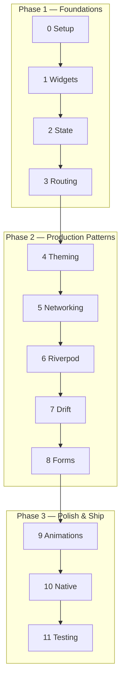

# Learning to Fly

> *"The moment you doubt whether you can fly, you cease for ever to be able to do it."*
> — J.M. Barrie (but also applicable to learning Flutter)

**Learning to Fly** is a hands-on Flutter tutorial for developers who already know how to code — just not in Flutter yet. You'll build **FlightBank**, a realistic banking app, from a blank screen to a polished, tested, production-ready application across 12 progressive chapters.

No toy counters. No "Hello World". A real app with real patterns.

---

## What You'll Build

FlightBank is a multi-screen banking app featuring:

- Login with validation and error handling
- Accounts overview with balances
- Transaction history per account
- Money transfers between accounts
- Settings with light/dark theme toggle
- Biometric authentication via platform channels
- Offline-first data with local SQLite caching
- Animated transitions and Hero effects

By the end, you'll have written — and understood — every line.

## The Flight Plan

| Ch | Title | What You'll Learn | Time |
|----|-------|-------------------|------|
| 0 | **Pre-Flight Check** | Flutter SDK, IDE setup, Dart crash course | ~15 min |
| 1 | **First Flight** | Widget tree, Scaffold, Row/Column, ListView | ~25 min |
| 2 | **Reading the Instruments** | StatefulWidget, setState, lifecycle, Keys | ~25 min |
| 3 | **Navigating the Skies** | GoRouter, routes, guards, deep linking | ~30 min |
| 4 | **Building the Cockpit** | ThemeData, dark mode, responsive layout | ~25 min |
| 5 | **Talking to the Tower** | HTTP, async/await, FutureBuilder, errors | ~25 min |
| 6 | **Autopilot Engaged** | Riverpod 3, providers, refactoring from setState | ~30 min |
| 7 | **Flight Recorder** | Drift (SQLite), DAOs, migrations, offline-first | ~30 min |
| 8 | **Forms & Checklists** | Form validation, formatters, transfer UX | ~25 min |
| 9 | **Smooth Flying** | Hero, implicit/explicit animations, transitions | ~30 min |
| 10 | **Ground Control** | MethodChannel, Swift/Kotlin, platform plugins | ~30 min |
| 11 | **Cleared for Landing** | Widget/integration/golden tests, profiling, release | ~30 min |

**Total flight time:** ~6 hours gate-to-gate

## Who Is This For?

You're a developer who already writes React, Swift, Kotlin, or something similar. You know what a class is, how async works, and why state management matters — you just haven't done it in Flutter yet.

If you've never programmed before, start with the [Dart language tour](https://dart.dev/language) first. We'll be here when you get back.

## Quick Start

Three commands and you're airborne:

```bash
# 1. Clone the repo
git clone git@github.com:team360r/flight.git
cd flight

# 2. Install everything (Flutter deps + docs site)
./setup.sh

# 3. Launch the tutorial in your browser
./start.sh
```

Then open the project in your IDE and head to **Chapter 0: Pre-Flight Check**.

## How It Works

You work in two windows side by side — the tutorial in your browser, FlightBank in your IDE. Read a section, write the code, hot reload, repeat.

Each chapter has a **git branch** (`chapter-0-preflight`, `chapter-1-first-flight`, etc.) with the completed code. Stuck? Check out the branch and compare.

The tutorial site tracks your progress automatically — visited pages get a checkmark in the sidebar, and a "Welcome back" banner picks up where you left off.

## Learning Path

The tutorial is divided into three phases, each building on the last:

**Phase 1 — Foundations** (Chapters 0-3)
> Setup, widgets, state, and navigation. By the end you have a multi-screen app with GoRouter.

**Phase 2 — Production Patterns** (Chapters 4-8)
> Theming, networking, Riverpod 3, Drift persistence, and forms. The app becomes data-driven and offline-capable.

**Phase 3 — Polish & Ship** (Chapters 9-11)
> Animations, platform channels, testing, and release prep. The app is production-ready.



## Project Structure

```
flight/
├── docs-site/                  # Tutorial website (Docusaurus)
│   ├── docs/chapters/          #   12 chapters, each with Part 1 + Part 2 + Quiz
│   ├── src/components/Quiz/    #   Quiz system with progress tracking
│   ├── src/hooks/              #   useProgress hook (localStorage)
│   └── src/theme/              #   Resume banner + visited checkmarks
│
├── lib/                        # FlightBank app (Flutter)
│   ├── screens/                #   Login, Accounts, Transactions, Transfer, Settings
│   ├── providers/              #   Riverpod 3 state management
│   ├── routing/                #   GoRouter configuration
│   ├── database/               #   Drift tables + database
│   ├── data/                   #   Models, mock data, API service
│   ├── theme/                  #   Material 3 light/dark theming
│   └── widgets/                #   AccountCard, TransactionTile
│
├── setup.sh                    # Install Flutter + Node deps
└── start.sh                    # Launch tutorial at localhost:3000
```

## Tech Stack

**Tutorial site:**
- Docusaurus 3.9 with Mermaid diagrams
- React 19, TypeScript
- Custom quiz component with localStorage progress

**FlightBank app:**
- Flutter 3.22+ / Dart 3.4+
- Riverpod 3 (state management)
- GoRouter 14 (navigation)
- Drift 2.20 (SQLite persistence)
- Google Fonts, Material 3

## Requirements

- **Flutter SDK** 3.22 or later ([install](https://docs.flutter.dev/get-started/install))
- **Node.js** 20+ (for the tutorial site)
- **A device or emulator** — iOS Simulator, Android Emulator, or a physical device
- **An IDE** — VS Code with Flutter extension, or Android Studio

## Contributing

This is a private tutorial for team360r. If you find a bug or typo, open an issue or PR.

---

Built with Docusaurus and a lot of turbulence. Happy flying.
