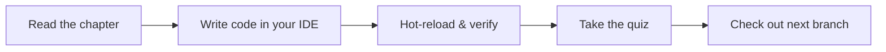

# Pre-Flight Check — Part 2

## 4. Clone the Repo and Verify

### Step 1: Clone the starter repository

```bash
git clone https://github.com/corebank/learning-to-fly.git
cd learning-to-fly
```

### Step 2: Run the setup script

The repo includes a `setup.sh` that installs dependencies and generates required files:

```bash
chmod +x setup.sh
./setup.sh
```

Behind the scenes this runs `flutter pub get` and creates any missing environment config files.

### Step 3: Run Flutter Doctor

```bash
flutter doctor -v
```

You need green checkmarks for at least **one** platform (iOS, Android, or Chrome for web). Fix any issues the doctor reports before continuing.

:::tip[CHECKPOINT]
At this point you should have:
- Flutter SDK installed and on your PATH
- An IDE with the Flutter extension
- The starter repo cloned with dependencies installed
- `flutter doctor` showing at least one connected platform with no errors

:::

---

## 5. Run the Starter App

Let's make sure everything compiles and launches:

```bash
# List available devices
flutter devices

# Run on your preferred target
flutter run -d chrome       # Web
flutter run -d macos         # macOS desktop
flutter run                  # Default connected device / emulator
```

You should see a minimal CoreBank splash screen with the text "Ready for takeoff." If you see this, your environment is solid.

```
┌──────────────────────────────┐
│                              │
│     ✈  CoreBank            │
│                              │
│     Ready for takeoff.       │
│                              │
└──────────────────────────────┘
```

If the app fails to launch, double-check `flutter doctor` output and ensure your emulator or device is connected.

---

## 6. How This Tutorial Works

Each chapter of **CoreBank Tutorial** follows a consistent pattern:



- **Read** the chapter in your browser. Concepts are explained first, then applied.
- **Code** along in your IDE. Every code block shows the target file path in its title bar.
- **Hot-reload** (`r` in terminal, or save in VS Code) to see changes instantly.
- **Quiz** at the end of each chapter tests comprehension — no trick questions.
- **Branches** — each chapter has a starting branch. If you get stuck, check out the chapter branch to see the completed state:

```bash
# Jump to the completed state of chapter 1
git checkout chapter-1-first-flight
```

:::tip[WHY THIS MATTERS]
This tutorial is designed for a two-window workflow: **browser on the left, IDE on the right**. Resist the urge to just read — the muscle memory of typing the code and seeing results in real time is what makes the concepts stick.

:::

---

## Summary

You now have a fully configured Flutter development environment and a cloned starter project. You have seen the Dart features that Flutter uses most heavily — null safety, shorthand constructors, mixins, async/await, named parameters, and records. In the next chapter, you will put these to work by building your first screens.

---

## Deep Dive

- [Flutter installation guide — flutter.dev](https://docs.flutter.dev/get-started/install)
- [Dart language tour — dart.dev](https://dart.dev/language)
- [FVM — Flutter Version Management](https://fvm.app)
- [Flutter extension for VS Code — marketplace](https://marketplace.visualstudio.com/items?itemName=Dart-Code.flutter)
- [DartPad — online Dart playground](https://dartpad.dev)

---

## What's Next

In Chapter 1 you will build your first real screens. You will learn how Flutter's widget tree works, explore layout widgets like `Column`, `Row`, and `ListView`, and assemble the login and accounts pages from scratch. Everything you just installed gets put to work.
