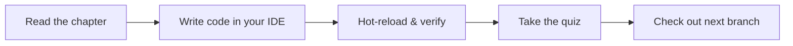

import Tabs from '@theme/Tabs';
import TabItem from '@theme/TabItem';

# Chapter 0: Pre-Flight Check

> *"The engine is the heart of an aeroplane, but the pilot is its soul."* — Walter Raleigh

**Estimated time:** ~15 minutes | **Focus:** Environment Setup | **Branch:** `chapter-0-preflight`

Before any aircraft leaves the ground, the crew runs a methodical checklist. Missing one item can ground the whole flight. Software is the same — a broken toolchain wastes hours. This chapter gets your environment flight-ready so the rest of the tutorial is smooth air.

---

## 1. Install the Flutter SDK

Flutter needs three things on your machine: the SDK itself, a platform toolchain (Xcode for iOS, Android Studio for Android), and a connected device or emulator.

### Step 1: Download Flutter

Head to [flutter.dev/docs/get-started/install](https://flutter.dev/docs/get-started/install) and follow the instructions for your OS. We recommend Flutter **3.22+** for this tutorial.

```bash
# Verify the install
flutter --version
```

You should see output like `Flutter 3.22.x • channel stable`.


### Step 2: Optional: Use FVM for version management

If you work on multiple Flutter projects that pin different SDK versions, [FVM](https://fvm.app) is worth the five-minute setup. It lets you run `fvm use 3.22.0` per project — similar to `nvm` for Node.

```bash
# Install FVM
dart pub global activate fvm

# Pin this project
fvm use 3.22.0
fvm flutter doctor
```

FVM is not required for this tutorial. Every command shown will use the bare `flutter` CLI.


---

## 2. IDE Setup

You have two solid choices. Pick whichever feels more natural.

<Tabs>
<TabItem value="vscode" label="VS Code" default>

1. Install [Visual Studio Code](https://code.visualstudio.com/).
2. Open the Extensions panel (`Cmd+Shift+X` / `Ctrl+Shift+X`).
3. Install **Flutter** (by Dart Code) — this automatically installs the Dart extension too.
4. Recommended extras: **Error Lens**, **Better Comments**, **Material Icon Theme**.

Verify the setup: open the command palette (`Cmd+Shift+P`) and type **Flutter: Run Flutter Doctor**. You should see all green checkmarks.

</TabItem>
<TabItem value="android-studio" label="Android Studio">

1. Install [Android Studio](https://developer.android.com/studio).
2. Open **Settings → Plugins** and install the **Flutter** plugin (installs Dart automatically).
3. Restart the IDE.
4. Go to **Settings → Languages & Frameworks → Flutter** and set the SDK path.

Android Studio gives you a built-in Android emulator manager and a more integrated Gradle experience.

</TabItem>
</Tabs>

:::tip[WHY THIS MATTERS]
Your IDE does more than syntax highlighting. The Flutter extension gives you widget wrapping shortcuts, hot-reload buttons, a widget inspector, and inline error overlays. Without it, you are flying blind.

:::

---

## 3. Dart Crash Course for Experienced Developers

If you know TypeScript, Kotlin, or Swift, Dart will feel familiar within ten minutes. This section covers the six features you will use constantly in Flutter. It is not a Dart tutorial — it is a cheat sheet.

### Null Safety

Dart is sound null-safe. A variable declared as `String` can never be `null`. If it might be absent, declare it `String?`.

```dart title="null_safety.dart"
String greeting = 'Hello';   // Non-nullable — always has a value
String? nickname;             // Nullable — defaults to null

// The bang operator (!) asserts non-null. Throws if null at runtime.
print(nickname!.length);      // DANGER — crashes if nickname is null

// Prefer null-aware operators instead:
print(nickname?.length ?? 0); // Safe — prints 0 if nickname is null
```

### Classes and Constructors

Dart constructors have a shorthand that assigns fields directly from parameters:

```dart title="account.dart"
class Account {
  final String id;
  final String name;
  final double balance;

  // Shorthand constructor — "this." assigns directly to the field.
  const Account({
    required this.id,
    required this.name,
    required this.balance,
  });

  bool get isOverdrawn => balance < 0;
}
```

### Mixins

Mixins let you share behaviour across unrelated class hierarchies — think of them as interfaces with implementations:

```dart title="mixins.dart"
mixin Loggable {
  void log(String message) => print('[LOG] $message');
}

class TransactionService with Loggable {
  void transfer(double amount) {
    log('Transferring \$${amount.toStringAsFixed(2)}');
    // ... transfer logic
  }
}
```

### Async / Await

Network calls, file I/O, and timers are all `Future`-based. The syntax mirrors JavaScript:

```dart title="async_example.dart"
Future<List<Account>> fetchAccounts() async {
  final response = await http.get(Uri.parse('/api/accounts'));
  if (response.statusCode != 200) {
    throw Exception('Failed to load accounts');
  }
  final List<dynamic> data = jsonDecode(response.body);
  return data.map((json) => Account.fromJson(json)).toList();
}
```

### Named Parameters and Defaults

Flutter widgets rely heavily on named parameters. Curly braces make parameters named; `required` enforces them:

```dart title="named_params.dart"
void showSnackBar({
  required String message,
  Duration duration = const Duration(seconds: 3),
  bool showUndo = false,
}) {
  // ...
}

// Call site reads like documentation:
showSnackBar(message: 'Transfer complete', showUndo: true);
```

### Records (Dart 3+)

Records give you lightweight, immutable tuples with optional named fields — handy for returning multiple values:

```dart title="records.dart"
// Positional record
(String, double) getAccountSummary() {
  return ('Chequing', 4250.00);
}

// Named-field record
({String name, double balance}) getNamedSummary() {
  return (name: 'Savings', balance: 12800.50);
}

void main() {
  final summary = getNamedSummary();
  print('${summary.name}: \$${summary.balance}');
}
```

:::info[TRY IT YOURSELF]
Open [DartPad](https://dartpad.dev) and paste any of the snippets above. Modify them until you can predict what the output will be before hitting **Run**.

:::

---

## 4. Clone the Repo and Verify

### Step 1: Clone the starter repository

```bash
git clone https://github.com/flightbank/learning-to-fly.git
cd learning-to-fly
```


### Step 2: Run the setup script

The repo includes a `setup.sh` that installs dependencies and generates required files:

```bash
chmod +x setup.sh
./setup.sh
```

Behind the scenes this runs `flutter pub get` and creates any missing environment config files.


### Step 3: Run Flutter Doctor

```bash
flutter doctor -v
```

You need green checkmarks for at least **one** platform (iOS, Android, or Chrome for web). Fix any issues the doctor reports before continuing.


:::tip[CHECKPOINT]
At this point you should have:
- Flutter SDK installed and on your PATH
- An IDE with the Flutter extension
- The starter repo cloned with dependencies installed
- `flutter doctor` showing at least one connected platform with no errors

:::

---

## 5. Run the Starter App

Let's make sure everything compiles and launches:

```bash
# List available devices
flutter devices

# Run on your preferred target
flutter run -d chrome       # Web
flutter run -d macos         # macOS desktop
flutter run                  # Default connected device / emulator
```

You should see a minimal FlightBank splash screen with the text "Ready for takeoff." If you see this, your environment is solid.

```
┌──────────────────────────────┐
│                              │
│     ✈  FlightBank            │
│                              │
│     Ready for takeoff.       │
│                              │
└──────────────────────────────┘
```

If the app fails to launch, double-check `flutter doctor` output and ensure your emulator or device is connected.

---

## 6. How This Tutorial Works

Each chapter of **Learning to Fly** follows a consistent pattern:



- **Read** the chapter in your browser. Concepts are explained first, then applied.
- **Code** along in your IDE. Every code block shows the target file path in its title bar.
- **Hot-reload** (`r` in terminal, or save in VS Code) to see changes instantly.
- **Quiz** at the end of each chapter tests comprehension — no trick questions.
- **Branches** — each chapter has a starting branch. If you get stuck, check out the chapter branch to see the completed state:

```bash
# Jump to the completed state of chapter 1
git checkout chapter-1-first-flight
```

:::tip[WHY THIS MATTERS]
This tutorial is designed for a two-window workflow: **browser on the left, IDE on the right**. Resist the urge to just read — the muscle memory of typing the code and seeing results in real time is what makes the concepts stick.

:::

---

## Summary

You now have a fully configured Flutter development environment and a cloned starter project. You have seen the Dart features that Flutter uses most heavily — null safety, shorthand constructors, mixins, async/await, named parameters, and records. In the next chapter, you will put these to work by building your first screens.

Up next: [Chapter 1: First Flight](/chapters/first-flight) — where you build the login and accounts screens from scratch.
