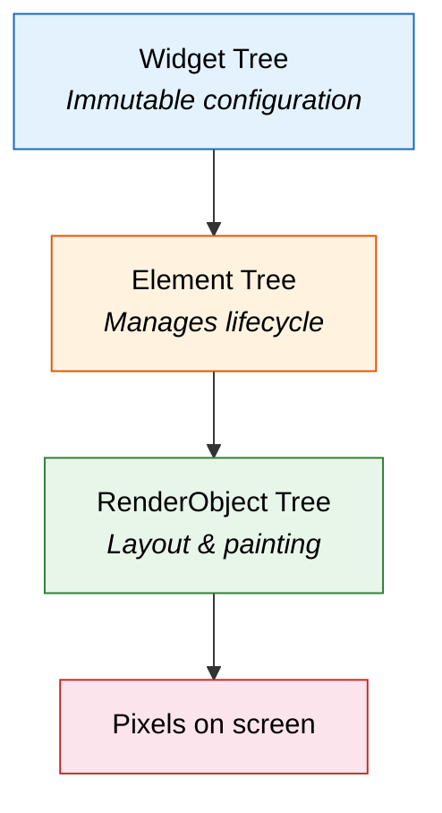
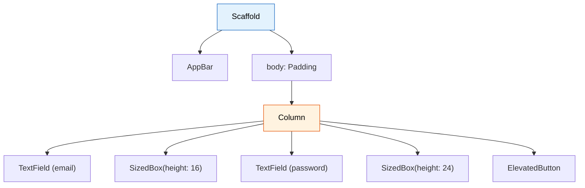

import Tabs from '@theme/Tabs';
import TabItem from '@theme/TabItem';

# Chapter 1: First Flight

> *"The moment you doubt whether you can fly, you cease forever to be able to do it."* — J.M. Barrie

**Estimated time:** ~25 minutes | **Focus:** Login & Accounts Screens | **Branch:** `chapter-1-first-flight`

Every pilot remembers their first solo flight. This chapter is yours. You will learn how Flutter turns Dart objects into pixels on the screen, then build two real screens — a login page and an accounts overview — using only layout widgets. No state management, no networking. Just structure.

---

## 1. How Flutter Renders: Three Trees

When you write a Flutter widget, you are describing *what* the UI should look like. Flutter takes that description through three internal trees to produce actual pixels:



| Tree | Role | Analogy |
|------|------|---------|
| **Widget tree** | Lightweight, immutable blueprints. Rebuilt frequently. | Architectural drawings |
| **Element tree** | Long-lived objects that track which widget maps to which render object. | Construction foreman |
| **RenderObject tree** | Performs layout calculations and paints pixels. | The actual building |

You almost never interact with the element or render trees directly. Your job is to describe the widget tree, and Flutter handles the rest. But understanding this architecture explains *why* rebuilding widgets is cheap — the framework reuses elements and render objects whenever possible.

:::tip[WHY THIS MATTERS]
New Flutter developers often worry about rebuilding widgets. They come from frameworks where re-rendering is expensive. In Flutter, widgets are intentionally disposable. The element tree diffs changes and only updates the render objects that actually changed — similar to React's virtual DOM, but at a lower level.

:::

---

## 2. MaterialApp, Scaffold, AppBar — The App Shell

Every Flutter app starts with a `MaterialApp` at the root. It provides theming, navigation, and localisation. Inside each screen, `Scaffold` gives you the standard Material layout slots: app bar, body, floating action button, bottom navigation, and drawers.

```dart title="lib/main.dart"
import 'package:flutter/material.dart';
import 'screens/login_screen.dart';

void main() {
  runApp(const FlightBankApp());
}

class FlightBankApp extends StatelessWidget {
  const FlightBankApp({super.key});

  @override
  Widget build(BuildContext context) {
    return MaterialApp(
      title: 'FlightBank',
      debugShowCheckedModeBanner: false,
      theme: ThemeData(
        colorSchemeSeed: const Color(0xFF1565C0),
        useMaterial3: true,
        fontFamily: 'Inter',
      ),
      home: const LoginScreen(),
    );
  }
}
```

`MaterialApp` wraps your entire app. `Scaffold` wraps each screen:

```dart title="lib/screens/login_screen.dart"
import 'package:flutter/material.dart';

class LoginScreen extends StatelessWidget {
  const LoginScreen({super.key});

  @override
  Widget build(BuildContext context) {
    return Scaffold(
      appBar: AppBar(
        title: const Text('FlightBank'),
        centerTitle: true,
      ),
      body: const Center(
        child: Text('Login screen coming soon'),
      ),
    );
  }
}
```

Run this now. You should see an app bar with "FlightBank" and placeholder text.

---

## 3. Layout Widgets: Row, Column, Expanded, and Friends

Flutter has no CSS. Layout is done entirely with widgets. Here are the six you will use the most:

| Widget | What it does |
|--------|-------------|
| `Column` | Lays children out vertically (top to bottom) |
| `Row` | Lays children out horizontally (left to right) |
| `Expanded` | Tells a `Row` or `Column` child to fill remaining space |
| `Padding` | Adds empty space around a child |
| `SizedBox` | A box with fixed width/height — great for spacing |
| `Container` | A convenience widget combining padding, margin, decoration, and size constraints |

These compose together. A `Column` inside a `Padding` inside a `Scaffold` body is the bread and butter of every Flutter screen.



:::info[TRY IT YOURSELF]
Before reading the next section, try building the login screen yourself using the widget tree diagram above. Use `TextField` for the input fields and `ElevatedButton` for the button. Compare with the solution below when you are done.

:::


Continue to [Part 2](/chapters/first-flight/part-2) to build the login screen, accounts screen, and learn the hot reload workflow.
