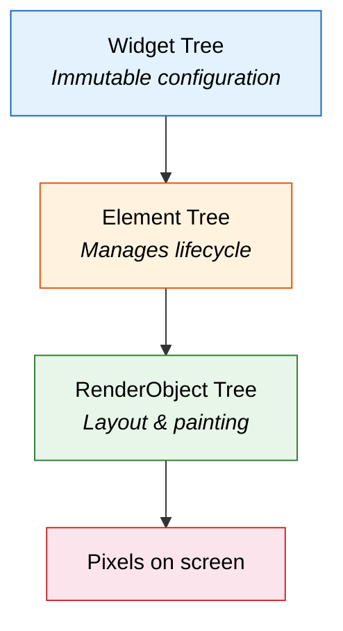
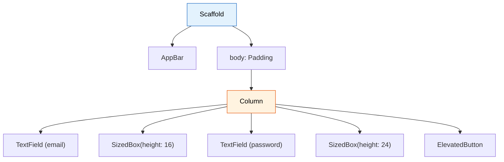

import Tabs from '@theme/Tabs';
import TabItem from '@theme/TabItem';

# Chapter 1: First Flight

> *"The moment you doubt whether you can fly, you cease forever to be able to do it."* — J.M. Barrie

**Estimated time:** ~25 minutes | **Focus:** Login & Accounts Screens | **Branch:** `chapter-1-first-flight`

Every pilot remembers their first solo flight. This chapter is yours. You will learn how Flutter turns Dart objects into pixels on the screen, then build two real screens — a login page and an accounts overview — using only layout widgets. No state management, no networking. Just structure.

---

## 1. How Flutter Renders: Three Trees

When you write a Flutter widget, you are describing *what* the UI should look like. Flutter takes that description through three internal trees to produce actual pixels:



| Tree | Role | Analogy |
|------|------|---------|
| **Widget tree** | Lightweight, immutable blueprints. Rebuilt frequently. | Architectural drawings |
| **Element tree** | Long-lived objects that track which widget maps to which render object. | Construction foreman |
| **RenderObject tree** | Performs layout calculations and paints pixels. | The actual building |

You almost never interact with the element or render trees directly. Your job is to describe the widget tree, and Flutter handles the rest. But understanding this architecture explains *why* rebuilding widgets is cheap — the framework reuses elements and render objects whenever possible.

:::tip[WHY THIS MATTERS]
New Flutter developers often worry about rebuilding widgets. They come from frameworks where re-rendering is expensive. In Flutter, widgets are intentionally disposable. The element tree diffs changes and only updates the render objects that actually changed — similar to React's virtual DOM, but at a lower level.

:::

---

## 2. MaterialApp, Scaffold, AppBar — The App Shell

Every Flutter app starts with a `MaterialApp` at the root. It provides theming, navigation, and localisation. Inside each screen, `Scaffold` gives you the standard Material layout slots: app bar, body, floating action button, bottom navigation, and drawers.

```dart title="lib/main.dart"
import 'package:flutter/material.dart';
import 'screens/login_screen.dart';

void main() {
  runApp(const CoreBankApp());
}

class CoreBankApp extends StatelessWidget {
  const CoreBankApp({super.key});

  @override
  Widget build(BuildContext context) {
    return MaterialApp(
      title: 'CoreBank',
      debugShowCheckedModeBanner: false,
      theme: ThemeData(
        colorSchemeSeed: const Color(0xFF1565C0),
        useMaterial3: true,
        fontFamily: 'Inter',
      ),
      home: const LoginScreen(),
    );
  }
}
```

`MaterialApp` wraps your entire app. `Scaffold` wraps each screen:

```dart title="lib/screens/login_screen.dart"
import 'package:flutter/material.dart';

class LoginScreen extends StatelessWidget {
  const LoginScreen({super.key});

  @override
  Widget build(BuildContext context) {
    return Scaffold(
      appBar: AppBar(
        title: const Text('CoreBank'),
        centerTitle: true,
      ),
      body: const Center(
        child: Text('Login screen coming soon'),
      ),
    );
  }
}
```

Run this now. You should see an app bar with "CoreBank" and placeholder text.

---

## 3. Layout Widgets: Row, Column, Expanded, and Friends

Flutter has no CSS. Layout is done entirely with widgets. Here are the six you will use the most:

| Widget | What it does |
|--------|-------------|
| `Column` | Lays children out vertically (top to bottom) |
| `Row` | Lays children out horizontally (left to right) |
| `Expanded` | Tells a `Row` or `Column` child to fill remaining space |
| `Padding` | Adds empty space around a child |
| `SizedBox` | A box with fixed width/height — great for spacing |
| `Container` | A convenience widget combining padding, margin, decoration, and size constraints |

These compose together. A `Column` inside a `Padding` inside a `Scaffold` body is the bread and butter of every Flutter screen.



:::info[TRY IT YOURSELF]
Before reading the next section, try building the login screen yourself using the widget tree diagram above. Use `TextField` for the input fields and `ElevatedButton` for the button. Compare with the solution below when you are done.

:::

---

## 4. Build the Login Screen

Replace your placeholder `LoginScreen` with the real layout. This version is completely static — no validation, no callbacks. That comes in Chapter 2.

```dart title="lib/screens/login_screen.dart"
import 'package:flutter/material.dart';

class LoginScreen extends StatelessWidget {
  const LoginScreen({super.key});

  @override
  Widget build(BuildContext context) {
    final theme = Theme.of(context);

    return Scaffold(
      appBar: AppBar(
        title: const Text('CoreBank'),
        centerTitle: true,
      ),
      body: SafeArea(
        child: SingleChildScrollView(
          padding: const EdgeInsets.symmetric(horizontal: 24, vertical: 32),
          child: Column(
            crossAxisAlignment: CrossAxisAlignment.stretch,
            children: [
              // Logo / welcome area
              Icon(
                Icons.flight_takeoff,
                size: 64,
                color: theme.colorScheme.primary,
              ),
              const SizedBox(height: 16),
              Text(
                'Welcome aboard',
                style: theme.textTheme.headlineMedium?.copyWith(
                  fontWeight: FontWeight.bold,
                ),
                textAlign: TextAlign.center,
              ),
              const SizedBox(height: 8),
              Text(
                'Sign in to your CoreBank account',
                style: theme.textTheme.bodyLarge?.copyWith(
                  color: theme.colorScheme.onSurfaceVariant,
                ),
                textAlign: TextAlign.center,
              ),
              const SizedBox(height: 48),

              // Email field
              TextField(
                decoration: InputDecoration(
                  labelText: 'Email address',
                  hintText: 'you@example.com',
                  prefixIcon: const Icon(Icons.email_outlined),
                  border: OutlineInputBorder(
                    borderRadius: BorderRadius.circular(12),
                  ),
                ),
                keyboardType: TextInputType.emailAddress,
                textInputAction: TextInputAction.next,
              ),
              const SizedBox(height: 16),

              // Password field
              TextField(
                decoration: InputDecoration(
                  labelText: 'Password',
                  prefixIcon: const Icon(Icons.lock_outline),
                  suffixIcon: const Icon(Icons.visibility_off_outlined),
                  border: OutlineInputBorder(
                    borderRadius: BorderRadius.circular(12),
                  ),
                ),
                obscureText: true,
                textInputAction: TextInputAction.done,
              ),
              const SizedBox(height: 8),

              // Forgot password link
              Align(
                alignment: Alignment.centerRight,
                child: TextButton(
                  onPressed: () {},
                  child: const Text('Forgot password?'),
                ),
              ),
              const SizedBox(height: 24),

              // Login button
              FilledButton(
                onPressed: () {},
                style: FilledButton.styleFrom(
                  minimumSize: const Size.fromHeight(52),
                  shape: RoundedRectangleBorder(
                    borderRadius: BorderRadius.circular(12),
                  ),
                ),
                child: const Text(
                  'Sign In',
                  style: TextStyle(fontSize: 16, fontWeight: FontWeight.w600),
                ),
              ),
              const SizedBox(height: 16),

              // Sign up prompt
              Row(
                mainAxisAlignment: MainAxisAlignment.center,
                children: [
                  Text(
                    "Don't have an account? ",
                    style: theme.textTheme.bodyMedium,
                  ),
                  TextButton(
                    onPressed: () {},
                    child: const Text('Sign up'),
                  ),
                ],
              ),
            ],
          ),
        ),
      ),
    );
  }
}
```

### Step 1: Save and hot-reload

Press `r` in your terminal (or save the file in VS Code with the Flutter extension). The login screen should appear instantly — no full restart needed.


Key layout decisions in this code:

- **`SafeArea`** — prevents content from hiding behind notches or system bars.
- **`SingleChildScrollView`** — ensures the form scrolls on small screens.
- **`CrossAxisAlignment.stretch`** — makes every child in the `Column` fill the full width.
- **`SizedBox`** — used for vertical spacing between elements. This is idiomatic Flutter; avoid using `Padding` just for spacing between siblings.

---

## 5. Build the Accounts Overview Screen

Now create a second screen that shows a hardcoded list of bank accounts. We will navigate between the two screens in Chapter 3 — for now, you can temporarily change `home:` in `main.dart` to preview this screen.

```dart title="lib/screens/accounts_screen.dart"
import 'package:flutter/material.dart';

class AccountsScreen extends StatelessWidget {
  const AccountsScreen({super.key});

  @override
  Widget build(BuildContext context) {
    final theme = Theme.of(context);

    return Scaffold(
      appBar: AppBar(
        title: const Text('Accounts'),
        actions: [
          IconButton(
            icon: const Icon(Icons.notifications_outlined),
            onPressed: () {},
          ),
          IconButton(
            icon: const Icon(Icons.settings_outlined),
            onPressed: () {},
          ),
        ],
      ),
      body: Column(
        crossAxisAlignment: CrossAxisAlignment.start,
        children: [
          // Total balance header
          Container(
            width: double.infinity,
            padding: const EdgeInsets.all(24),
            color: theme.colorScheme.primaryContainer,
            child: Column(
              crossAxisAlignment: CrossAxisAlignment.start,
              children: [
                Text(
                  'Total Balance',
                  style: theme.textTheme.titleSmall?.copyWith(
                    color: theme.colorScheme.onPrimaryContainer,
                  ),
                ),
                const SizedBox(height: 4),
                Text(
                  '\$24,531.89',
                  style: theme.textTheme.headlineLarge?.copyWith(
                    fontWeight: FontWeight.bold,
                    color: theme.colorScheme.onPrimaryContainer,
                  ),
                ),
              ],
            ),
          ),

          // Section label
          Padding(
            padding: const EdgeInsets.fromLTRB(16, 24, 16, 8),
            child: Text(
              'Your Accounts',
              style: theme.textTheme.titleMedium?.copyWith(
                fontWeight: FontWeight.w600,
              ),
            ),
          ),

          // Accounts list
          Expanded(
            child: ListView.builder(
              padding: const EdgeInsets.symmetric(horizontal: 16),
              itemCount: _accounts.length,
              itemBuilder: (context, index) {
                final account = _accounts[index];
                return _AccountCard(
                  icon: account.icon,
                  name: account.name,
                  number: account.number,
                  balance: account.balance,
                  onTap: () {},
                );
              },
            ),
          ),
        ],
      ),
    );
  }
}
```

---

## 6. ListView.builder for the Accounts List

Notice we used `ListView.builder` instead of putting `Card` widgets directly in a `Column`. Here is why:

| Approach | Builds | Memory |
|----------|--------|--------|
| `Column` with children list | All items immediately | All in memory |
| `ListView.builder` | Only visible items + buffer | Recycled as you scroll |

For five accounts, it barely matters. For five hundred transactions, it is the difference between smooth scrolling and jank. Build the habit now.

Here is the account data model and card widget:

```dart title="lib/screens/accounts_screen.dart (continued)"
// Hardcoded data — we'll replace this with real data in Chapter 5
final List<_AccountData> _accounts = [
  _AccountData(
    icon: Icons.account_balance,
    name: 'Chequing',
    number: '****4521',
    balance: '\$3,241.50',
  ),
  _AccountData(
    icon: Icons.savings_outlined,
    name: 'Savings',
    number: '****8832',
    balance: '\$18,450.39',
  ),
  _AccountData(
    icon: Icons.credit_card,
    name: 'Credit Card',
    number: '****2210',
    balance: '-\$1,340.00',
  ),
  _AccountData(
    icon: Icons.trending_up,
    name: 'Investment',
    number: '****7745',
    balance: '\$4,180.00',
  ),
];

class _AccountData {
  final IconData icon;
  final String name;
  final String number;
  final String balance;

  const _AccountData({
    required this.icon,
    required this.name,
    required this.number,
    required this.balance,
  });
}

class _AccountCard extends StatelessWidget {
  final IconData icon;
  final String name;
  final String number;
  final String balance;
  final VoidCallback onTap;

  const _AccountCard({
    required this.icon,
    required this.name,
    required this.number,
    required this.balance,
    required this.onTap,
  });

  @override
  Widget build(BuildContext context) {
    final theme = Theme.of(context);

    return Card(
      margin: const EdgeInsets.only(bottom: 12),
      child: InkWell(
        onTap: onTap,
        borderRadius: BorderRadius.circular(12),
        child: Padding(
          padding: const EdgeInsets.all(16),
          child: Row(
            children: [
              // Account icon
              Container(
                width: 48,
                height: 48,
                decoration: BoxDecoration(
                  color: theme.colorScheme.primaryContainer,
                  borderRadius: BorderRadius.circular(12),
                ),
                child: Icon(
                  icon,
                  color: theme.colorScheme.primary,
                ),
              ),
              const SizedBox(width: 16),

              // Account name and number
              Expanded(
                child: Column(
                  crossAxisAlignment: CrossAxisAlignment.start,
                  children: [
                    Text(
                      name,
                      style: theme.textTheme.titleSmall?.copyWith(
                        fontWeight: FontWeight.w600,
                      ),
                    ),
                    const SizedBox(height: 2),
                    Text(
                      number,
                      style: theme.textTheme.bodySmall?.copyWith(
                        color: theme.colorScheme.onSurfaceVariant,
                      ),
                    ),
                  ],
                ),
              ),

              // Balance
              Text(
                balance,
                style: theme.textTheme.titleMedium?.copyWith(
                  fontWeight: FontWeight.bold,
                ),
              ),
              const SizedBox(width: 4),
              Icon(
                Icons.chevron_right,
                color: theme.colorScheme.onSurfaceVariant,
              ),
            ],
          ),
        ),
      ),
    );
  }
}
```

:::tip[CHECKPOINT]
Hot-reload and confirm:
- The login screen renders with email/password fields and a Sign In button
- The accounts screen shows four account cards in a scrollable list
- The total balance header is visible at the top
- Both screens look correct on your target device/emulator

:::

---

## 7. Hot Reload Workflow

Flutter's hot reload is your best productivity tool. It injects updated source code into the running Dart VM without losing app state.

| Action | What happens | When to use |
|--------|-------------|------------|
| **Hot reload** (`r` or save) | Updates changed widgets. Preserves state. | UI tweaks, layout changes, adding widgets |
| **Hot restart** (`R`) | Rebuilds the entire app from `main()`. Resets state. | Changed `main()`, changed global variables, added new fields to a `State` class |
| **Full restart** (stop + run) | Recompiles native code. | Changed platform-specific code, native plugins, pubspec.yaml |

:::tip[WHY THIS MATTERS]
Hot reload typically completes in under a second. Full rebuilds take 10-30 seconds. If you structure your code so that most changes are widget-level, you spend nearly zero time waiting for compiles. This feedback loop is what makes Flutter development fast.

:::

---

## Summary

You built two complete screens with nothing but layout widgets. You know that Flutter's rendering pipeline goes widget tree to element tree to render tree, and that rebuilding widgets is intentionally cheap. You used `Column`, `Row`, `Expanded`, `SizedBox`, `Padding`, `Container`, `ListView.builder`, `Card`, and `InkWell` — the layout primitives you will use on every screen for the rest of this tutorial.

But both screens are static. The login button does nothing. You cannot tap an account to see its transactions. In the next chapter, you will add interactivity with `StatefulWidget` and `setState`.

Up next: [Chapter 2: Reading the Instruments](/chapters/instruments) — where widgets come alive with state.
