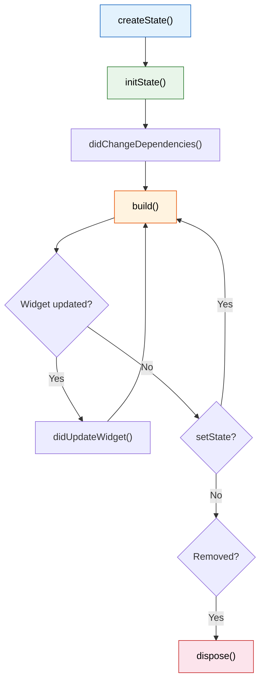

import Tabs from '@theme/Tabs';
import TabItem from '@theme/TabItem';

# Chapter 2: Reading the Instruments

> *"Good pilots are always learning. Great pilots know that they are always learning."* — Anonymous

**Estimated time:** ~25 minutes | **Focus:** Login & Account Selection | **Branch:** `chapter-2-instruments`

A pilot who cannot read the instruments is just a passenger. In Chapter 1 you built static screens — they look right but do nothing. This chapter gives your widgets the ability to respond to user input by introducing `StatefulWidget`, the build cycle, and widget lifecycle methods.

---

## 1. StatelessWidget vs StatefulWidget

You have already used `StatelessWidget`. Its `build` method is called once (plus whenever a parent rebuilds it), and the widget itself holds no mutable data.

`StatefulWidget` adds a companion `State` object that persists across rebuilds. The widget is still immutable, but the `State` sticks around and can hold data that changes over time.

| | StatelessWidget | StatefulWidget |
|---|---|---|
| Mutable data? | No | Yes (in the `State` object) |
| When to use | Display-only content, layout wrappers | Forms, animations, anything interactive |
| Rebuild trigger | Parent rebuilds, InheritedWidget changes | Same as stateless, *plus* `setState()` |

**Rule of thumb:** Start with `StatelessWidget`. Promote to `StatefulWidget` only when the widget needs to hold data that changes during its lifetime.

```dart title="Comparison"
// Stateless — no mutable state
class BalanceLabel extends StatelessWidget {
  final String balance;
  const BalanceLabel({super.key, required this.balance});

  @override
  Widget build(BuildContext context) => Text(balance);
}

// Stateful — tracks mutable state
class PasswordField extends StatefulWidget {
  const PasswordField({super.key});

  @override
  State<PasswordField> createState() => _PasswordFieldState();
}

class _PasswordFieldState extends State<PasswordField> {
  bool _obscured = true;

  @override
  Widget build(BuildContext context) {
    return TextField(
      obscureText: _obscured,
      decoration: InputDecoration(
        labelText: 'Password',
        suffixIcon: IconButton(
          icon: Icon(_obscured ? Icons.visibility_off : Icons.visibility),
          onPressed: () => setState(() => _obscured = !_obscured),
        ),
      ),
    );
  }
}
```

---

## 2. setState and the Build Cycle

`setState` is the most important method in Flutter state management. It does two things:

1. Executes the callback you pass it (where you mutate state).
2. Schedules a rebuild of *this* widget's subtree.

```dart
setState(() {
  _email = value;        // 1. Mutate
});                       // 2. Flutter calls build() on next frame
```

```mermaid
sequenceDiagram
    participant User
    participant Widget as StatefulWidget
    participant State as State object
    participant Framework as Flutter Framework

    User->>Widget: Types in TextField
    Widget->>State: onChanged callback fires
    State->>State: setState(() { _email = value; })
    State->>Framework: Mark this element as dirty
    Framework->>State: Call build()
    State->>Framework: Return new widget tree
    Framework->>Framework: Diff and update RenderObjects
```

:::tip[WHY THIS MATTERS]
Never mutate state *outside* a `setState` call. The mutation will happen, but Flutter will not know it needs to rebuild. Your UI will be stale, and you will spend an hour debugging why the screen does not update.

```dart
// BAD — Flutter does not know to rebuild
_email = value;

// GOOD — rebuild is scheduled
setState(() => _email = value);
```

:::

---

## 3. Widget Lifecycle

A `State` object has a well-defined lifecycle. You do not need to memorise every method, but you need to know the four you will use regularly:



| Method | When it runs | Typical use |
|--------|-------------|-------------|
| `initState()` | Once, when the State is first created | Subscribe to streams, create controllers |
| `didChangeDependencies()` | After `initState` and when an InheritedWidget changes | Read theme, media query, or provider data |
| `didUpdateWidget(old)` | When the parent rebuilds and passes new configuration | React to changed props (e.g., new account ID) |
| `dispose()` | When the widget is permanently removed from the tree | Cancel subscriptions, dispose controllers |

```dart title="lib/screens/login_screen.dart (lifecycle example)"
class _LoginScreenState extends State<LoginScreen> {
  late final TextEditingController _emailController;
  late final TextEditingController _passwordController;

  @override
  void initState() {
    super.initState();
    _emailController = TextEditingController();
    _passwordController = TextEditingController();
  }

  @override
  void dispose() {
    _emailController.dispose();
    _passwordController.dispose();
    super.dispose();
  }

  @override
  Widget build(BuildContext context) {
    // ... build method uses the controllers
  }
}
```

:::tip[WHY THIS MATTERS]
Forgetting to dispose controllers and subscriptions is the most common source of memory leaks in Flutter apps. Every `TextEditingController`, `AnimationController`, `StreamSubscription`, or `FocusNode` you create in `initState` must be disposed in `dispose`.

:::


Continue to [Part 2](/chapters/instruments/part-2) to make the login interactive, add account selection, and learn about widget keys.
