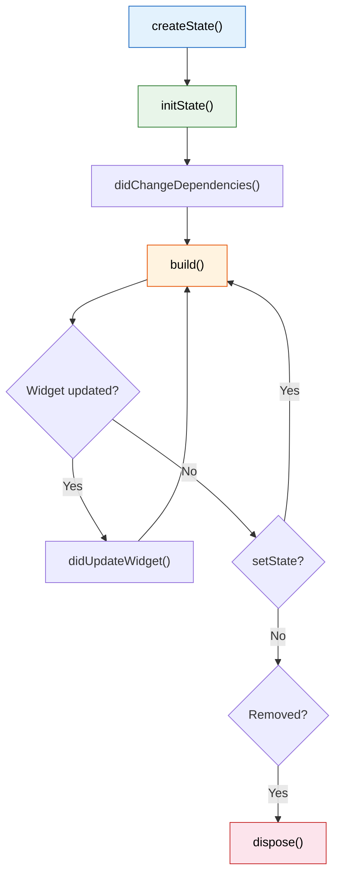

import Tabs from '@theme/Tabs';
import TabItem from '@theme/TabItem';

# Chapter 2: Reading the Instruments

> *"Good pilots are always learning. Great pilots know that they are always learning."* — Anonymous

**Estimated time:** ~25 minutes | **Focus:** Login & Account Selection | **Branch:** `chapter-2-instruments`

A pilot who cannot read the instruments is just a passenger. In Chapter 1 you built static screens — they look right but do nothing. This chapter gives your widgets the ability to respond to user input by introducing `StatefulWidget`, the build cycle, and widget lifecycle methods.

---

## 1. StatelessWidget vs StatefulWidget

You have already used `StatelessWidget`. Its `build` method is called once (plus whenever a parent rebuilds it), and the widget itself holds no mutable data.

`StatefulWidget` adds a companion `State` object that persists across rebuilds. The widget is still immutable, but the `State` sticks around and can hold data that changes over time.

| | StatelessWidget | StatefulWidget |
|---|---|---|
| Mutable data? | No | Yes (in the `State` object) |
| When to use | Display-only content, layout wrappers | Forms, animations, anything interactive |
| Rebuild trigger | Parent rebuilds, InheritedWidget changes | Same as stateless, *plus* `setState()` |

**Rule of thumb:** Start with `StatelessWidget`. Promote to `StatefulWidget` only when the widget needs to hold data that changes during its lifetime.

```dart title="Comparison"
// Stateless — no mutable state
class BalanceLabel extends StatelessWidget {
  final String balance;
  const BalanceLabel({super.key, required this.balance});

  @override
  Widget build(BuildContext context) => Text(balance);
}

// Stateful — tracks mutable state
class PasswordField extends StatefulWidget {
  const PasswordField({super.key});

  @override
  State<PasswordField> createState() => _PasswordFieldState();
}

class _PasswordFieldState extends State<PasswordField> {
  bool _obscured = true;

  @override
  Widget build(BuildContext context) {
    return TextField(
      obscureText: _obscured,
      decoration: InputDecoration(
        labelText: 'Password',
        suffixIcon: IconButton(
          icon: Icon(_obscured ? Icons.visibility_off : Icons.visibility),
          onPressed: () => setState(() => _obscured = !_obscured),
        ),
      ),
    );
  }
}
```

---

## 2. setState and the Build Cycle

`setState` is the most important method in Flutter state management. It does two things:

1. Executes the callback you pass it (where you mutate state).
2. Schedules a rebuild of *this* widget's subtree.

```dart
setState(() {
  _email = value;        // 1. Mutate
});                       // 2. Flutter calls build() on next frame
```

```mermaid
sequenceDiagram
    participant User
    participant Widget as StatefulWidget
    participant State as State object
    participant Framework as Flutter Framework

    User->>Widget: Types in TextField
    Widget->>State: onChanged callback fires
    State->>State: setState(() { _email = value; })
    State->>Framework: Mark this element as dirty
    Framework->>State: Call build()
    State->>Framework: Return new widget tree
    Framework->>Framework: Diff and update RenderObjects
```

:::tip[WHY THIS MATTERS]
Never mutate state *outside* a `setState` call. The mutation will happen, but Flutter will not know it needs to rebuild. Your UI will be stale, and you will spend an hour debugging why the screen does not update.

```dart
// BAD — Flutter does not know to rebuild
_email = value;

// GOOD — rebuild is scheduled
setState(() => _email = value);
```

:::

---

## 3. Widget Lifecycle

A `State` object has a well-defined lifecycle. You do not need to memorise every method, but you need to know the four you will use regularly:



| Method | When it runs | Typical use |
|--------|-------------|-------------|
| `initState()` | Once, when the State is first created | Subscribe to streams, create controllers |
| `didChangeDependencies()` | After `initState` and when an InheritedWidget changes | Read theme, media query, or provider data |
| `didUpdateWidget(old)` | When the parent rebuilds and passes new configuration | React to changed props (e.g., new account ID) |
| `dispose()` | When the widget is permanently removed from the tree | Cancel subscriptions, dispose controllers |

```dart title="lib/screens/login_screen.dart (lifecycle example)"
class _LoginScreenState extends State<LoginScreen> {
  late final TextEditingController _emailController;
  late final TextEditingController _passwordController;

  @override
  void initState() {
    super.initState();
    _emailController = TextEditingController();
    _passwordController = TextEditingController();
  }

  @override
  void dispose() {
    _emailController.dispose();
    _passwordController.dispose();
    super.dispose();
  }

  @override
  Widget build(BuildContext context) {
    // ... build method uses the controllers
  }
}
```

:::tip[WHY THIS MATTERS]
Forgetting to dispose controllers and subscriptions is the most common source of memory leaks in Flutter apps. Every `TextEditingController`, `AnimationController`, `StreamSubscription`, or `FocusNode` you create in `initState` must be disposed in `dispose`.

:::

---

## 4. Make the Login Interactive

Time to promote `LoginScreen` from `StatelessWidget` to `StatefulWidget` and add real validation.

<Tabs>
<TabItem value="before" label="Before (static)" default>

```dart title="lib/screens/login_screen.dart"
class LoginScreen extends StatelessWidget {
  const LoginScreen({super.key});

  @override
  Widget build(BuildContext context) {
    return Scaffold(
      body: Column(
        children: [
          TextField(decoration: InputDecoration(labelText: 'Email')),
          TextField(decoration: InputDecoration(labelText: 'Password')),
          FilledButton(onPressed: () {}, child: Text('Sign In')),
        ],
      ),
    );
  }
}
```

</TabItem>
<TabItem value="after" label="After (interactive)">

```dart title="lib/screens/login_screen.dart"
class LoginScreen extends StatefulWidget {
  const LoginScreen({super.key});

  @override
  State<LoginScreen> createState() => _LoginScreenState();
}

class _LoginScreenState extends State<LoginScreen> {
  final _emailController = TextEditingController();
  final _passwordController = TextEditingController();

  String? _emailError;
  String? _passwordError;
  bool _isLoading = false;
  bool _obscurePassword = true;

  @override
  void dispose() {
    _emailController.dispose();
    _passwordController.dispose();
    super.dispose();
  }

  void _validateAndSubmit() {
    setState(() {
      _emailError = _validateEmail(_emailController.text);
      _passwordError = _validatePassword(_passwordController.text);
    });

    if (_emailError != null || _passwordError != null) return;

    setState(() => _isLoading = true);

    // Simulate network call — replaced with real auth in Chapter 5
    Future.delayed(const Duration(seconds: 2), () {
      if (mounted) {
        setState(() => _isLoading = false);
        // Navigate to accounts screen (Chapter 3)
      }
    });
  }

  String? _validateEmail(String value) {
    if (value.isEmpty) return 'Email is required';
    if (!value.contains('@')) return 'Enter a valid email address';
    return null;
  }

  String? _validatePassword(String value) {
    if (value.isEmpty) return 'Password is required';
    if (value.length < 8) return 'Password must be at least 8 characters';
    return null;
  }

  @override
  Widget build(BuildContext context) {
    final theme = Theme.of(context);

    return Scaffold(
      appBar: AppBar(
        title: const Text('CoreBank'),
        centerTitle: true,
      ),
      body: SafeArea(
        child: SingleChildScrollView(
          padding: const EdgeInsets.symmetric(horizontal: 24, vertical: 32),
          child: Column(
            crossAxisAlignment: CrossAxisAlignment.stretch,
            children: [
              Icon(
                Icons.flight_takeoff,
                size: 64,
                color: theme.colorScheme.primary,
              ),
              const SizedBox(height: 16),
              Text(
                'Welcome aboard',
                style: theme.textTheme.headlineMedium?.copyWith(
                  fontWeight: FontWeight.bold,
                ),
                textAlign: TextAlign.center,
              ),
              const SizedBox(height: 48),

              // Email field with validation
              TextField(
                controller: _emailController,
                decoration: InputDecoration(
                  labelText: 'Email address',
                  hintText: 'you@example.com',
                  prefixIcon: const Icon(Icons.email_outlined),
                  errorText: _emailError,
                  border: OutlineInputBorder(
                    borderRadius: BorderRadius.circular(12),
                  ),
                ),
                keyboardType: TextInputType.emailAddress,
                textInputAction: TextInputAction.next,
                onChanged: (_) {
                  if (_emailError != null) {
                    setState(() => _emailError = null);
                  }
                },
              ),
              const SizedBox(height: 16),

              // Password field with visibility toggle
              TextField(
                controller: _passwordController,
                decoration: InputDecoration(
                  labelText: 'Password',
                  prefixIcon: const Icon(Icons.lock_outline),
                  errorText: _passwordError,
                  suffixIcon: IconButton(
                    icon: Icon(
                      _obscurePassword
                          ? Icons.visibility_off_outlined
                          : Icons.visibility_outlined,
                    ),
                    onPressed: () {
                      setState(() => _obscurePassword = !_obscurePassword);
                    },
                  ),
                  border: OutlineInputBorder(
                    borderRadius: BorderRadius.circular(12),
                  ),
                ),
                obscureText: _obscurePassword,
                textInputAction: TextInputAction.done,
                onSubmitted: (_) => _validateAndSubmit(),
                onChanged: (_) {
                  if (_passwordError != null) {
                    setState(() => _passwordError = null);
                  }
                },
              ),
              const SizedBox(height: 24),

              // Submit button with loading state
              FilledButton(
                onPressed: _isLoading ? null : _validateAndSubmit,
                style: FilledButton.styleFrom(
                  minimumSize: const Size.fromHeight(52),
                  shape: RoundedRectangleBorder(
                    borderRadius: BorderRadius.circular(12),
                  ),
                ),
                child: _isLoading
                    ? const SizedBox(
                        height: 20,
                        width: 20,
                        child: CircularProgressIndicator(
                          strokeWidth: 2,
                          color: Colors.white,
                        ),
                      )
                    : const Text(
                        'Sign In',
                        style: TextStyle(
                          fontSize: 16,
                          fontWeight: FontWeight.w600,
                        ),
                      ),
              ),
            ],
          ),
        ),
      ),
    );
  }
}
```

</TabItem>
</Tabs>

### Step 1: Test the validation

Hot-reload, then:
1. Tap **Sign In** with empty fields — you should see error text under both fields.
2. Type an email without `@` — the error should appear.
3. Type a valid email and a short password — only the password error shows.
4. Fill both fields correctly and tap **Sign In** — the button should show a spinner for two seconds.


---

## 5. Account Selection with State

Let's make the accounts screen interactive. When the user taps an account, we highlight it by tracking the selected index in state.

```dart title="lib/screens/accounts_screen.dart"
class AccountsScreen extends StatefulWidget {
  const AccountsScreen({super.key});

  @override
  State<AccountsScreen> createState() => _AccountsScreenState();
}

class _AccountsScreenState extends State<AccountsScreen> {
  int? _selectedIndex;

  @override
  Widget build(BuildContext context) {
    final theme = Theme.of(context);

    return Scaffold(
      appBar: AppBar(title: const Text('Accounts')),
      body: ListView.builder(
        padding: const EdgeInsets.all(16),
        itemCount: _accounts.length,
        itemBuilder: (context, index) {
          final account = _accounts[index];
          final isSelected = _selectedIndex == index;

          return Card(
            margin: const EdgeInsets.only(bottom: 12),
            shape: RoundedRectangleBorder(
              borderRadius: BorderRadius.circular(12),
              side: isSelected
                  ? BorderSide(
                      color: theme.colorScheme.primary,
                      width: 2,
                    )
                  : BorderSide.none,
            ),
            color: isSelected
                ? theme.colorScheme.primaryContainer.withOpacity(0.3)
                : null,
            child: InkWell(
              borderRadius: BorderRadius.circular(12),
              onTap: () {
                setState(() {
                  // Toggle: tap again to deselect
                  _selectedIndex = isSelected ? null : index;
                });
              },
              child: Padding(
                padding: const EdgeInsets.all(16),
                child: Row(
                  children: [
                    Icon(account.icon, color: theme.colorScheme.primary),
                    const SizedBox(width: 16),
                    Expanded(
                      child: Text(
                        account.name,
                        style: theme.textTheme.titleSmall,
                      ),
                    ),
                    Text(
                      account.balance,
                      style: theme.textTheme.titleMedium?.copyWith(
                        fontWeight: FontWeight.bold,
                      ),
                    ),
                    if (isSelected) ...[
                      const SizedBox(width: 8),
                      Icon(
                        Icons.check_circle,
                        color: theme.colorScheme.primary,
                      ),
                    ],
                  ],
                ),
              ),
            ),
          );
        },
      ),
      bottomNavigationBar: _selectedIndex != null
          ? SafeArea(
              child: Padding(
                padding: const EdgeInsets.all(16),
                child: FilledButton(
                  onPressed: () {
                    // Navigate to transactions — Chapter 3
                  },
                  style: FilledButton.styleFrom(
                    minimumSize: const Size.fromHeight(52),
                  ),
                  child: Text(
                    'View ${_accounts[_selectedIndex!].name} Transactions',
                  ),
                ),
              ),
            )
          : null,
    );
  }
}
```

Note how the "View Transactions" button only appears when an account is selected. This is conditional rendering — just use an `if` or a ternary in the widget tree.

---

## 6. Keys: Why They Matter for Lists

When Flutter rebuilds a list, it matches old elements to new widgets by their position in the list. If you reorder, insert, or remove items, Flutter can get confused and recycle the wrong element — causing visual glitches or lost `State`.

**Keys** fix this by giving Flutter a stable identity for each item.

```dart
// Without key — Flutter matches by index (fragile)
ListView.builder(
  itemBuilder: (context, index) {
    return AccountCard(account: accounts[index]);
  },
);

// With key — Flutter matches by account ID (stable)
ListView.builder(
  itemBuilder: (context, index) {
    final account = accounts[index];
    return AccountCard(
      key: ValueKey(account.id),
      account: account,
    );
  },
);
```

| Key type | When to use |
|----------|------------|
| `ValueKey(value)` | When each item has a unique business identifier (ID, email, etc.) |
| `ObjectKey(object)` | When identity is the object instance itself |
| `UniqueKey()` | Forces a new element every time — rarely what you want |
| `GlobalKey()` | Accesses a widget's state from outside — use sparingly |

:::tip[WHY THIS MATTERS]
You can skip keys on static lists that never reorder. But the moment your list supports sorting, filtering, or deletion, add `ValueKey` to every item. The bugs that appear without keys are subtle and painful — state leaking between list items, animations firing on the wrong row, checkboxes checking themselves randomly.

:::

---

## 7. Before / After: Static vs Interactive Login

Here is the full transformation from Chapter 1's static screen to Chapter 2's interactive screen:

<Tabs>
<TabItem value="before" label="Chapter 1 (Static)" default>

```dart title="lib/screens/login_screen.dart"
class LoginScreen extends StatelessWidget {
  const LoginScreen({super.key});

  @override
  Widget build(BuildContext context) {
    return Scaffold(
      appBar: AppBar(title: const Text('CoreBank')),
      body: SingleChildScrollView(
        padding: const EdgeInsets.all(24),
        child: Column(
          crossAxisAlignment: CrossAxisAlignment.stretch,
          children: [
            // Static — no controllers, no validation, no callbacks
            TextField(
              decoration: InputDecoration(labelText: 'Email'),
            ),
            const SizedBox(height: 16),
            TextField(
              decoration: InputDecoration(labelText: 'Password'),
              obscureText: true,
            ),
            const SizedBox(height: 24),
            FilledButton(
              onPressed: () {}, // Does nothing
              child: Text('Sign In'),
            ),
          ],
        ),
      ),
    );
  }
}
```

**What is missing:**
- No `TextEditingController` — we cannot read what the user typed
- No validation — empty fields pass silently
- No loading state — no feedback after tapping Sign In
- No visibility toggle on the password field

</TabItem>
<TabItem value="after" label="Chapter 2 (Interactive)">

```dart title="lib/screens/login_screen.dart"
class LoginScreen extends StatefulWidget {
  const LoginScreen({super.key});

  @override
  State<LoginScreen> createState() => _LoginScreenState();
}

class _LoginScreenState extends State<LoginScreen> {
  final _emailController = TextEditingController();
  final _passwordController = TextEditingController();
  String? _emailError;
  String? _passwordError;
  bool _isLoading = false;
  bool _obscurePassword = true;

  @override
  void dispose() {
    _emailController.dispose();
    _passwordController.dispose();
    super.dispose();
  }

  void _validateAndSubmit() {
    setState(() {
      _emailError = _validateEmail(_emailController.text);
      _passwordError = _validatePassword(_passwordController.text);
    });
    if (_emailError != null || _passwordError != null) return;
    setState(() => _isLoading = true);
    // ... auth logic
  }

  // Validation methods, build method with errorText, loading spinner...
}
```

**What changed:**
- `StatelessWidget` became `StatefulWidget` with a `State` class
- `TextEditingController` captures user input
- `setState` triggers rebuilds when validation errors or loading state change
- `dispose` cleans up controllers to prevent memory leaks
- Password visibility toggles with `_obscurePassword` boolean

</TabItem>
</Tabs>

:::tip[CHECKPOINT]
After completing this chapter you should be able to:
- Explain the difference between `StatelessWidget` and `StatefulWidget`
- Use `setState` to trigger rebuilds when data changes
- Name the four key lifecycle methods and when each runs
- Validate form fields and display error messages
- Track selection state in a list
- Explain when and why to use `ValueKey` in a `ListView`

:::

---

## Summary

Your screens are alive. The login form validates input and shows a loading spinner. The accounts list highlights the selected account. You understand the widget lifecycle and the golden rule: always mutate state inside `setState`.

But there is still no way to move between screens. The login button validates, but cannot navigate to accounts. The account card highlights, but cannot open transactions. The next chapter fixes that.

Up next: [Chapter 3: Navigating the Skies](/chapters/navigation) — where you connect screens with GoRouter.
