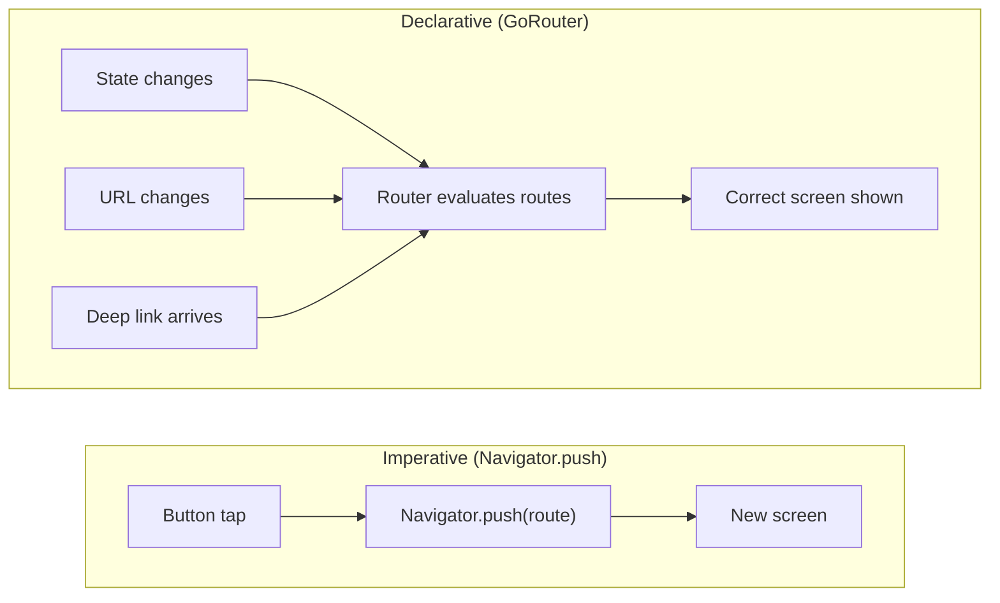
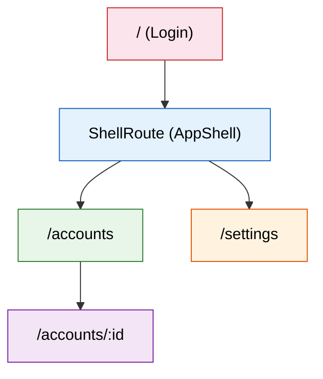
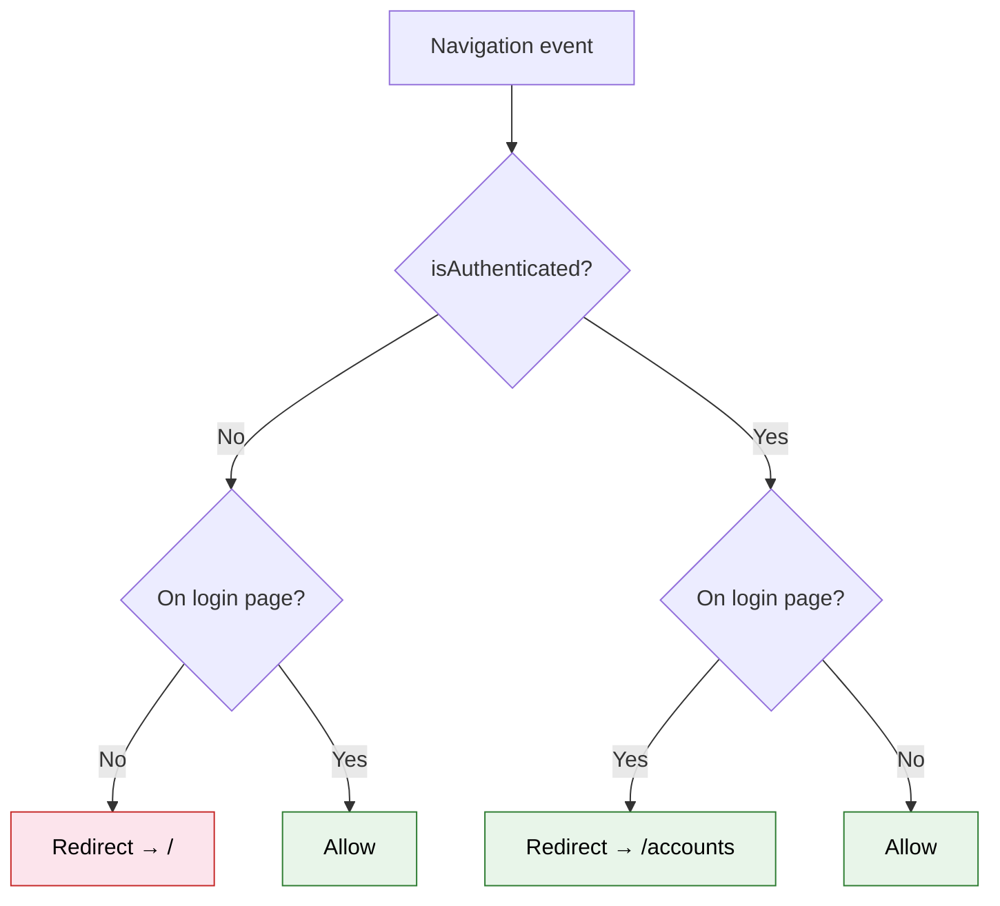

import Tabs from '@theme/Tabs';
import TabItem from '@theme/TabItem';

# Chapter 3: Navigating the Skies

> *"Navigation is the art of getting from where you are to where you want to be — the shortest, safest way."* — U.S. Navy Pilot Training Manual

**Estimated time:** ~30 minutes | **Focus:** Multi-screen Navigation | **Branch:** `chapter-3-navigation`

A banking app with one screen is not a banking app. Users need to sign in, view accounts, drill into transactions, and access settings — and they need the back button, deep links, and browser history to work correctly. This chapter replaces Flutter's imperative `Navigator.push` with `go_router`, a declarative routing package that handles all of this cleanly.

---

## 1. Why Declarative Routing

Flutter ships with `Navigator`, which uses an imperative push/pop model:

```dart
// Imperative — you tell Flutter exactly what to do
Navigator.push(
  context,
  MaterialPageRoute(builder: (context) => AccountsScreen()),
);
```

This works for simple apps but breaks down fast:

| Problem | What goes wrong |
|---------|----------------|
| **Deep links** | No URL structure. A link cannot open `/accounts/4521` directly. |
| **Browser back button** | On web, push/pop does not integrate with browser history properly. |
| **Redirect guards** | No built-in way to redirect unauthenticated users to login. |
| **Nested navigation** | Tabs with independent back stacks become a tangled mess of `Navigator` keys. |
| **Testability** | Routes are scattered across `onPressed` callbacks instead of a single config. |

`go_router` solves all of these by letting you declare your route tree in one place. Navigation becomes a function of *state* — the URL reflects where you are, and changing the URL changes the screen.



---

## 2. Add go_router

### Step 1: Add the dependency

```bash
flutter pub add go_router
```

This adds `go_router` to your `pubspec.yaml` and runs `pub get`.


### Step 2: Create the router configuration file

All routes live in a single file. This is your app's navigation map.

```dart title="lib/router.dart"
import 'package:flutter/material.dart';
import 'package:go_router/go_router.dart';

import 'screens/login_screen.dart';
import 'screens/accounts_screen.dart';
import 'screens/transactions_screen.dart';
import 'screens/settings_screen.dart';
import 'widgets/app_shell.dart';

final goRouter = GoRouter(
  initialLocation: '/',
  debugLogDiagnostics: true,
  routes: [
    // Login — no shell (no bottom nav)
    GoRoute(
      path: '/',
      name: 'login',
      builder: (context, state) => const LoginScreen(),
    ),

    // Authenticated routes wrapped in a ShellRoute
    ShellRoute(
      builder: (context, state, child) => AppShell(child: child),
      routes: [
        GoRoute(
          path: '/accounts',
          name: 'accounts',
          builder: (context, state) => const AccountsScreen(),
          routes: [
            // Nested route: /accounts/:id
            GoRoute(
              path: ':id',
              name: 'transactions',
              builder: (context, state) {
                final accountId = state.pathParameters['id']!;
                return TransactionsScreen(accountId: accountId);
              },
            ),
          ],
        ),
        GoRoute(
          path: '/settings',
          name: 'settings',
          builder: (context, state) => const SettingsScreen(),
        ),
      ],
    ),
  ],
);
```


---

## 3. Define the Routes

Our CoreBank app has four screens, each with a clear URL:



| Path | Screen | Notes |
|------|--------|-------|
| `/` | Login | No bottom nav bar |
| `/accounts` | Accounts overview | Bottom nav visible |
| `/accounts/:id` | Transactions for one account | Bottom nav visible, path parameter |
| `/settings` | Settings | Bottom nav visible |

Notice that `/accounts/:id` is nested under `/accounts`. This is intentional — `go_router` treats nested routes as children, which means `/accounts/4521` automatically has `/accounts` as its parent context.

---

## 4. ShellRoute for Persistent Bottom Navigation

The `ShellRoute` wraps all authenticated screens with a shared layout — in our case, a `BottomNavigationBar` that stays visible as you navigate between Accounts and Settings.

```dart title="lib/widgets/app_shell.dart"
import 'package:flutter/material.dart';
import 'package:go_router/go_router.dart';

class AppShell extends StatelessWidget {
  final Widget child;

  const AppShell({super.key, required this.child});

  @override
  Widget build(BuildContext context) {
    return Scaffold(
      body: child,
      bottomNavigationBar: NavigationBar(
        selectedIndex: _calculateSelectedIndex(context),
        onDestinationSelected: (index) => _onItemTapped(index, context),
        destinations: const [
          NavigationDestination(
            icon: Icon(Icons.account_balance_outlined),
            selectedIcon: Icon(Icons.account_balance),
            label: 'Accounts',
          ),
          NavigationDestination(
            icon: Icon(Icons.settings_outlined),
            selectedIcon: Icon(Icons.settings),
            label: 'Settings',
          ),
        ],
      ),
    );
  }

  int _calculateSelectedIndex(BuildContext context) {
    final location = GoRouterState.of(context).uri.path;
    if (location.startsWith('/accounts')) return 0;
    if (location.startsWith('/settings')) return 1;
    return 0;
  }

  void _onItemTapped(int index, BuildContext context) {
    switch (index) {
      case 0:
        context.go('/accounts');
      case 1:
        context.go('/settings');
    }
  }
}
```

:::tip[WHY THIS MATTERS]
Without `ShellRoute`, you would need to duplicate the `BottomNavigationBar` in every screen, manually synchronise the selected index, and handle the case where navigating between tabs rebuilds the entire widget tree (losing scroll position and state). `ShellRoute` keeps the shell widget alive while swapping only the `child`.

:::

---

## 5. Path Parameters and Query Parameters

`go_router` supports both path parameters (`:id`) and query parameters (`?sort=date`).

### Path parameters

Path parameters are part of the route definition and are required:

```dart
// Route definition
GoRoute(
  path: ':id',   // matches /accounts/4521
  builder: (context, state) {
    final accountId = state.pathParameters['id']!;
    return TransactionsScreen(accountId: accountId);
  },
),

// Navigation
context.go('/accounts/4521');
```

### Query parameters

Query parameters are optional and do not need to be declared in the route:

```dart
// Navigation with query params
context.go('/accounts/4521?sort=date&filter=debit');

// Reading them in the builder
GoRoute(
  path: ':id',
  builder: (context, state) {
    final accountId = state.pathParameters['id']!;
    final sortBy = state.uri.queryParameters['sort'] ?? 'date';
    final filter = state.uri.queryParameters['filter'];
    return TransactionsScreen(
      accountId: accountId,
      sortBy: sortBy,
      filter: filter,
    );
  },
),
```

:::info[TRY IT YOURSELF]
Add a query parameter `?highlight=true` to the transactions route. In `TransactionsScreen`, read the parameter and conditionally highlight the first transaction in the list with a coloured border. This exercises both route reading and conditional rendering.

:::

---

## 6. Redirect Guards

Banking apps must prevent unauthenticated users from accessing account data. `go_router` has a built-in `redirect` callback that runs before every navigation:

```dart title="lib/router.dart (updated)"
// Simple auth state — replaced with real auth in Chapter 6
bool isAuthenticated = false;

final goRouter = GoRouter(
  initialLocation: '/',
  debugLogDiagnostics: true,
  redirect: (context, state) {
    final loggingIn = state.matchedLocation == '/';

    // Not authenticated and not on login page → redirect to login
    if (!isAuthenticated && !loggingIn) {
      return '/';
    }

    // Authenticated but on login page → redirect to accounts
    if (isAuthenticated && loggingIn) {
      return '/accounts';
    }

    // No redirect needed
    return null;
  },
  routes: [
    // ... same routes as before
  ],
);
```



Now update the login screen to set `isAuthenticated = true` after successful validation, then call `context.go('/accounts')`:

```dart title="lib/screens/login_screen.dart (submit method)"
void _validateAndSubmit() {
  setState(() {
    _emailError = _validateEmail(_emailController.text);
    _passwordError = _validatePassword(_passwordController.text);
  });

  if (_emailError != null || _passwordError != null) return;

  setState(() => _isLoading = true);

  // Simulate auth — replaced with real auth in Chapter 6
  Future.delayed(const Duration(seconds: 1), () {
    if (!mounted) return;
    setState(() => _isLoading = false);

    // Set auth state and navigate
    isAuthenticated = true;
    context.go('/accounts');
  });
}
```

---

## 7. context.go() vs context.push()

`go_router` provides two navigation methods, and choosing the wrong one creates confusing back-button behaviour:

| Method | What it does | Back button behaviour |
|--------|-------------|----------------------|
| `context.go('/accounts')` | Replaces the navigation stack to match the target path | Back button follows the route hierarchy |
| `context.push('/accounts/4521')` | Pushes a new screen onto the current stack | Back button pops to the previous screen |

**Use `go` for top-level navigation** — switching between tabs, redirecting after login. The stack is rebuilt to match the URL.

**Use `push` for drilling down** — opening a specific account from the list. The user expects the back button to return to the list.

```dart title="lib/screens/accounts_screen.dart"
// Tap an account → push to transactions (back button returns here)
onTap: () {
  context.push('/accounts/${account.id}');
},
```

```dart title="lib/screens/login_screen.dart"
// After login → go to accounts (back button should NOT return to login)
context.go('/accounts');
```

:::tip[WHY THIS MATTERS]
If you use `push` to navigate after login, the user can tap the back button and land on the login screen again — even though they are authenticated. Using `go` replaces the stack entirely, so the login screen is no longer in the back stack. Think of `go` as "I am now *here*" and `push` as "show me this, and let me come back."

:::

---

## 8. Deep Linking Basics

One of `go_router`'s biggest wins is automatic deep link support. Because every screen has a URL, the OS can open your app directly to a specific screen.

On **Flutter Web**, deep linking works automatically — the browser URL bar reflects the current route, and pasting a URL navigates directly to that screen.

On **mobile**, you need to configure platform-specific settings:

<Tabs>
<TabItem value="android" label="Android" default>

Add an intent filter to `android/app/src/main/AndroidManifest.xml`:

```xml title="android/app/src/main/AndroidManifest.xml"
<intent-filter>
  <action android:name="android.intent.action.VIEW" />
  <category android:name="android.intent.category.DEFAULT" />
  <category android:name="android.intent.category.BROWSABLE" />
  <data
    android:scheme="https"
    android:host="corebank.app" />
</intent-filter>
```

</TabItem>
<TabItem value="ios" label="iOS">

Add associated domains to your `Info.plist` or Xcode signing settings:

```xml title="ios/Runner/Info.plist"
<key>FlutterDeepLinkingEnabled</key>
<true/>
```

And configure your Associated Domains entitlement:

```
applinks:corebank.app
```

</TabItem>
</Tabs>

With this in place, `https://corebank.app/accounts/4521` opens the app directly to the transactions screen for account 4521. The `go_router` redirect guard ensures that if the user is not authenticated, they see the login screen first, and after login they are forwarded to the original deep link destination.

---

## 9. Wire Up main.dart

Replace `MaterialApp` with `MaterialApp.router` to hand control to `go_router`:

```dart title="lib/main.dart"
import 'package:flutter/material.dart';
import 'router.dart';

void main() {
  runApp(const CoreBankApp());
}

class CoreBankApp extends StatelessWidget {
  const CoreBankApp({super.key});

  @override
  Widget build(BuildContext context) {
    return MaterialApp.router(
      title: 'CoreBank',
      debugShowCheckedModeBanner: false,
      theme: ThemeData(
        colorSchemeSeed: const Color(0xFF1565C0),
        useMaterial3: true,
        fontFamily: 'Inter',
      ),
      routerConfig: goRouter,
    );
  }
}
```

### Step 1: Create placeholder screens

You need `TransactionsScreen` and `SettingsScreen` for the routes to compile:

```dart title="lib/screens/transactions_screen.dart"
import 'package:flutter/material.dart';

class TransactionsScreen extends StatelessWidget {
  final String accountId;

  const TransactionsScreen({super.key, required this.accountId});

  @override
  Widget build(BuildContext context) {
    return Scaffold(
      appBar: AppBar(title: Text('Account $accountId')),
      body: Center(
        child: Text(
          'Transactions for account $accountId\n(Coming in Chapter 5)',
          textAlign: TextAlign.center,
        ),
      ),
    );
  }
}
```

```dart title="lib/screens/settings_screen.dart"
import 'package:flutter/material.dart';

class SettingsScreen extends StatelessWidget {
  const SettingsScreen({super.key});

  @override
  Widget build(BuildContext context) {
    return Scaffold(
      appBar: AppBar(title: const Text('Settings')),
      body: const Center(
        child: Text('Settings screen\n(Coming in Chapter 7)'),
      ),
    );
  }
}
```


### Step 2: Test the full navigation flow

Hot-restart the app (press `R`) since we changed `main.dart`. Then:

1. **Login screen** appears at `/`.
2. Fill in valid credentials and tap **Sign In**.
3. The app navigates to `/accounts` — the bottom nav bar is visible.
4. Tap an account — the app pushes to `/accounts/4521`.
5. Press back — you return to `/accounts`.
6. Tap **Settings** in the bottom nav — navigates to `/settings`.
7. Press back on the login screen — you should NOT be able to go back to an authenticated page.


---

## 10. Before / After: Navigator.push vs GoRouter

<Tabs>
<TabItem value="before" label="Before (Navigator.push)" default>

```dart title="Imperative navigation"
// In login screen — after auth
Navigator.pushReplacement(
  context,
  MaterialPageRoute(builder: (_) => AccountsScreen()),
);

// In accounts screen — drill into transactions
Navigator.push(
  context,
  MaterialPageRoute(
    builder: (_) => TransactionsScreen(accountId: '4521'),
  ),
);

// No URL structure, no deep links, no redirect guards
// Bottom nav requires manual Navigator key management
```

**Problems:**
- No URL for each screen
- Deep links require custom platform channel code
- Auth guards are ad-hoc checks scattered across screens
- Bottom navigation with independent back stacks is painful

</TabItem>
<TabItem value="after" label="After (GoRouter)">

```dart title="Declarative navigation"
// In login screen — after auth
context.go('/accounts');

// In accounts screen — drill into transactions
context.push('/accounts/4521');

// Router config handles:
// - URL structure automatically
// - Deep links on web and mobile
// - Auth redirect guard in one place
// - ShellRoute keeps bottom nav alive
```

**Wins:**
- Single source of truth for all routes
- Auth redirect in one `redirect` callback
- Deep links work on web, iOS, and Android
- `ShellRoute` handles persistent bottom navigation
- URLs visible in browser on Flutter Web

</TabItem>
</Tabs>

:::tip[CHECKPOINT]
After completing this chapter you should have:
- `go_router` installed and configured in `lib/router.dart`
- Four routes: `/`, `/accounts`, `/accounts/:id`, `/settings`
- A `ShellRoute` with a `BottomNavigationBar` wrapping authenticated screens
- A redirect guard that sends unauthenticated users to login
- `MaterialApp.router` replacing the old `MaterialApp` in `main.dart`
- Working navigation between all screens with correct back-button behaviour

:::

---

## Summary

Your app now has real navigation. Users sign in, browse accounts, drill into transactions, and access settings — all with working back buttons, URL-based routing, and auth guards. `ShellRoute` keeps the bottom navigation bar alive across screen changes, and deep links work on all platforms.

The routes are in place, but the data is still hardcoded. The next chapter introduces state management beyond `setState` — using Riverpod to share data across the widget tree without prop drilling.

Up next: **Chapter 4: The Cockpit** — where you manage app-wide state with Riverpod.
