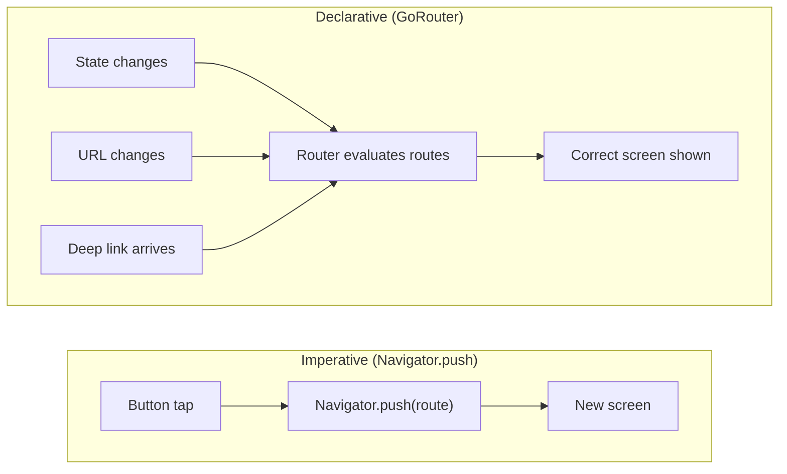
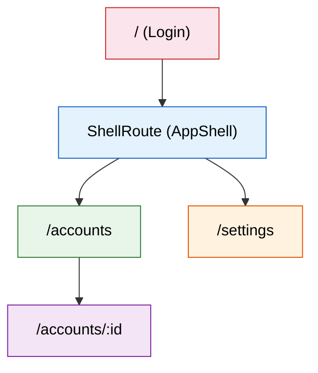

import Tabs from '@theme/Tabs';
import TabItem from '@theme/TabItem';

# Chapter 3: Navigating the Skies

> *"Navigation is the art of getting from where you are to where you want to be — the shortest, safest way."* — U.S. Navy Pilot Training Manual

**Estimated time:** ~30 minutes | **Focus:** Multi-screen Navigation | **Branch:** `chapter-3-navigation`

A banking app with one screen is not a banking app. Users need to sign in, view accounts, drill into transactions, and access settings — and they need the back button, deep links, and browser history to work correctly. This chapter replaces Flutter's imperative `Navigator.push` with `go_router`, a declarative routing package that handles all of this cleanly.

---

## 1. Why Declarative Routing

Flutter ships with `Navigator`, which uses an imperative push/pop model:

```dart
// Imperative — you tell Flutter exactly what to do
Navigator.push(
  context,
  MaterialPageRoute(builder: (context) => AccountsScreen()),
);
```

This works for simple apps but breaks down fast:

| Problem | What goes wrong |
|---------|----------------|
| **Deep links** | No URL structure. A link cannot open `/accounts/4521` directly. |
| **Browser back button** | On web, push/pop does not integrate with browser history properly. |
| **Redirect guards** | No built-in way to redirect unauthenticated users to login. |
| **Nested navigation** | Tabs with independent back stacks become a tangled mess of `Navigator` keys. |
| **Testability** | Routes are scattered across `onPressed` callbacks instead of a single config. |

`go_router` solves all of these by letting you declare your route tree in one place. Navigation becomes a function of *state* — the URL reflects where you are, and changing the URL changes the screen.



---

## 2. Add go_router

### Step 1: Add the dependency

```bash
flutter pub add go_router
```

This adds `go_router` to your `pubspec.yaml` and runs `pub get`.


### Step 2: Create the router configuration file

All routes live in a single file. This is your app's navigation map.

```dart title="lib/router.dart"
import 'package:flutter/material.dart';
import 'package:go_router/go_router.dart';

import 'screens/login_screen.dart';
import 'screens/accounts_screen.dart';
import 'screens/transactions_screen.dart';
import 'screens/settings_screen.dart';
import 'widgets/app_shell.dart';

final goRouter = GoRouter(
  initialLocation: '/',
  debugLogDiagnostics: true,
  routes: [
    // Login — no shell (no bottom nav)
    GoRoute(
      path: '/',
      name: 'login',
      builder: (context, state) => const LoginScreen(),
    ),

    // Authenticated routes wrapped in a ShellRoute
    ShellRoute(
      builder: (context, state, child) => AppShell(child: child),
      routes: [
        GoRoute(
          path: '/accounts',
          name: 'accounts',
          builder: (context, state) => const AccountsScreen(),
          routes: [
            // Nested route: /accounts/:id
            GoRoute(
              path: ':id',
              name: 'transactions',
              builder: (context, state) {
                final accountId = state.pathParameters['id']!;
                return TransactionsScreen(accountId: accountId);
              },
            ),
          ],
        ),
        GoRoute(
          path: '/settings',
          name: 'settings',
          builder: (context, state) => const SettingsScreen(),
        ),
      ],
    ),
  ],
);
```


---

## 3. Define the Routes

Our FlightBank app has four screens, each with a clear URL:



| Path | Screen | Notes |
|------|--------|-------|
| `/` | Login | No bottom nav bar |
| `/accounts` | Accounts overview | Bottom nav visible |
| `/accounts/:id` | Transactions for one account | Bottom nav visible, path parameter |
| `/settings` | Settings | Bottom nav visible |

Notice that `/accounts/:id` is nested under `/accounts`. This is intentional — `go_router` treats nested routes as children, which means `/accounts/4521` automatically has `/accounts` as its parent context.

---

## 4. ShellRoute for Persistent Bottom Navigation

The `ShellRoute` wraps all authenticated screens with a shared layout — in our case, a `BottomNavigationBar` that stays visible as you navigate between Accounts and Settings.

```dart title="lib/widgets/app_shell.dart"
import 'package:flutter/material.dart';
import 'package:go_router/go_router.dart';

class AppShell extends StatelessWidget {
  final Widget child;

  const AppShell({super.key, required this.child});

  @override
  Widget build(BuildContext context) {
    return Scaffold(
      body: child,
      bottomNavigationBar: NavigationBar(
        selectedIndex: _calculateSelectedIndex(context),
        onDestinationSelected: (index) => _onItemTapped(index, context),
        destinations: const [
          NavigationDestination(
            icon: Icon(Icons.account_balance_outlined),
            selectedIcon: Icon(Icons.account_balance),
            label: 'Accounts',
          ),
          NavigationDestination(
            icon: Icon(Icons.settings_outlined),
            selectedIcon: Icon(Icons.settings),
            label: 'Settings',
          ),
        ],
      ),
    );
  }

  int _calculateSelectedIndex(BuildContext context) {
    final location = GoRouterState.of(context).uri.path;
    if (location.startsWith('/accounts')) return 0;
    if (location.startsWith('/settings')) return 1;
    return 0;
  }

  void _onItemTapped(int index, BuildContext context) {
    switch (index) {
      case 0:
        context.go('/accounts');
      case 1:
        context.go('/settings');
    }
  }
}
```

:::tip[WHY THIS MATTERS]
Without `ShellRoute`, you would need to duplicate the `BottomNavigationBar` in every screen, manually synchronise the selected index, and handle the case where navigating between tabs rebuilds the entire widget tree (losing scroll position and state). `ShellRoute` keeps the shell widget alive while swapping only the `child`.

:::

---

## 5. Path Parameters and Query Parameters

`go_router` supports both path parameters (`:id`) and query parameters (`?sort=date`).

### Path parameters

Path parameters are part of the route definition and are required:

```dart
// Route definition
GoRoute(
  path: ':id',   // matches /accounts/4521
  builder: (context, state) {
    final accountId = state.pathParameters['id']!;
    return TransactionsScreen(accountId: accountId);
  },
),

// Navigation
context.go('/accounts/4521');
```

### Query parameters

Query parameters are optional and do not need to be declared in the route:

```dart
// Navigation with query params
context.go('/accounts/4521?sort=date&filter=debit');

// Reading them in the builder
GoRoute(
  path: ':id',
  builder: (context, state) {
    final accountId = state.pathParameters['id']!;
    final sortBy = state.uri.queryParameters['sort'] ?? 'date';
    final filter = state.uri.queryParameters['filter'];
    return TransactionsScreen(
      accountId: accountId,
      sortBy: sortBy,
      filter: filter,
    );
  },
),
```

:::info[TRY IT YOURSELF]
Add a query parameter `?highlight=true` to the transactions route. In `TransactionsScreen`, read the parameter and conditionally highlight the first transaction in the list with a coloured border. This exercises both route reading and conditional rendering.

:::


Continue to [Part 2](/chapters/navigation/part-2) to add redirect guards, deep linking, and wire up the full navigation flow.
