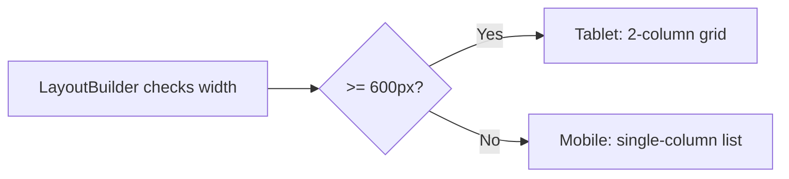

import Tabs from '@theme/Tabs';
import TabItem from '@theme/TabItem';

# Chapter 4: Building the Cockpit

> *"The cockpit is where chaos becomes control. Every dial, every switch, every light — placed with purpose."*
> — Aviation proverb

**Estimated time:** ~25 minutes | **Focus:** Theme & Custom Widgets | **Branch:** `chapter-4-cockpit`

In the previous chapters you built screens with default styling. That works for prototyping, but FlightBank needs to look like a real product. In this chapter you will build a complete design system: a colour palette, typography scale, dark mode, reusable widgets, and responsive layouts that adapt from phone to tablet.

---

## 1. ThemeData and ColorScheme.fromSeed

Flutter's `ThemeData` is the single source of truth for your app's visual identity. Rather than scattering colours across dozens of widgets, you define them once and let every widget inherit them automatically.

Material 3 introduced `ColorScheme.fromSeed`, which generates a full, harmonious palette from a single brand colour.

```dart title="lib/theme/app_theme.dart"
import 'package:flutter/material.dart';

class AppTheme {
  // FlightBank brand blue — our single seed colour
  static const Color _seedColor = Color(0xFF1565C0);

  static ThemeData light() {
    final colorScheme = ColorScheme.fromSeed(
      seedColor: _seedColor,
      brightness: Brightness.light,
    );

    return ThemeData(
      useMaterial3: true,
      colorScheme: colorScheme,
      scaffoldBackgroundColor: colorScheme.surface,
      appBarTheme: AppBarTheme(
        centerTitle: true,
        backgroundColor: colorScheme.surface,
        foregroundColor: colorScheme.onSurface,
        elevation: 0,
      ),
      cardTheme: CardThemeData(
        elevation: 0,
        shape: RoundedRectangleBorder(
          borderRadius: BorderRadius.circular(16),
        ),
        color: colorScheme.surfaceContainerLow,
      ),
    );
  }
}
```

:::tip[WHY THIS MATTERS]
`ColorScheme.fromSeed` does not just pick a few shades. It generates **29 tonal colour roles** — primary, secondary, tertiary, error, surface variants, and their on-colours — all guaranteed to meet accessibility contrast ratios. One seed colour gives you a production-ready palette.

:::

Apply the theme in `main.dart`:

```dart title="lib/main.dart"
import 'package:flight_bank/theme/app_theme.dart';

class FlightBankApp extends StatelessWidget {
  const FlightBankApp({super.key});

  @override
  Widget build(BuildContext context) {
    return MaterialApp(
      title: 'FlightBank',
      theme: AppTheme.light(),
      home: const LoginScreen(),
    );
  }
}
```

---

## 2. TextTheme — Defining Typography

A banking app needs a clear hierarchy: large balance figures, medium headings, compact transaction labels. Define this once in your theme.

```dart title="lib/theme/app_theme.dart (add to light method)"
static ThemeData light() {
  final colorScheme = ColorScheme.fromSeed(
    seedColor: _seedColor,
    brightness: Brightness.light,
  );

  const textTheme = TextTheme(
    displayLarge: TextStyle(
      fontSize: 36,
      fontWeight: FontWeight.w700,
      letterSpacing: -0.5,
    ),
    headlineMedium: TextStyle(
      fontSize: 24,
      fontWeight: FontWeight.w600,
    ),
    titleMedium: TextStyle(
      fontSize: 16,
      fontWeight: FontWeight.w500,
    ),
    bodyLarge: TextStyle(
      fontSize: 16,
      fontWeight: FontWeight.w400,
    ),
    bodyMedium: TextStyle(
      fontSize: 14,
      fontWeight: FontWeight.w400,
    ),
    labelLarge: TextStyle(
      fontSize: 14,
      fontWeight: FontWeight.w600,
      letterSpacing: 0.5,
    ),
  );

  return ThemeData(
    useMaterial3: true,
    colorScheme: colorScheme,
    textTheme: textTheme,
    // ... rest of theme
  );
}
```

Now use it anywhere in the app:

```dart
Text(
  '\$12,450.00',
  style: Theme.of(context).textTheme.displayLarge,
)
```

Never hardcode font sizes in individual widgets. Always reference the `textTheme`.

---

## 3. Dark Mode

FlightBank will support both light and dark themes. The `ThemeMode` enum has three values: `light`, `dark`, and `system` (follows OS preference).

### Step 1: Add a dark theme factory

```dart title="lib/theme/app_theme.dart"
static ThemeData dark() {
  final colorScheme = ColorScheme.fromSeed(
    seedColor: _seedColor,
    brightness: Brightness.dark,
  );

  return ThemeData(
    useMaterial3: true,
    colorScheme: colorScheme,
    scaffoldBackgroundColor: colorScheme.surface,
    appBarTheme: AppBarTheme(
      centerTitle: true,
      backgroundColor: colorScheme.surface,
      foregroundColor: colorScheme.onSurface,
      elevation: 0,
    ),
    cardTheme: CardThemeData(
      elevation: 0,
      shape: RoundedRectangleBorder(
        borderRadius: BorderRadius.circular(16),
      ),
      color: colorScheme.surfaceContainerLow,
    ),
    // Reuse the same textTheme — colours adapt automatically
    textTheme: _textTheme,
  );
}
```


### Step 2: Wire both themes into MaterialApp

```dart title="lib/main.dart"
class FlightBankApp extends StatefulWidget {
  const FlightBankApp({super.key});

  @override
  State<FlightBankApp> createState() => _FlightBankAppState();
}

class _FlightBankAppState extends State<FlightBankApp> {
  ThemeMode _themeMode = ThemeMode.system;

  void toggleTheme(bool isDark) {
    setState(() {
      _themeMode = isDark ? ThemeMode.dark : ThemeMode.light;
    });
  }

  @override
  Widget build(BuildContext context) {
    return MaterialApp(
      title: 'FlightBank',
      theme: AppTheme.light(),
      darkTheme: AppTheme.dark(),
      themeMode: _themeMode,
      home: const LoginScreen(),
    );
  }
}
```


:::info[TRY IT YOURSELF]
Run the app. Open your device's system settings and switch between light and dark mode. Your app should follow instantly. Later in Chapter 6, you will move this state into Riverpod so any screen can toggle it.

:::

---

## 4. Reusable Widgets

Raw `Container` and `Column` code scattered across screens is hard to maintain. Extract three reusable widgets that will appear on multiple screens.

### AccountCard

Displays a bank account summary: name, account number, and balance.

```dart title="lib/widgets/account_card.dart"
import 'package:flutter/material.dart';
import 'package:flight_bank/models/account.dart';

class AccountCard extends StatelessWidget {
  final Account account;
  final VoidCallback? onTap;

  const AccountCard({
    super.key,
    required this.account,
    this.onTap,
  });

  @override
  Widget build(BuildContext context) {
    final theme = Theme.of(context);
    final colors = theme.colorScheme;

    return Card(
      child: InkWell(
        onTap: onTap,
        borderRadius: BorderRadius.circular(16),
        child: Padding(
          padding: const EdgeInsets.all(20),
          child: Column(
            crossAxisAlignment: CrossAxisAlignment.start,
            children: [
              Row(
                mainAxisAlignment: MainAxisAlignment.spaceBetween,
                children: [
                  Text(
                    account.name,
                    style: theme.textTheme.titleMedium,
                  ),
                  Icon(
                    Icons.arrow_forward_ios,
                    size: 16,
                    color: colors.onSurfaceVariant,
                  ),
                ],
              ),
              const SizedBox(height: 4),
              Text(
                account.maskedNumber,
                style: theme.textTheme.bodyMedium?.copyWith(
                  color: colors.onSurfaceVariant,
                ),
              ),
              const SizedBox(height: 16),
              Text(
                account.formattedBalance,
                style: theme.textTheme.displayLarge?.copyWith(
                  color: colors.primary,
                ),
              ),
            ],
          ),
        ),
      ),
    );
  }
}
```

### TransactionTile

A single row in a transaction list:

```dart title="lib/widgets/transaction_tile.dart"
import 'package:flutter/material.dart';
import 'package:flight_bank/models/transaction.dart';

class TransactionTile extends StatelessWidget {
  final Transaction transaction;

  const TransactionTile({super.key, required this.transaction});

  @override
  Widget build(BuildContext context) {
    final theme = Theme.of(context);
    final isCredit = transaction.amount > 0;

    return ListTile(
      leading: CircleAvatar(
        backgroundColor: isCredit
            ? theme.colorScheme.primaryContainer
            : theme.colorScheme.errorContainer,
        child: Icon(
          isCredit ? Icons.arrow_downward : Icons.arrow_upward,
          color: isCredit
              ? theme.colorScheme.onPrimaryContainer
              : theme.colorScheme.onErrorContainer,
        ),
      ),
      title: Text(transaction.description),
      subtitle: Text(
        transaction.formattedDate,
        style: theme.textTheme.bodySmall,
      ),
      trailing: Text(
        transaction.formattedAmount,
        style: theme.textTheme.titleMedium?.copyWith(
          color: isCredit
              ? theme.colorScheme.primary
              : theme.colorScheme.error,
          fontWeight: FontWeight.w600,
        ),
      ),
    );
  }
}
```

### FlightButton

A branded button with loading state:

```dart title="lib/widgets/flight_button.dart"
import 'package:flutter/material.dart';

class FlightButton extends StatelessWidget {
  final String label;
  final VoidCallback? onPressed;
  final bool isLoading;
  final bool isOutlined;

  const FlightButton({
    super.key,
    required this.label,
    this.onPressed,
    this.isLoading = false,
    this.isOutlined = false,
  });

  @override
  Widget build(BuildContext context) {
    final child = isLoading
        ? const SizedBox(
            height: 20,
            width: 20,
            child: CircularProgressIndicator(strokeWidth: 2),
          )
        : Text(label);

    if (isOutlined) {
      return SizedBox(
        width: double.infinity,
        height: 52,
        child: OutlinedButton(
          onPressed: isLoading ? null : onPressed,
          child: child,
        ),
      );
    }

    return SizedBox(
      width: double.infinity,
      height: 52,
      child: FilledButton(
        onPressed: isLoading ? null : onPressed,
        child: child,
      ),
    );
  }
}
```

---

## 5. Responsive Layout

A banking app should look great on both a phone and a tablet. Use `LayoutBuilder` to inspect the available width and switch layouts at a breakpoint.

```dart title="lib/widgets/responsive_layout.dart"
import 'package:flutter/material.dart';

class ResponsiveLayout extends StatelessWidget {
  final Widget mobile;
  final Widget? tablet;

  const ResponsiveLayout({
    super.key,
    required this.mobile,
    this.tablet,
  });

  static const double breakpoint = 600;

  @override
  Widget build(BuildContext context) {
    return LayoutBuilder(
      builder: (context, constraints) {
        if (constraints.maxWidth >= breakpoint && tablet != null) {
          return tablet!;
        }
        return mobile;
      },
    );
  }
}
```

Use it on the accounts screen to show a list on phones and a two-column grid on tablets:

```dart title="lib/screens/accounts_screen.dart (build method)"
@override
Widget build(BuildContext context) {
  return Scaffold(
    appBar: AppBar(title: const Text('Accounts')),
    body: ResponsiveLayout(
      mobile: ListView.separated(
        padding: const EdgeInsets.all(16),
        itemCount: accounts.length,
        separatorBuilder: (_, __) => const SizedBox(height: 12),
        itemBuilder: (context, index) => AccountCard(
          account: accounts[index],
          onTap: () => _onAccountTap(accounts[index]),
        ),
      ),
      tablet: GridView.builder(
        padding: const EdgeInsets.all(24),
        gridDelegate: const SliverGridDelegateWithFixedCrossAxisCount(
          crossAxisCount: 2,
          crossAxisSpacing: 16,
          mainAxisSpacing: 16,
          childAspectRatio: 1.8,
        ),
        itemCount: accounts.length,
        itemBuilder: (context, index) => AccountCard(
          account: accounts[index],
          onTap: () => _onAccountTap(accounts[index]),
        ),
      ),
    ),
  );
}
```



---

## 6. Settings Screen with Theme Toggle

Build a simple settings screen where users can switch between light and dark mode.

```dart title="lib/screens/settings_screen.dart"
import 'package:flutter/material.dart';

class SettingsScreen extends StatelessWidget {
  final ThemeMode currentMode;
  final ValueChanged<bool> onThemeToggle;

  const SettingsScreen({
    super.key,
    required this.currentMode,
    required this.onThemeToggle,
  });

  @override
  Widget build(BuildContext context) {
    final theme = Theme.of(context);
    final isDark = currentMode == ThemeMode.dark;

    return Scaffold(
      appBar: AppBar(title: const Text('Settings')),
      body: ListView(
        children: [
          const SizedBox(height: 8),
          _SectionHeader(title: 'Appearance', theme: theme),
          SwitchListTile(
            title: const Text('Dark Mode'),
            subtitle: const Text('Toggle dark theme on or off'),
            secondary: Icon(
              isDark ? Icons.dark_mode : Icons.light_mode,
              color: theme.colorScheme.primary,
            ),
            value: isDark,
            onChanged: onThemeToggle,
          ),
          const Divider(),
          _SectionHeader(title: 'Account', theme: theme),
          ListTile(
            leading: const Icon(Icons.person_outline),
            title: const Text('Profile'),
            trailing: const Icon(Icons.arrow_forward_ios, size: 16),
            onTap: () {},
          ),
          ListTile(
            leading: const Icon(Icons.notifications_outlined),
            title: const Text('Notifications'),
            trailing: const Icon(Icons.arrow_forward_ios, size: 16),
            onTap: () {},
          ),
          ListTile(
            leading: const Icon(Icons.security_outlined),
            title: const Text('Security'),
            trailing: const Icon(Icons.arrow_forward_ios, size: 16),
            onTap: () {},
          ),
          const Divider(),
          _SectionHeader(title: 'About', theme: theme),
          ListTile(
            leading: const Icon(Icons.info_outline),
            title: const Text('App Version'),
            subtitle: const Text('1.0.0 (build 1)'),
          ),
        ],
      ),
    );
  }
}

class _SectionHeader extends StatelessWidget {
  final String title;
  final ThemeData theme;

  const _SectionHeader({required this.title, required this.theme});

  @override
  Widget build(BuildContext context) {
    return Padding(
      padding: const EdgeInsets.symmetric(horizontal: 16, vertical: 8),
      child: Text(
        title.toUpperCase(),
        style: theme.textTheme.labelLarge?.copyWith(
          color: theme.colorScheme.primary,
        ),
      ),
    );
  }
}
```

---

## 7. Material 3 Design Tokens

Material 3 organises visual properties into **design tokens** — named, semantic values that replace hardcoded numbers. Here is how the key token categories map to Flutter:

| Token category | Flutter API | Example |
|---|---|---|
| **Colour** | `ColorScheme` | `colorScheme.primary`, `colorScheme.surfaceContainerHigh` |
| **Typography** | `TextTheme` | `textTheme.headlineMedium` |
| **Shape** | `ShapeBorder` on component themes | `RoundedRectangleBorder(borderRadius: ...)` |
| **Elevation** | `elevation` on component themes | `CardTheme(elevation: 0)` |
| **Motion** | `Durations`, `Easing` | `Durations.medium2`, `Easing.emphasizedDecelerate` |

:::tip[WHY THIS MATTERS]
Design tokens mean you describe *what* something is ("this is a primary container"), not *how* it looks ("this is `#1565C0`"). When you change the seed colour or switch to dark mode, every widget updates automatically because they reference roles, not raw values.

:::

Reference colour roles rather than raw values everywhere in your code:

```dart
// GOOD — semantic role
Container(color: Theme.of(context).colorScheme.primaryContainer)

// BAD — hardcoded colour
Container(color: Color(0xFFBBDEFB))
```

---

## Checkpoint

:::tip[CHECKPOINT]
By the end of this chapter you should have:

- A light and dark theme defined in `AppTheme` with a single seed colour
- A `TextTheme` with clear typographic hierarchy
- `ThemeMode` toggling between light, dark, and system
- Three reusable widgets: `AccountCard`, `TransactionTile`, `FlightButton`
- A `ResponsiveLayout` widget that adapts to screen width
- A `SettingsScreen` with a working dark mode toggle
- No hardcoded colours or font sizes in any widget

Run `flutter analyze` — you should have zero issues.

:::

Head to the quiz to test your understanding, then continue to [Chapter 5: Talking to the Tower](/chapters/networking).
