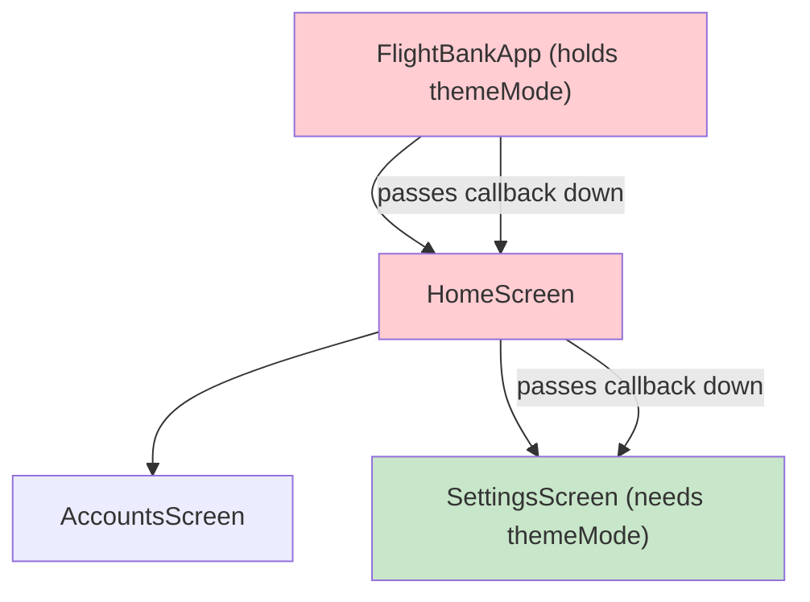
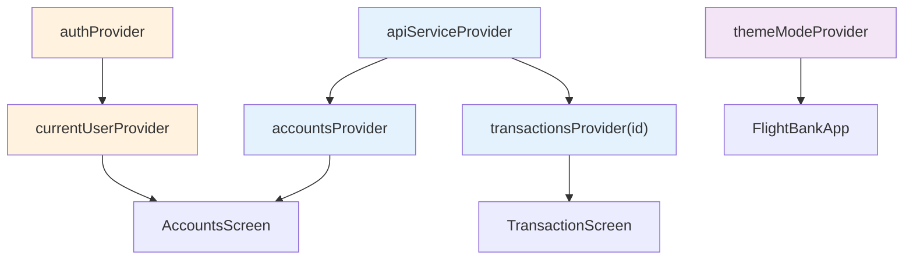

import Tabs from '@theme/Tabs';
import TabItem from '@theme/TabItem';

# Chapter 6: Autopilot Engaged

> *"Autopilot doesn't replace the pilot — it frees the pilot to focus on what matters. State management does the same for your code."*
> — Software engineering wisdom

**Estimated time:** ~30 minutes | **Focus:** State Management with Riverpod 3 | **Branch:** `chapter-6-autopilot`

In the previous chapters you used `setState` to manage local widget state. That works for small screens, but FlightBank is growing: accounts, transactions, user preferences, and theme settings all need to be shared across screens. This chapter introduces Riverpod 3 — Flutter's most popular state management solution — and refactors the entire app to use it.

---

## 1. The Problem with setState at Scale

Consider what happens as FlightBank grows:

**Prop drilling** — The theme toggle lives in `main.dart`, but the settings screen needs it. You pass callbacks down through every intermediate widget, even ones that do not care about the theme.

**Rebuild scope** — Calling `setState` rebuilds the entire widget. If a `ListView` of 100 transactions lives inside, all 100 rebuild when a single value changes.

**Testing** — To test a widget that depends on `setState` in a parent, you need to set up the entire widget tree. There is no way to test state logic in isolation.



Every widget in the red path carries state it does not use — just so it can pass it to the green widget that does. Riverpod eliminates this entirely.

---

## 2. Riverpod 3 Overview

Riverpod provides **providers** — global, type-safe, testable containers for state. Any widget can read any provider without prop drilling.

Key provider types in Riverpod 3:

| Provider type | Use case | Example |
|---|---|---|
| `Provider` | Computed/constant value | Current user, API service instance |
| `NotifierProvider` | Synchronous mutable state | Theme mode, form state |
| `AsyncNotifierProvider` | Async mutable state (with loading/error) | Accounts from API |
| `StreamProvider` | Reactive stream | Real-time balance updates |
| `FutureProvider` | Simple one-shot async | Fetch-once configuration |

:::tip[WHY THIS MATTERS]
Riverpod 3 uses code generation (via `riverpod_annotation` and `riverpod_generator`) to reduce boilerplate. You annotate a class or function, run `build_runner`, and the provider is generated for you. This chapter shows both the annotation style and the underlying types so you understand what the generator produces.

:::

---

## 3. Setup

### Step 1: Add dependencies

```bash
flutter pub add flutter_riverpod riverpod_annotation
flutter pub add --dev riverpod_generator build_runner
```


### Step 2: Wrap the app in ProviderScope

`ProviderScope` is the root container that holds all provider state. It must wrap `MaterialApp`.

```dart title="lib/main.dart"
import 'package:flutter_riverpod/flutter_riverpod.dart';

void main() {
  runApp(
    const ProviderScope(
      child: FlightBankApp(),
    ),
  );
}
```


### Step 3: Convert FlightBankApp to ConsumerWidget

```dart title="lib/main.dart"
class FlightBankApp extends ConsumerWidget {
  const FlightBankApp({super.key});

  @override
  Widget build(BuildContext context, WidgetRef ref) {
    final themeMode = ref.watch(themeModeProvider);

    return MaterialApp(
      title: 'FlightBank',
      theme: AppTheme.light(),
      darkTheme: AppTheme.dark(),
      themeMode: themeMode,
      home: const LoginScreen(),
    );
  }
}
```


---

## 4. First Provider: Current User

Start simple. A `Provider` exposes a value that any widget can read.

```dart title="lib/providers/user_provider.dart"
import 'package:riverpod_annotation/riverpod_annotation.dart';
import 'package:flight_bank/models/user.dart';

part 'user_provider.g.dart';

@riverpod
User currentUser(ref) {
  // For now, return a hardcoded user.
  // In production this would come from auth state.
  return const User(
    id: 'usr-001',
    name: 'Amelia Earhart',
    email: 'amelia@flightbank.dev',
  );
}
```

After running `build_runner` (section 10), this generates a `currentUserProvider` that you can read anywhere:

```dart
final user = ref.watch(currentUserProvider);
Text('Welcome, ${user.name}');
```

---

## 5. ConsumerWidget and ConsumerStatefulWidget

Riverpod provides two widget base classes that give you access to `ref`:

**ConsumerWidget** — for stateless widgets that read providers:

```dart
class GreetingWidget extends ConsumerWidget {
  const GreetingWidget({super.key});

  @override
  Widget build(BuildContext context, WidgetRef ref) {
    final user = ref.watch(currentUserProvider);
    return Text('Welcome, ${user.name}');
  }
}
```

**ConsumerStatefulWidget** — for widgets that also need `initState`, controllers, etc.:

```dart
class SearchScreen extends ConsumerStatefulWidget {
  const SearchScreen({super.key});

  @override
  ConsumerState<SearchScreen> createState() => _SearchScreenState();
}

class _SearchScreenState extends ConsumerState<SearchScreen> {
  final _controller = TextEditingController();

  @override
  Widget build(BuildContext context) {
    final accounts = ref.watch(accountsProvider);
    // Use both _controller (local) and accounts (provider)
    return TextField(controller: _controller);
  }
}
```

The rule is straightforward: use `ConsumerWidget` when you can, `ConsumerStatefulWidget` when you need lifecycle methods or mutable local state (like `TextEditingController`).

---

## 6. AsyncNotifierProvider — Accounts from the API

The accounts screen currently uses `FutureBuilder`. Replace it with an `AsyncNotifierProvider` that gives you loading, error, and data states — plus the ability to refresh, add, and modify accounts.

```dart title="lib/providers/accounts_provider.dart"
import 'package:riverpod_annotation/riverpod_annotation.dart';
import 'package:flight_bank/models/account.dart';
import 'package:flight_bank/services/api_service.dart';

part 'accounts_provider.g.dart';

@riverpod
class Accounts extends _$Accounts {
  @override
  Future<List<Account>> build() async {
    final apiService = ref.read(apiServiceProvider);
    return apiService.getAccounts();
  }

  /// Pull-to-refresh: invalidate and refetch.
  Future<void> refresh() async {
    state = const AsyncLoading();
    state = await AsyncValue.guard(() {
      final apiService = ref.read(apiServiceProvider);
      return apiService.getAccounts();
    });
  }
}
```

And the `ApiService` as a simple provider:

```dart title="lib/providers/api_service_provider.dart"
import 'package:riverpod_annotation/riverpod_annotation.dart';
import 'package:flight_bank/services/api_service.dart';

part 'api_service_provider.g.dart';

@riverpod
ApiService apiService(ref) {
  return ApiService();
}
```

---

## 7. Refactor: Login Screen

<Tabs>
<TabItem value="before" label="Before (setState)">

```dart title="lib/screens/login_screen.dart"
class LoginScreen extends StatefulWidget {
  const LoginScreen({super.key});

  @override
  State<LoginScreen> createState() => _LoginScreenState();
}

class _LoginScreenState extends State<LoginScreen> {
  bool _isLoading = false;
  String? _error;

  Future<void> _login() async {
    setState(() {
      _isLoading = true;
      _error = null;
    });

    try {
      await Future.delayed(const Duration(seconds: 2));
      if (!mounted) return;
      Navigator.pushReplacement(
        context,
        MaterialPageRoute(builder: (_) => const HomeScreen()),
      );
    } catch (e) {
      setState(() => _error = e.toString());
    } finally {
      if (mounted) setState(() => _isLoading = false);
    }
  }

  @override
  Widget build(BuildContext context) {
    return Scaffold(
      body: Column(
        children: [
          if (_error != null) Text(_error!),
          FlightButton(
            label: 'Log In',
            isLoading: _isLoading,
            onPressed: _login,
          ),
        ],
      ),
    );
  }
}
```

</TabItem>
<TabItem value="after" label="After (Riverpod)">

```dart title="lib/providers/auth_provider.dart"
@riverpod
class Auth extends _$Auth {
  @override
  Future<User?> build() async => null; // not logged in initially

  Future<void> login(String email, String password) async {
    state = const AsyncLoading();
    state = await AsyncValue.guard(() async {
      await Future.delayed(const Duration(seconds: 2));
      return const User(
        id: 'usr-001',
        name: 'Amelia Earhart',
        email: 'amelia@flightbank.dev',
      );
    });
  }
}
```

```dart title="lib/screens/login_screen.dart"
class LoginScreen extends ConsumerWidget {
  const LoginScreen({super.key});

  @override
  Widget build(BuildContext context, WidgetRef ref) {
    final authState = ref.watch(authProvider);

    ref.listen(authProvider, (prev, next) {
      if (next.valueOrNull != null) {
        Navigator.pushReplacement(
          context,
          MaterialPageRoute(builder: (_) => const HomeScreen()),
        );
      }
    });

    return Scaffold(
      body: Column(
        children: [
          if (authState.hasError)
            Text(authState.error.toString()),
          FlightButton(
            label: 'Log In',
            isLoading: authState.isLoading,
            onPressed: () {
              ref.read(authProvider.notifier).login(
                    'amelia@flightbank.dev',
                    'password',
                  );
            },
          ),
        ],
      ),
    );
  }
}
```

</TabItem>
</Tabs>

The login screen is now a `ConsumerWidget` — no `StatefulWidget` needed. Loading and error state live in the provider, not the widget. The widget just watches and reacts.

---

## 8. Refactor: Accounts Screen

<Tabs>
<TabItem value="before" label="Before (FutureBuilder)">

```dart title="lib/screens/accounts_screen.dart"
class _AccountsScreenState extends State<AccountsScreen> {
  final _api = ApiService();
  late final Future<List<Account>> _accountsFuture;

  @override
  void initState() {
    super.initState();
    _accountsFuture = _api.getAccounts();
  }

  @override
  Widget build(BuildContext context) {
    return Scaffold(
      body: FutureBuilder<List<Account>>(
        future: _accountsFuture,
        builder: (context, snapshot) {
          if (snapshot.connectionState == ConnectionState.waiting) {
            return const _AccountsLoadingSkeleton();
          }
          if (snapshot.hasError) {
            return Center(child: Text('Error: ${snapshot.error}'));
          }
          return _buildList(snapshot.data!);
        },
      ),
    );
  }
}
```

</TabItem>
<TabItem value="after" label="After (Riverpod)">

```dart title="lib/screens/accounts_screen.dart"
class AccountsScreen extends ConsumerWidget {
  const AccountsScreen({super.key});

  @override
  Widget build(BuildContext context, WidgetRef ref) {
    final accountsAsync = ref.watch(accountsProvider);

    return Scaffold(
      appBar: AppBar(title: const Text('Accounts')),
      body: accountsAsync.when(
        loading: () => const _AccountsLoadingSkeleton(),
        error: (error, stack) => Center(
          child: Column(
            mainAxisSize: MainAxisSize.min,
            children: [
              Text('Error: $error'),
              const SizedBox(height: 8),
              FilledButton(
                onPressed: () =>
                    ref.read(accountsProvider.notifier).refresh(),
                child: const Text('Retry'),
              ),
            ],
          ),
        ),
        data: (accounts) => RefreshIndicator(
          onRefresh: () =>
              ref.read(accountsProvider.notifier).refresh(),
          child: ListView.separated(
            padding: const EdgeInsets.all(16),
            itemCount: accounts.length,
            separatorBuilder: (_, __) => const SizedBox(height: 12),
            itemBuilder: (context, index) => AccountCard(
              account: accounts[index],
            ),
          ),
        ),
      ),
    );
  }
}
```

</TabItem>
</Tabs>

Notice the improvements: `ConsumerWidget` instead of `ConsumerStatefulWidget`, no `initState`, no manual `Future` management. The `.when()` method provides exhaustive handling of all three states. Pull-to-refresh calls `refresh()` on the notifier.

---

## 9. Family Providers — Parameterized State

Transactions are scoped to a specific account. You need a provider that takes `accountId` as a parameter. Riverpod calls this a "family" provider.

```dart title="lib/providers/transactions_provider.dart"
import 'package:riverpod_annotation/riverpod_annotation.dart';
import 'package:flight_bank/models/transaction.dart';

part 'transactions_provider.g.dart';

@riverpod
class Transactions extends _$Transactions {
  @override
  Future<List<Transaction>> build(String accountId) async {
    final apiService = ref.read(apiServiceProvider);
    return apiService.getTransactions(accountId);
  }

  Future<void> refresh() async {
    state = const AsyncLoading();
    state = await AsyncValue.guard(() {
      final apiService = ref.read(apiServiceProvider);
      return apiService.getTransactions(accountId);
    });
  }
}
```

Use it in a screen:

```dart
// The generator creates transactionsProvider(accountId)
final txAsync = ref.watch(transactionsProvider(account.id));

txAsync.when(
  loading: () => const CircularProgressIndicator(),
  error: (e, _) => Text('Error: $e'),
  data: (transactions) => ListView.builder(
    itemCount: transactions.length,
    itemBuilder: (_, i) => TransactionTile(transaction: transactions[i]),
  ),
);
```

Each unique `accountId` gets its own provider instance with its own loading/error/data state. Riverpod caches the result and disposes it when no widget is watching.

---

## Provider Dependency Graph

Here is how FlightBank's providers relate to each other:



Blue providers handle data fetching, orange handle authentication, and purple handles UI preferences. Any provider can depend on any other provider through `ref.read` or `ref.watch`.

---

## 10. Running build_runner

Riverpod 3 code generation creates the `.g.dart` files that contain the actual provider declarations.

```bash
dart run build_runner build --delete-conflicting-outputs
```

Or run it in watch mode during development:

```bash
dart run build_runner watch --delete-conflicting-outputs
```

:::info[TRY IT YOURSELF]
Run `build_runner` now. You should see `.g.dart` files appear next to each provider file. Open one to see what was generated — it creates the provider variable and wires up the notifier class.

:::

Every time you add or modify a `@riverpod` annotation, re-run `build_runner`. The `watch` command does this automatically on file save.

---

## 11. Testing Providers in Isolation

One of Riverpod's greatest strengths is testability. You can test a provider without any widget tree by using `ProviderContainer`.

```dart title="test/providers/accounts_provider_test.dart"
import 'package:flutter_test/flutter_test.dart';
import 'package:flutter_riverpod/flutter_riverpod.dart';
import 'package:flight_bank/providers/accounts_provider.dart';
import 'package:flight_bank/providers/api_service_provider.dart';
import 'package:flight_bank/services/api_service.dart';

void main() {
  test('accountsProvider fetches accounts from API', () async {
    // Create a container with a mock API service
    final container = ProviderContainer(
      overrides: [
        apiServiceProvider.overrideWithValue(
          MockApiService(), // returns canned data
        ),
      ],
    );
    addTearDown(container.dispose);

    // Read the provider — triggers build()
    final future = container.read(accountsProvider.future);
    final accounts = await future;

    expect(accounts, hasLength(3));
    expect(accounts.first.name, 'Checking Account');
  });

  test('accountsProvider handles API errors', () async {
    final container = ProviderContainer(
      overrides: [
        apiServiceProvider.overrideWithValue(
          FailingApiService(), // throws ApiException
        ),
      ],
    );
    addTearDown(container.dispose);

    final value = await container.read(accountsProvider.future)
        .then((_) => null)
        .catchError((e) => e);

    expect(value, isA<ApiException>());
  });
}
```

No `WidgetTester`, no `pumpWidget`, no widget tree. Pure logic testing. This is why Riverpod is preferred for serious apps.

---

## Theme Mode Provider

Before wrapping up, here is the `themeModeProvider` referenced in section 3:

```dart title="lib/providers/theme_provider.dart"
import 'package:flutter/material.dart';
import 'package:riverpod_annotation/riverpod_annotation.dart';

part 'theme_provider.g.dart';

@riverpod
class ThemeModeNotifier extends _$ThemeModeNotifier {
  @override
  ThemeMode build() => ThemeMode.system;

  void toggle(bool isDark) {
    state = isDark ? ThemeMode.dark : ThemeMode.light;
  }
}
```

The settings screen now reads and writes through the provider:

```dart
// In SettingsScreen (now a ConsumerWidget)
final mode = ref.watch(themeModeNotifierProvider);

SwitchListTile(
  value: mode == ThemeMode.dark,
  onChanged: (isDark) {
    ref.read(themeModeNotifierProvider.notifier).toggle(isDark);
  },
)
```

No more callback drilling from `main.dart` through intermediate screens.

---

## Checkpoint

:::tip[CHECKPOINT]
By the end of this chapter you should have:

- `flutter_riverpod` and `riverpod_annotation` installed
- `ProviderScope` wrapping the app in `main.dart`
- Providers for: API service, current user, auth state, accounts, transactions, theme mode
- Login screen refactored from `setState` to Riverpod
- Accounts screen refactored from `FutureBuilder` to `accountsProvider.when()`
- Family provider for `transactionsProvider(accountId)`
- `build_runner` generating `.g.dart` files
- At least one provider test using `ProviderContainer`

Run all tests: `flutter test` — everything should pass.

:::

Head to the quiz, then continue to [Chapter 7: Flight Recorder](/chapters/recorder).
