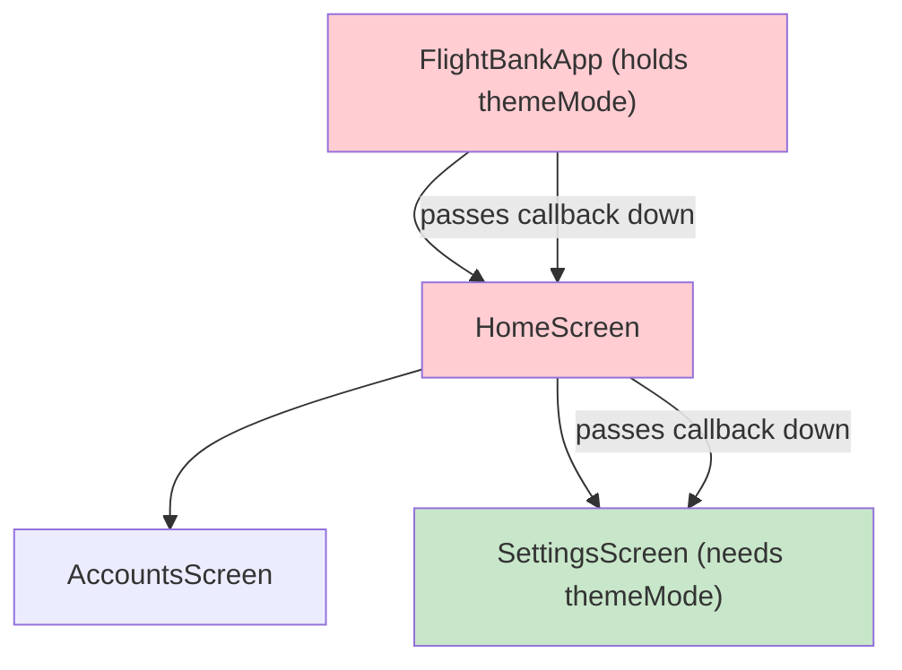

import Tabs from '@theme/Tabs';
import TabItem from '@theme/TabItem';

# Chapter 6: Autopilot Engaged

> *"Autopilot doesn't replace the pilot — it frees the pilot to focus on what matters. State management does the same for your code."*
> — Software engineering wisdom

**Estimated time:** ~30 minutes | **Focus:** State Management with Riverpod 3 | **Branch:** `chapter-6-autopilot`

In the previous chapters you used `setState` to manage local widget state. That works for small screens, but FlightBank is growing: accounts, transactions, user preferences, and theme settings all need to be shared across screens. This chapter introduces Riverpod 3 — Flutter's most popular state management solution — and refactors the entire app to use it.

---

## 1. The Problem with setState at Scale

Consider what happens as FlightBank grows:

**Prop drilling** — The theme toggle lives in `main.dart`, but the settings screen needs it. You pass callbacks down through every intermediate widget, even ones that do not care about the theme.

**Rebuild scope** — Calling `setState` rebuilds the entire widget. If a `ListView` of 100 transactions lives inside, all 100 rebuild when a single value changes.

**Testing** — To test a widget that depends on `setState` in a parent, you need to set up the entire widget tree. There is no way to test state logic in isolation.



Every widget in the red path carries state it does not use — just so it can pass it to the green widget that does. Riverpod eliminates this entirely.

---

## 2. Riverpod 3 Overview

Riverpod provides **providers** — global, type-safe, testable containers for state. Any widget can read any provider without prop drilling.

Key provider types in Riverpod 3:

| Provider type | Use case | Example |
|---|---|---|
| `Provider` | Computed/constant value | Current user, API service instance |
| `NotifierProvider` | Synchronous mutable state | Theme mode, form state |
| `AsyncNotifierProvider` | Async mutable state (with loading/error) | Accounts from API |
| `StreamProvider` | Reactive stream | Real-time balance updates |
| `FutureProvider` | Simple one-shot async | Fetch-once configuration |

:::tip[WHY THIS MATTERS]
Riverpod 3 uses code generation (via `riverpod_annotation` and `riverpod_generator`) to reduce boilerplate. You annotate a class or function, run `build_runner`, and the provider is generated for you. This chapter shows both the annotation style and the underlying types so you understand what the generator produces.

:::

---

## 3. Setup

### Step 1: Add dependencies

```bash
flutter pub add flutter_riverpod riverpod_annotation
flutter pub add --dev riverpod_generator build_runner
```


### Step 2: Wrap the app in ProviderScope

`ProviderScope` is the root container that holds all provider state. It must wrap `MaterialApp`.

```dart title="lib/main.dart"
import 'package:flutter_riverpod/flutter_riverpod.dart';

void main() {
  runApp(
    const ProviderScope(
      child: FlightBankApp(),
    ),
  );
}
```


### Step 3: Convert FlightBankApp to ConsumerWidget

```dart title="lib/main.dart"
class FlightBankApp extends ConsumerWidget {
  const FlightBankApp({super.key});

  @override
  Widget build(BuildContext context, WidgetRef ref) {
    final themeMode = ref.watch(themeModeProvider);

    return MaterialApp(
      title: 'FlightBank',
      theme: AppTheme.light(),
      darkTheme: AppTheme.dark(),
      themeMode: themeMode,
      home: const LoginScreen(),
    );
  }
}
```


---

## 4. First Provider: Current User

Start simple. A `Provider` exposes a value that any widget can read.

```dart title="lib/providers/user_provider.dart"
import 'package:riverpod_annotation/riverpod_annotation.dart';
import 'package:flight_bank/models/user.dart';

part 'user_provider.g.dart';

@riverpod
User currentUser(ref) {
  // For now, return a hardcoded user.
  // In production this would come from auth state.
  return const User(
    id: 'usr-001',
    name: 'Amelia Earhart',
    email: 'amelia@flightbank.dev',
  );
}
```

After running `build_runner` (section 10), this generates a `currentUserProvider` that you can read anywhere:

```dart
final user = ref.watch(currentUserProvider);
Text('Welcome, ${user.name}');
```

---

## 5. ConsumerWidget and ConsumerStatefulWidget

Riverpod provides two widget base classes that give you access to `ref`:

**ConsumerWidget** — for stateless widgets that read providers:

```dart
class GreetingWidget extends ConsumerWidget {
  const GreetingWidget({super.key});

  @override
  Widget build(BuildContext context, WidgetRef ref) {
    final user = ref.watch(currentUserProvider);
    return Text('Welcome, ${user.name}');
  }
}
```

**ConsumerStatefulWidget** — for widgets that also need `initState`, controllers, etc.:

```dart
class SearchScreen extends ConsumerStatefulWidget {
  const SearchScreen({super.key});

  @override
  ConsumerState<SearchScreen> createState() => _SearchScreenState();
}

class _SearchScreenState extends ConsumerState<SearchScreen> {
  final _controller = TextEditingController();

  @override
  Widget build(BuildContext context) {
    final accounts = ref.watch(accountsProvider);
    // Use both _controller (local) and accounts (provider)
    return TextField(controller: _controller);
  }
}
```

The rule is straightforward: use `ConsumerWidget` when you can, `ConsumerStatefulWidget` when you need lifecycle methods or mutable local state (like `TextEditingController`).

Continue to [Part 2](/chapters/autopilot/part-2) where you will build async providers, refactor screens, and test providers in isolation.
