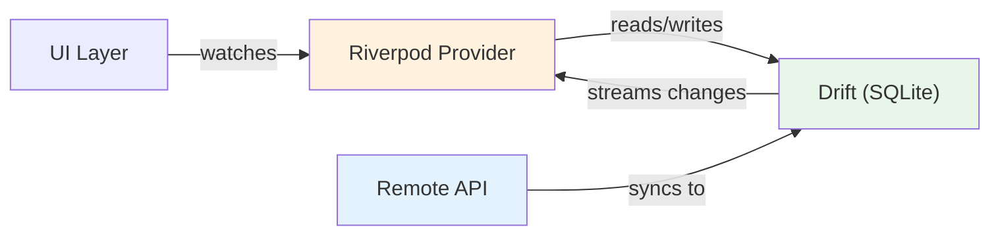

import Tabs from '@theme/Tabs';
import TabItem from '@theme/TabItem';

# Chapter 7: Flight Recorder

> *"Every aircraft carries a flight recorder — a black box that captures everything. Your app needs one too: a local database that works even when the network doesn't."*
> — Engineering principle

**Estimated time:** ~30 minutes | **Focus:** Local Persistence with Drift | **Branch:** `chapter-7-recorder`

CoreBank currently fetches data from the network every time the user opens a screen. If the network is slow or unavailable, the user sees a loading spinner — or worse, an error. In this chapter you will add a local SQLite database using Drift, so the app works offline, loads instantly on revisit, and only hits the network to sync fresh data.

---

## 1. Why Local Storage

Offline-first architecture offers three major benefits:

**Instant startup** — The app loads cached data from the local database in milliseconds. The network request updates the data in the background.

**Offline resilience** — Users on a plane, in a tunnel, or with poor reception still see their accounts and recent transactions.

**Reduced server load** — The API is only called when stale data needs refreshing, not on every screen open.



The data flow is: **API fetches remote data and writes it to Drift. Riverpod providers watch Drift streams. The UI watches Riverpod.** The UI never talks to the API directly — the database is always the source of truth.

---

## 2. Drift Overview

Drift (formerly known as Moor) is a reactive persistence library for Flutter and Dart. It wraps SQLite and provides:

- Type-safe table definitions in Dart (no raw SQL strings)
- Code generation for queries, data classes, and companions
- Reactive streams — `watch()` returns a `Stream` that emits whenever the table changes
- Schema migrations with version tracking
- Cross-platform support: iOS, Android, macOS, Linux, Windows, and web

Compared to alternatives:

| Feature | sqflite | Floor | Drift |
|---|---|---|---|
| Type-safe queries | No | Partial | Yes |
| Reactive streams | No | Yes | Yes |
| Code generation | No | Yes | Yes |
| Web support | No | No | Yes |
| Schema migrations | Manual | Partial | Built-in |

---

## 3. Setup

### Step 1: Add runtime dependencies

```bash
flutter pub add drift sqlite3_flutter_libs
```

`drift` is the core library. `sqlite3_flutter_libs` bundles the native SQLite binary for each platform.


### Step 2: Add dev dependencies for code generation

```bash
flutter pub add --dev drift_dev build_runner
```


### Step 3: Add the path_provider dependency for locating the database file

```bash
flutter pub add path_provider
```


---

## 4. Define Tables

Drift tables are Dart classes that extend `Table`. Each getter defines a column.

```dart title="lib/database/tables.dart"
import 'package:drift/drift.dart';

/// Stores bank account summaries.
class AccountTable extends Table {
  TextColumn get id => text()();
  TextColumn get name => text().withLength(min: 1, max: 100)();
  TextColumn get number => text()();
  RealColumn get balance => real()();
  DateTimeColumn get lastSynced => dateTime().nullable()();

  @override
  Set<Column> get primaryKey => {id};
}

/// Stores individual transactions.
class TransactionTable extends Table {
  TextColumn get id => text()();
  TextColumn get accountId => text().references(AccountTable, #id)();
  TextColumn get description => text()();
  RealColumn get amount => real()();
  DateTimeColumn get date => dateTime()();
  IntColumn get type => intEnum<TransactionType>()();

  @override
  Set<Column> get primaryKey => {id};
}
```

:::tip[WHY THIS MATTERS]
Notice `intEnum<TransactionType>()` — Drift stores the enum's index as an integer in SQLite. This is type-safe at the Dart level. The `references` call creates a foreign key relationship, which SQLite enforces for data integrity.

:::

---

## 5. Create the AppDatabase

The database class ties together your tables and opens the SQLite file.

```dart title="lib/database/app_database.dart"
import 'dart:io';
import 'package:drift/drift.dart';
import 'package:drift/native.dart';
import 'package:path_provider/path_provider.dart';
import 'package:path/path.dart' as p;
import 'package:flight_bank/database/tables.dart';

part 'app_database.g.dart';

@DriftDatabase(tables: [AccountTable, TransactionTable])
class AppDatabase extends _$AppDatabase {
  AppDatabase() : super(_openConnection());

  // Bump this when you change the schema
  @override
  int get schemaVersion => 1;

  static LazyDatabase _openConnection() {
    return LazyDatabase(() async {
      final dbFolder = await getApplicationDocumentsDirectory();
      final file = File(p.join(dbFolder.path, 'corebank.sqlite'));
      return NativeDatabase.createInBackground(file);
    });
  }
}
```

After running `build_runner`, Drift generates `app_database.g.dart` with data classes (`AccountTableData`, `TransactionTableData`) and companion objects for inserts.

---

## 6. Write a DAO: AccountDao

DAOs (Data Access Objects) group related database operations. They keep your database class clean.

```dart title="lib/database/daos/account_dao.dart"
import 'package:drift/drift.dart';
import 'package:flight_bank/database/app_database.dart';
import 'package:flight_bank/database/tables.dart';

part 'account_dao.g.dart';

@DriftAccessor(tables: [AccountTable])
class AccountDao extends DatabaseAccessor<AppDatabase>
    with _$AccountDaoMixin {
  AccountDao(super.db);

  /// Watch all accounts — emits a new list whenever the table changes.
  Stream<List<AccountTableData>> watchAll() {
    return (select(accountTable)
          ..orderBy([(t) => OrderingTerm.asc(t.name)]))
        .watch();
  }

  /// Get all accounts (one-shot, not reactive).
  Future<List<AccountTableData>> getAll() {
    return (select(accountTable)
          ..orderBy([(t) => OrderingTerm.asc(t.name)]))
        .get();
  }

  /// Insert or update an account (upsert).
  Future<void> upsert(AccountTableCompanion account) {
    return into(accountTable).insertOnConflictUpdate(account);
  }

  /// Insert multiple accounts in a batch.
  Future<void> upsertAll(List<AccountTableCompanion> accounts) {
    return batch((b) {
      for (final account in accounts) {
        b.insert(accountTable, account, onConflict: DoUpdate((_) => account));
      }
    });
  }

  /// Delete an account by ID.
  Future<void> deleteById(String id) {
    return (delete(accountTable)..where((t) => t.id.equals(id))).go();
  }
}
```

The key method is `watchAll()`. It returns a `Stream<List<AccountTableData>>` that fires whenever a row in the table is inserted, updated, or deleted. This is what makes the UI reactive without polling.

---

## 7. TransactionDao with Filtered Queries

Transactions are always scoped to an account, so the primary query filters by `accountId`.

```dart title="lib/database/daos/transaction_dao.dart"
import 'package:drift/drift.dart';
import 'package:flight_bank/database/app_database.dart';
import 'package:flight_bank/database/tables.dart';

part 'transaction_dao.g.dart';

@DriftAccessor(tables: [TransactionTable])
class TransactionDao extends DatabaseAccessor<AppDatabase>
    with _$TransactionDaoMixin {
  TransactionDao(super.db);

  /// Watch transactions for a specific account, newest first.
  Stream<List<TransactionTableData>> watchForAccount(String accountId) {
    return (select(transactionTable)
          ..where((t) => t.accountId.equals(accountId))
          ..orderBy([(t) => OrderingTerm.desc(t.date)]))
        .watch();
  }

  /// Get transactions for an account (one-shot).
  Future<List<TransactionTableData>> getForAccount(String accountId) {
    return (select(transactionTable)
          ..where((t) => t.accountId.equals(accountId))
          ..orderBy([(t) => OrderingTerm.desc(t.date)]))
        .get();
  }

  /// Insert multiple transactions in a batch.
  Future<void> upsertAll(List<TransactionTableCompanion> transactions) {
    return batch((b) {
      for (final tx in transactions) {
        b.insert(
          transactionTable,
          tx,
          onConflict: DoUpdate((_) => tx),
        );
      }
    });
  }

  /// Delete all transactions for an account.
  Future<void> deleteForAccount(String accountId) {
    return (delete(transactionTable)
          ..where((t) => t.accountId.equals(accountId)))
        .go();
  }

  /// Count transactions for an account.
  Future<int> countForAccount(String accountId) async {
    final count = countAll();
    final query = selectOnly(transactionTable)
      ..addColumns([count])
      ..where(transactionTable.accountId.equals(accountId));
    final row = await query.getSingle();
    return row.read(count)!;
  }
}
```

---

## 8. Type Converters

Drift needs help converting Dart types that SQLite does not understand natively.

The `TransactionType` enum is already handled by `intEnum<TransactionType>()` in the table definition. But if you had a custom type — say, a `Money` value object — you would write a converter:

```dart title="lib/database/converters.dart"
import 'package:drift/drift.dart';

/// Example: convert DateTime to/from Unix milliseconds.
/// (Drift handles DateTime natively, but this shows the pattern.)
class DateTimeConverter extends TypeConverter<DateTime, int> {
  const DateTimeConverter();

  @override
  DateTime fromSql(int fromDb) =>
      DateTime.fromMillisecondsSinceEpoch(fromDb);

  @override
  int toSql(DateTime value) => value.millisecondsSinceEpoch;
}
```

Apply a converter to a column:

```dart
// In a table definition:
IntColumn get createdAt => integer().map(const DateTimeConverter())();
```

For enums, prefer `intEnum<T>()` (stores the index) or `textEnum<T>()` (stores the name). Both are built into Drift and require no custom converter.

---

## 9. Wire Drift into Riverpod

Now connect the database layer to your Riverpod providers. The database is a long-lived singleton; expose it as a provider.

```dart title="lib/providers/database_provider.dart"
import 'package:riverpod_annotation/riverpod_annotation.dart';
import 'package:flight_bank/database/app_database.dart';

part 'database_provider.g.dart';

@Riverpod(keepAlive: true)
AppDatabase database(ref) {
  final db = AppDatabase();
  ref.onDispose(() => db.close());
  return db;
}
```

:::tip[WHY THIS MATTERS]
`keepAlive: true` prevents Riverpod from disposing the database when no widget is watching it. A database connection is expensive to open and should live for the app's lifetime. The `onDispose` callback ensures it is closed gracefully if the provider is ever invalidated.

:::

Now create a database-backed accounts provider that streams from Drift and syncs from the API:

```dart title="lib/providers/accounts_provider.dart"
import 'package:riverpod_annotation/riverpod_annotation.dart';
import 'package:flight_bank/database/app_database.dart';
import 'package:flight_bank/database/daos/account_dao.dart';
import 'package:flight_bank/models/account.dart';
import 'package:drift/drift.dart';

part 'accounts_provider.g.dart';

@riverpod
Stream<List<Account>> accounts(ref) {
  final db = ref.watch(databaseProvider);
  final dao = AccountDao(db);

  // Trigger a background sync (fire-and-forget)
  _syncAccounts(ref);

  // Return the reactive stream from the local database
  return dao.watchAll().map(
    (rows) => rows
        .map((row) => Account(
              id: row.id,
              name: row.name,
              number: row.number,
              balance: row.balance,
            ))
        .toList(),
  );
}

Future<void> _syncAccounts(ref) async {
  try {
    final api = ref.read(apiServiceProvider);
    final db = ref.read(databaseProvider);
    final dao = AccountDao(db);

    final remoteAccounts = await api.getAccounts();

    final companions = remoteAccounts
        .map((a) => AccountTableCompanion(
              id: Value(a.id),
              name: Value(a.name),
              number: Value(a.number),
              balance: Value(a.balance),
              lastSynced: Value(DateTime.now()),
            ))
        .toList();

    await dao.upsertAll(companions);
  } catch (_) {
    // Sync failed — the UI still shows cached data
  }
}
```

And the transactions provider becomes a reactive stream too:

```dart title="lib/providers/transactions_provider.dart"
@riverpod
Stream<List<Transaction>> transactions(ref, String accountId) {
  final db = ref.watch(databaseProvider);
  final dao = TransactionDao(db);

  // Background sync
  _syncTransactions(ref, accountId);

  return dao.watchForAccount(accountId).map(
    (rows) => rows
        .map((row) => Transaction(
              id: row.id,
              description: row.description,
              amount: row.amount,
              date: row.date,
              type: TransactionType.values[row.type],
            ))
        .toList(),
  );
}
```

The UI code barely changes — `ref.watch(accountsProvider)` now returns an `AsyncValue` backed by a stream instead of a future. The `.when()` pattern still works identically.

---

## 10. Schema Migrations

As CoreBank evolves, you will need to add columns. Drift handles this with version-aware migrations.

Say you want to add a `currency` column to the accounts table:

### Step 1: Add the column to the table

```dart title="lib/database/tables.dart"
class AccountTable extends Table {
  TextColumn get id => text()();
  TextColumn get name => text().withLength(min: 1, max: 100)();
  TextColumn get number => text()();
  RealColumn get balance => real()();
  TextColumn get currency => text().withDefault(const Constant('USD'))();
  DateTimeColumn get lastSynced => dateTime().nullable()();

  @override
  Set<Column> get primaryKey => {id};
}
```


### Step 2: Bump the schema version and write the migration

```dart title="lib/database/app_database.dart"
@override
int get schemaVersion => 2;

@override
MigrationStrategy get migration => MigrationStrategy(
  onUpgrade: (migrator, from, to) async {
    if (from < 2) {
      // Add the currency column with a default value
      await migrator.addColumn(
        accountTable,
        accountTable.currency,
      );
    }
  },
  onCreate: (migrator) async {
    // Create all tables from scratch for new installs
    await migrator.createAll();
  },
);
```


:::info[TRY IT YOURSELF]
Add a `category` text column to `TransactionTable` with a default value of `'general'`. Bump the schema to version 3 and write the migration step. Run `build_runner`, then run the app — the migration should execute silently.

:::

---

## 11. Running build_runner

Drift uses code generation just like Riverpod. Run them together:

```bash
dart run build_runner build --delete-conflicting-outputs
```

This generates:
- `app_database.g.dart` — data classes, companion objects, table metadata
- `account_dao.g.dart` — mixin with table references
- `transaction_dao.g.dart` — mixin with table references
- All Riverpod `.g.dart` files from Chapter 6

In watch mode:

```bash
dart run build_runner watch --delete-conflicting-outputs
```

:::tip[CHECKPOINT]
By the end of this chapter you should have:

- `drift`, `sqlite3_flutter_libs`, and `drift_dev` installed
- `AccountTable` and `TransactionTable` defined with proper column types
- An `AppDatabase` class with schema version tracking
- `AccountDao` with `watchAll()`, `upsert()`, `upsertAll()`, and `deleteById()`
- `TransactionDao` with `watchForAccount()` and batch operations
- Type converters for enums via `intEnum`
- A `databaseProvider` with `keepAlive: true`
- Accounts and transactions providers backed by Drift streams with background API sync
- A working schema migration from version 1 to version 2
- All `build_runner` generated files compiling without errors

Run the app in airplane mode. You should see cached data load instantly. Turn the network back on and the data syncs in the background — the UI updates reactively as Drift writes fresh rows.

:::

Head to the quiz, then continue to [Chapter 8: Filing the Flight Plan](/chapters/forms).
