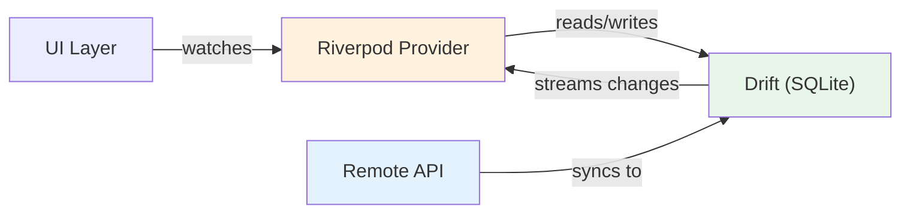

import Tabs from '@theme/Tabs';
import TabItem from '@theme/TabItem';

# Chapter 7: Flight Recorder

> *"Every aircraft carries a flight recorder — a black box that captures everything. Your app needs one too: a local database that works even when the network doesn't."*
> — Engineering principle

**Estimated time:** ~30 minutes | **Focus:** Local Persistence with Drift | **Branch:** `chapter-7-recorder`

FlightBank currently fetches data from the network every time the user opens a screen. If the network is slow or unavailable, the user sees a loading spinner — or worse, an error. In this chapter you will add a local SQLite database using Drift, so the app works offline, loads instantly on revisit, and only hits the network to sync fresh data.

---

## 1. Why Local Storage

Offline-first architecture offers three major benefits:

**Instant startup** — The app loads cached data from the local database in milliseconds. The network request updates the data in the background.

**Offline resilience** — Users on a plane, in a tunnel, or with poor reception still see their accounts and recent transactions.

**Reduced server load** — The API is only called when stale data needs refreshing, not on every screen open.



The data flow is: **API fetches remote data and writes it to Drift. Riverpod providers watch Drift streams. The UI watches Riverpod.** The UI never talks to the API directly — the database is always the source of truth.

---

## 2. Drift Overview

Drift (formerly known as Moor) is a reactive persistence library for Flutter and Dart. It wraps SQLite and provides:

- Type-safe table definitions in Dart (no raw SQL strings)
- Code generation for queries, data classes, and companions
- Reactive streams — `watch()` returns a `Stream` that emits whenever the table changes
- Schema migrations with version tracking
- Cross-platform support: iOS, Android, macOS, Linux, Windows, and web

Compared to alternatives:

| Feature | sqflite | Floor | Drift |
|---|---|---|---|
| Type-safe queries | No | Partial | Yes |
| Reactive streams | No | Yes | Yes |
| Code generation | No | Yes | Yes |
| Web support | No | No | Yes |
| Schema migrations | Manual | Partial | Built-in |

---

## 3. Setup

### Step 1: Add runtime dependencies

```bash
flutter pub add drift sqlite3_flutter_libs
```

`drift` is the core library. `sqlite3_flutter_libs` bundles the native SQLite binary for each platform.


### Step 2: Add dev dependencies for code generation

```bash
flutter pub add --dev drift_dev build_runner
```


### Step 3: Add the path_provider dependency for locating the database file

```bash
flutter pub add path_provider
```


---

## 4. Define Tables

Drift tables are Dart classes that extend `Table`. Each getter defines a column.

```dart title="lib/database/tables.dart"
import 'package:drift/drift.dart';

/// Stores bank account summaries.
class AccountTable extends Table {
  TextColumn get id => text()();
  TextColumn get name => text().withLength(min: 1, max: 100)();
  TextColumn get number => text()();
  RealColumn get balance => real()();
  DateTimeColumn get lastSynced => dateTime().nullable()();

  @override
  Set<Column> get primaryKey => {id};
}

/// Stores individual transactions.
class TransactionTable extends Table {
  TextColumn get id => text()();
  TextColumn get accountId => text().references(AccountTable, #id)();
  TextColumn get description => text()();
  RealColumn get amount => real()();
  DateTimeColumn get date => dateTime()();
  IntColumn get type => intEnum<TransactionType>()();

  @override
  Set<Column> get primaryKey => {id};
}
```

:::tip[WHY THIS MATTERS]
Notice `intEnum<TransactionType>()` — Drift stores the enum's index as an integer in SQLite. This is type-safe at the Dart level. The `references` call creates a foreign key relationship, which SQLite enforces for data integrity.

:::

---

## 5. Create the AppDatabase

The database class ties together your tables and opens the SQLite file.

```dart title="lib/database/app_database.dart"
import 'dart:io';
import 'package:drift/drift.dart';
import 'package:drift/native.dart';
import 'package:path_provider/path_provider.dart';
import 'package:path/path.dart' as p;
import 'package:flight_bank/database/tables.dart';

part 'app_database.g.dart';

@DriftDatabase(tables: [AccountTable, TransactionTable])
class AppDatabase extends _$AppDatabase {
  AppDatabase() : super(_openConnection());

  // Bump this when you change the schema
  @override
  int get schemaVersion => 1;

  static LazyDatabase _openConnection() {
    return LazyDatabase(() async {
      final dbFolder = await getApplicationDocumentsDirectory();
      final file = File(p.join(dbFolder.path, 'flightbank.sqlite'));
      return NativeDatabase.createInBackground(file);
    });
  }
}
```

After running `build_runner`, Drift generates `app_database.g.dart` with data classes (`AccountTableData`, `TransactionTableData`) and companion objects for inserts.

Continue to [Part 2](/chapters/recorder/part-2) where you will write DAOs, wire Drift into Riverpod, and handle schema migrations.
