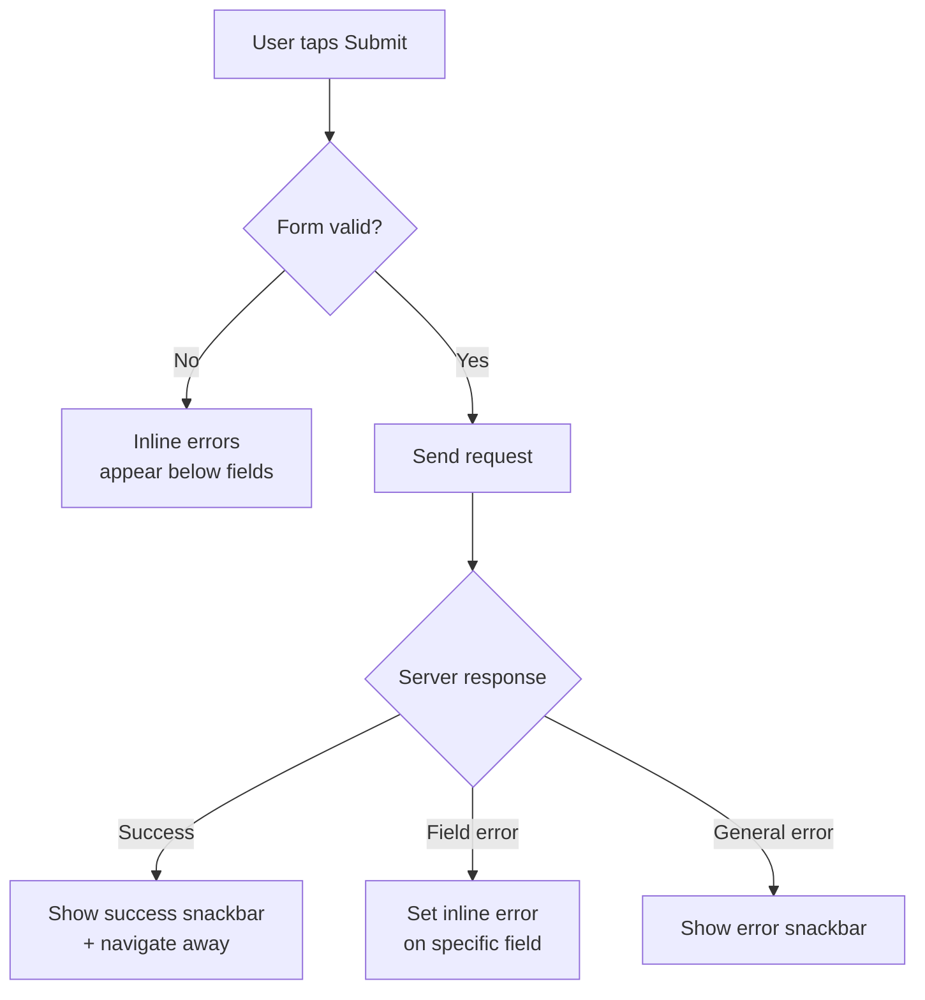

import Tabs from '@theme/Tabs';
import TabItem from '@theme/TabItem';

# Chapter 8: Forms & Checklists

> *"Checklists are not about ticking boxes. They are about embracing discipline — the foundation of safe flight."* — Chesley Sullenberger

**Estimated time:** ~25 minutes | **Focus:** Transfer Form | **Branch:** `chapter-8-forms`

A banking app lives or dies by its forms. Users transfer money, update profiles, and authenticate — all through form fields. A sloppy form means lost money, frustrated users, or worse. This chapter builds CoreBank's transfer form from the ground up: validation, formatting, error handling, and a polished submit flow.

---

## 1. The Form Widget and GlobalKey

Flutter's `Form` widget is a container that groups multiple form fields and coordinates their validation. You hand it a `GlobalKey<FormState>` so you can trigger validation and save from anywhere in your widget tree.

```dart title="lib/screens/transfer_screen.dart"
class TransferScreen extends ConsumerStatefulWidget {
  const TransferScreen({super.key});

  @override
  ConsumerState<TransferScreen> createState() => _TransferScreenState();
}

class _TransferScreenState extends ConsumerState<TransferScreen> {
  final _formKey = GlobalKey<FormState>();

  @override
  Widget build(BuildContext context) {
    return Scaffold(
      appBar: AppBar(title: const Text('Transfer Funds')),
      body: Form(
        key: _formKey,
        autovalidateMode: AutovalidateMode.disabled,
        child: ListView(
          padding: const EdgeInsets.all(16),
          children: [
            // Form fields go here
          ],
        ),
      ),
    );
  }
}
```

:::tip[WHY THIS MATTERS]
The `GlobalKey<FormState>` is not just ceremony. When you call `_formKey.currentState!.validate()`, Flutter walks every `FormField` descendant inside that `Form` and runs its validator. Without the key, you would have to track each field manually — error-prone and tedious.

:::

The `autovalidateMode` property controls when validation fires. Start with `AutovalidateMode.disabled` so users are not bombarded with errors before they have typed anything. Switch to `AutovalidateMode.onUserInteraction` after the first submission attempt.

---

## 2. TextFormField — Decoration, Validation, Controllers

Each input in your form is a `TextFormField`. It combines a `TextField` (for user input) with a `FormField` (for validation). You need three things for each field: a **controller**, **decoration**, and a **validator**.

```dart title="lib/screens/transfer_screen.dart"
class _TransferScreenState extends ConsumerState<TransferScreen> {
  final _formKey = GlobalKey<FormState>();
  final _amountController = TextEditingController();
  final _noteController = TextEditingController();

  @override
  void dispose() {
    _amountController.dispose();
    _noteController.dispose();
    super.dispose();
  }

  @override
  Widget build(BuildContext context) {
    return Scaffold(
      appBar: AppBar(title: const Text('Transfer Funds')),
      body: Form(
        key: _formKey,
        child: ListView(
          padding: const EdgeInsets.all(16),
          children: [
            TextFormField(
              controller: _amountController,
              decoration: const InputDecoration(
                labelText: 'Amount',
                prefixText: '\$ ',
                hintText: '0.00',
                border: OutlineInputBorder(),
              ),
              keyboardType: const TextInputType.numberWithOptions(decimal: true),
              validator: _validateAmount,
            ),
            const SizedBox(height: 16),
            TextFormField(
              controller: _noteController,
              decoration: const InputDecoration(
                labelText: 'Note (optional)',
                hintText: 'Rent, dinner, etc.',
                border: OutlineInputBorder(),
              ),
              maxLength: 100,
            ),
          ],
        ),
      ),
    );
  }
}
```

:::tip[WHY THIS MATTERS]
Always dispose controllers. They hold native resources. If you skip `dispose()`, you leak memory — every time the user navigates to the transfer screen and back, a new controller leaks. In a banking app with heavy navigation, this adds up fast.

:::

---

## 3. Validators: Required, Format, Range, Custom

Validators are pure functions: they take a `String?` and return `null` (valid) or an error message `String` (invalid). Stack them for complex rules.

```dart title="lib/utils/validators.dart"
class Validators {
  /// Ensures field is not empty.
  static String? required(String? value) {
    if (value == null || value.trim().isEmpty) {
      return 'This field is required';
    }
    return null;
  }

  /// Validates email format.
  static String? email(String? value) {
    if (value == null || value.trim().isEmpty) return 'Email is required';
    final emailRegex = RegExp(r'^[\w\-.]+@([\w-]+\.)+[\w-]{2,}$');
    if (!emailRegex.hasMatch(value.trim())) {
      return 'Enter a valid email address';
    }
    return null;
  }

  /// Validates a transfer amount is between $0.01 and $50,000.
  static String? amount(String? value) {
    if (value == null || value.trim().isEmpty) return 'Amount is required';
    final cleaned = value.replaceAll(',', '');
    final parsed = double.tryParse(cleaned);
    if (parsed == null) return 'Enter a valid number';
    if (parsed < 0.01) return 'Minimum transfer is \$0.01';
    if (parsed > 50000) return 'Maximum transfer is \$50,000';
    return null;
  }

  /// Composes multiple validators. Runs in order, returns first failure.
  static String? Function(String?) compose(
    List<String? Function(String?)> validators,
  ) {
    return (value) {
      for (final validator in validators) {
        final result = validator(value);
        if (result != null) return result;
      }
      return null;
    };
  }
}
```

Usage in a form field:

```dart
TextFormField(
  validator: Validators.compose([
    Validators.required,
    Validators.amount,
  ]),
)
```

The `compose` pattern keeps each rule testable in isolation while letting you combine them declaratively.

---

## 4. CurrencyInputFormatter

Raw number input is messy. Users type `10000` and cannot tell if they meant ten thousand or one hundred. A `TextInputFormatter` transforms input in real time, inserting commas and enforcing two decimal places.

```dart title="lib/utils/currency_input_formatter.dart"
import 'package:flutter/services.dart';
import 'package:intl/intl.dart';

class CurrencyInputFormatter extends TextInputFormatter {
  final NumberFormat _formatter = NumberFormat.currency(
    locale: 'en_US',
    symbol: '',
    decimalDigits: 2,
  );

  @override
  TextEditingValue formatEditUpdate(
    TextEditingValue oldValue,
    TextEditingValue newValue,
  ) {
    // Allow empty field
    if (newValue.text.isEmpty) return newValue;

    // Strip non-numeric characters except decimal point
    String cleaned = newValue.text.replaceAll(RegExp(r'[^\d.]'), '');

    // Prevent multiple decimal points
    final parts = cleaned.split('.');
    if (parts.length > 2) {
      cleaned = '${parts[0]}.${parts[1]}';
    }

    // Limit to 2 decimal places
    if (parts.length == 2 && parts[1].length > 2) {
      cleaned = '${parts[0]}.${parts[1].substring(0, 2)}';
    }

    final number = double.tryParse(cleaned);
    if (number == null) return oldValue;

    // Format with commas but skip forced decimals while typing
    final hasDecimal = cleaned.contains('.');
    String formatted;
    if (hasDecimal) {
      final intPart = NumberFormat('#,##0', 'en_US').format(number.truncate());
      final decPart = parts.length > 1 ? parts[1] : '';
      formatted = '$intPart.$decPart';
    } else {
      formatted = NumberFormat('#,##0', 'en_US').format(number.truncate());
    }

    return TextEditingValue(
      text: formatted,
      selection: TextSelection.collapsed(offset: formatted.length),
    );
  }
}
```

Wire it up:

```dart
TextFormField(
  controller: _amountController,
  inputFormatters: [
    FilteringTextInputFormatter.allow(RegExp(r'[\d.,]')),
    CurrencyInputFormatter(),
  ],
  keyboardType: const TextInputType.numberWithOptions(decimal: true),
)
```

The user types `15000.50` and sees `15,000.50` — immediately clear and professional.

---

## 5. Error Display Patterns

There are two common approaches to showing errors: **inline validation** (errors appear below each field) and **snackbar messages** (a banner at the bottom). Use both strategically.



**Inline errors** are best for field-level problems — the user sees exactly which field needs fixing. **Snackbar messages** are best for server-side errors or success confirmation.

```dart title="lib/screens/transfer_screen.dart"
// Switch to real-time validation after first submit attempt
void _onSubmit() {
  setState(() => _autovalidate = true);

  if (!_formKey.currentState!.validate()) return;

  // ... proceed with transfer
}
```

```dart
// Snackbar for server errors
ScaffoldMessenger.of(context).showSnackBar(
  SnackBar(
    content: const Text('Transfer failed. Please try again.'),
    backgroundColor: Theme.of(context).colorScheme.error,
    behavior: SnackBarBehavior.floating,
    action: SnackBarAction(
      label: 'Retry',
      textColor: Colors.white,
      onPressed: _onSubmit,
    ),
  ),
);
```

---

## 6. Build the Transfer Form

Time to assemble the complete transfer screen. We need four fields: **from account** (dropdown), **to account** (dropdown), **amount** (formatted input), and **note** (optional text).

### Step 1: Add account dropdown fields

```dart title="lib/screens/transfer_screen.dart"
class _TransferScreenState extends ConsumerState<TransferScreen> {
  final _formKey = GlobalKey<FormState>();
  final _amountController = TextEditingController();
  final _noteController = TextEditingController();
  bool _autovalidate = false;

  String? _fromAccountId;
  String? _toAccountId;

  @override
  Widget build(BuildContext context) {
    final accounts = ref.watch(accountsProvider);

    return Scaffold(
      appBar: AppBar(title: const Text('Transfer Funds')),
      body: Form(
        key: _formKey,
        autovalidateMode: _autovalidate
            ? AutovalidateMode.onUserInteraction
            : AutovalidateMode.disabled,
        child: ListView(
          padding: const EdgeInsets.all(16),
          children: [
            DropdownButtonFormField<String>(
              decoration: const InputDecoration(
                labelText: 'From Account',
                border: OutlineInputBorder(),
              ),
              items: accounts
                  .map((a) => DropdownMenuItem(
                        value: a.id,
                        child: Text('${a.name} — \$${a.balance.toStringAsFixed(2)}'),
                      ))
                  .toList(),
              onChanged: (value) => setState(() => _fromAccountId = value),
              validator: (value) =>
                  value == null ? 'Select a source account' : null,
            ),
            const SizedBox(height: 16),
            DropdownButtonFormField<String>(
              decoration: const InputDecoration(
                labelText: 'To Account',
                border: OutlineInputBorder(),
              ),
              items: accounts
                  .where((a) => a.id != _fromAccountId)
                  .map((a) => DropdownMenuItem(
                        value: a.id,
                        child: Text(a.name),
                      ))
                  .toList(),
              onChanged: (value) => setState(() => _toAccountId = value),
              validator: (value) =>
                  value == null ? 'Select a destination account' : null,
            ),
            const SizedBox(height: 16),
            TextFormField(
              controller: _amountController,
              decoration: const InputDecoration(
                labelText: 'Amount',
                prefixText: '\$ ',
                border: OutlineInputBorder(),
              ),
              keyboardType:
                  const TextInputType.numberWithOptions(decimal: true),
              inputFormatters: [
                FilteringTextInputFormatter.allow(RegExp(r'[\d.,]')),
                CurrencyInputFormatter(),
              ],
              validator: Validators.amount,
            ),
            const SizedBox(height: 16),
            TextFormField(
              controller: _noteController,
              decoration: const InputDecoration(
                labelText: 'Note (optional)',
                hintText: 'Rent, dinner, etc.',
                border: OutlineInputBorder(),
              ),
              textInputAction: TextInputAction.done,
              maxLength: 100,
            ),
            const SizedBox(height: 24),
            FilledButton(
              onPressed: _onSubmit,
              child: const Text('Transfer'),
            ),
          ],
        ),
      ),
    );
  }
}
```


### Step 2: Wire the to-account filter

Notice how the "To Account" dropdown filters out the currently selected "From Account":

```dart
items: accounts
    .where((a) => a.id != _fromAccountId)
    .map((a) => DropdownMenuItem(value: a.id, child: Text(a.name)))
    .toList(),
```

When the user changes the source account, `setState` triggers a rebuild and the destination list updates. This prevents the user from accidentally transferring money to the same account.


---

## 7. Submit Flow — Loading, Confirmation, Feedback

A transfer involves real money. You need a confirmation dialog, a loading state, and clear success or failure feedback.

### Step 1: Show a confirmation dialog

```dart title="lib/screens/transfer_screen.dart"
Future<void> _onSubmit() async {
  setState(() => _autovalidate = true);
  if (!_formKey.currentState!.validate()) return;

  final amount = double.parse(
    _amountController.text.replaceAll(',', ''),
  );

  final confirmed = await showDialog<bool>(
    context: context,
    builder: (ctx) => AlertDialog(
      title: const Text('Confirm Transfer'),
      content: Text(
        'Transfer \$${amount.toStringAsFixed(2)} from '
        '${_accountName(_fromAccountId!)} to '
        '${_accountName(_toAccountId!)}?',
      ),
      actions: [
        TextButton(
          onPressed: () => Navigator.pop(ctx, false),
          child: const Text('Cancel'),
        ),
        FilledButton(
          onPressed: () => Navigator.pop(ctx, true),
          child: const Text('Confirm'),
        ),
      ],
    ),
  );

  if (confirmed != true || !mounted) return;

  await _executeTransfer(amount);
}
```


### Step 2: Execute with loading state

```dart title="lib/screens/transfer_screen.dart"
bool _isLoading = false;

Future<void> _executeTransfer(double amount) async {
  setState(() => _isLoading = true);

  try {
    await ref.read(transferServiceProvider).transfer(
          fromAccountId: _fromAccountId!,
          toAccountId: _toAccountId!,
          amount: amount,
          note: _noteController.text.trim(),
        );

    if (!mounted) return;

    ScaffoldMessenger.of(context).showSnackBar(
      const SnackBar(
        content: Text('Transfer complete!'),
        behavior: SnackBarBehavior.floating,
      ),
    );

    context.pop(); // Navigate back
  } on TransferException catch (e) {
    if (!mounted) return;
    ScaffoldMessenger.of(context).showSnackBar(
      SnackBar(
        content: Text(e.message),
        backgroundColor: Theme.of(context).colorScheme.error,
      ),
    );
  } finally {
    if (mounted) setState(() => _isLoading = false);
  }
}
```


### Step 3: Disable the button while loading

```dart
FilledButton(
  onPressed: _isLoading ? null : _onSubmit,
  child: _isLoading
      ? const SizedBox(
          height: 20,
          width: 20,
          child: CircularProgressIndicator(strokeWidth: 2),
        )
      : const Text('Transfer'),
),
```

Setting `onPressed` to `null` disables the button visually and functionally — no double-tap transfers.


:::tip[CHECKPOINT]
At this point your transfer form should:
- Show two dropdowns (from/to) with the destination filtering out the source
- Format the amount input with commas as the user types
- Validate all fields on submit, then switch to real-time validation
- Show a confirmation dialog before executing
- Display a loading spinner in the button during the request
- Show a snackbar on success or failure

:::

---

## 8. Keyboard Types and Autofill Hints

Small details separate a usable form from a great one. Keyboard types and input actions control what the user sees on their soft keyboard.

```dart
// Numeric keyboard for amount
TextFormField(
  keyboardType: const TextInputType.numberWithOptions(decimal: true),
  textInputAction: TextInputAction.next, // "Next" button moves focus
)

// Email keyboard
TextFormField(
  keyboardType: TextInputType.emailAddress,
  autofillHints: const [AutofillHints.email],
  textInputAction: TextInputAction.next,
)

// Final field — "Done" dismisses the keyboard
TextFormField(
  textInputAction: TextInputAction.done,
  onFieldSubmitted: (_) => _onSubmit(),
)
```

| Property | Effect |
|---|---|
| `TextInputType.number` | Numeric keyboard, no decimal |
| `TextInputType.numberWithOptions(decimal: true)` | Numeric keyboard with decimal point |
| `TextInputType.emailAddress` | Keyboard with `@` and `.` readily available |
| `TextInputAction.next` | Shows "Next" button, moves focus to next field |
| `TextInputAction.done` | Shows "Done" button, dismisses keyboard |
| `AutofillHints.email` | Suggests saved emails from the OS keychain |

:::info[TRY IT YOURSELF]
Wrap your form fields in an `AutofillGroup` widget. This tells the OS to treat the group as a single autofill context — so saved email and name suggestions appear automatically.

```dart
AutofillGroup(
  child: Column(
    children: [
      TextFormField(autofillHints: const [AutofillHints.email]),
      TextFormField(autofillHints: const [AutofillHints.name]),
    ],
  ),
)
```

:::

---

## 9. Before/After: Basic Inputs vs Production Form

<Tabs>
<TabItem value="before" label="Before" default>

```dart title="Naive approach"
class TransferPage extends StatelessWidget {
  final fromController = TextEditingController();
  final toController = TextEditingController();
  final amountController = TextEditingController();

  @override
  Widget build(BuildContext context) {
    return Column(
      children: [
        TextField(
          controller: fromController,
          decoration: InputDecoration(labelText: 'From'),
        ),
        TextField(
          controller: toController,
          decoration: InputDecoration(labelText: 'To'),
        ),
        TextField(
          controller: amountController,
          decoration: InputDecoration(labelText: 'Amount'),
        ),
        ElevatedButton(
          onPressed: () {
            // No validation, no confirmation, no error handling
            transfer(fromController.text, toController.text,
                double.parse(amountController.text));
          },
          child: Text('Send'),
        ),
      ],
    );
  }
}
```

Problems: controllers leak (no `dispose`), no validation, no keyboard type, raw `double.parse` crashes on bad input, no loading state, no confirmation.

</TabItem>
<TabItem value="after" label="After">

```dart title="Production form"
class TransferScreen extends ConsumerStatefulWidget { /* ... */ }

class _TransferScreenState extends ConsumerState<TransferScreen> {
  final _formKey = GlobalKey<FormState>();
  final _amountController = TextEditingController();
  final _noteController = TextEditingController();
  String? _fromAccountId;
  String? _toAccountId;
  bool _isLoading = false;
  bool _autovalidate = false;

  @override
  void dispose() {
    _amountController.dispose();
    _noteController.dispose();
    super.dispose();
  }

  @override
  Widget build(BuildContext context) {
    return Form(
      key: _formKey,
      autovalidateMode: _autovalidate
          ? AutovalidateMode.onUserInteraction
          : AutovalidateMode.disabled,
      child: ListView(
        padding: const EdgeInsets.all(16),
        children: [
          DropdownButtonFormField<String>(/* from account */),
          DropdownButtonFormField<String>(/* to account, filtered */),
          TextFormField(
            controller: _amountController,
            keyboardType: const TextInputType.numberWithOptions(decimal: true),
            inputFormatters: [CurrencyInputFormatter()],
            validator: Validators.amount,
          ),
          TextFormField(
            controller: _noteController,
            textInputAction: TextInputAction.done,
          ),
          FilledButton(
            onPressed: _isLoading ? null : _onSubmit,
            child: _isLoading
                ? const CircularProgressIndicator(strokeWidth: 2)
                : const Text('Transfer'),
          ),
        ],
      ),
    );
  }
}
```

Fixed: proper disposal, Form + GlobalKey validation, currency formatting, keyboard hints, loading state, confirmation dialog, error snackbars.

</TabItem>
</Tabs>

---

## Summary

You have built a production-grade transfer form with:

- **Form + GlobalKey** for coordinated validation
- **TextFormField** with controllers, decoration, and validators
- **Composable validators** that stack and test independently
- **CurrencyInputFormatter** for real-time formatting
- **Inline + snackbar** error display strategy
- **Confirmation dialog** before executing transfers
- **Loading state** that prevents double submissions
- **Keyboard types and autofill hints** for a polished mobile experience

Next chapter, we add animations to make CoreBank feel alive.
