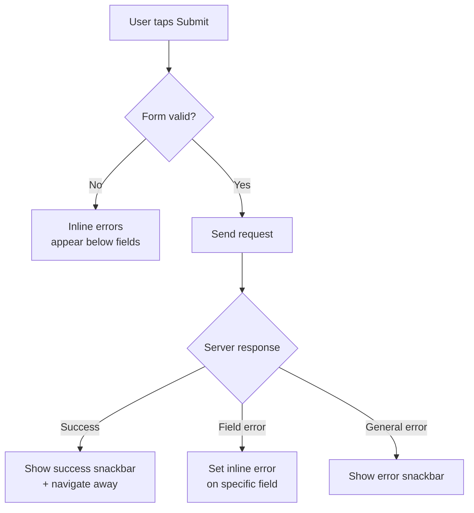

import Tabs from '@theme/Tabs';
import TabItem from '@theme/TabItem';

# Chapter 8: Forms & Checklists

> *"Checklists are not about ticking boxes. They are about embracing discipline — the foundation of safe flight."* — Chesley Sullenberger

**Estimated time:** ~25 minutes | **Focus:** Transfer Form | **Branch:** `chapter-8-forms`

A banking app lives or dies by its forms. Users transfer money, update profiles, and authenticate — all through form fields. A sloppy form means lost money, frustrated users, or worse. This chapter builds FlightBank's transfer form from the ground up: validation, formatting, error handling, and a polished submit flow.

---

## 1. The Form Widget and GlobalKey

Flutter's `Form` widget is a container that groups multiple form fields and coordinates their validation. You hand it a `GlobalKey<FormState>` so you can trigger validation and save from anywhere in your widget tree.

```dart title="lib/screens/transfer_screen.dart"
class TransferScreen extends ConsumerStatefulWidget {
  const TransferScreen({super.key});

  @override
  ConsumerState<TransferScreen> createState() => _TransferScreenState();
}

class _TransferScreenState extends ConsumerState<TransferScreen> {
  final _formKey = GlobalKey<FormState>();

  @override
  Widget build(BuildContext context) {
    return Scaffold(
      appBar: AppBar(title: const Text('Transfer Funds')),
      body: Form(
        key: _formKey,
        autovalidateMode: AutovalidateMode.disabled,
        child: ListView(
          padding: const EdgeInsets.all(16),
          children: [
            // Form fields go here
          ],
        ),
      ),
    );
  }
}
```

:::tip[WHY THIS MATTERS]
The `GlobalKey<FormState>` is not just ceremony. When you call `_formKey.currentState!.validate()`, Flutter walks every `FormField` descendant inside that `Form` and runs its validator. Without the key, you would have to track each field manually — error-prone and tedious.

:::

The `autovalidateMode` property controls when validation fires. Start with `AutovalidateMode.disabled` so users are not bombarded with errors before they have typed anything. Switch to `AutovalidateMode.onUserInteraction` after the first submission attempt.

---

## 2. TextFormField — Decoration, Validation, Controllers

Each input in your form is a `TextFormField`. It combines a `TextField` (for user input) with a `FormField` (for validation). You need three things for each field: a **controller**, **decoration**, and a **validator**.

```dart title="lib/screens/transfer_screen.dart"
class _TransferScreenState extends ConsumerState<TransferScreen> {
  final _formKey = GlobalKey<FormState>();
  final _amountController = TextEditingController();
  final _noteController = TextEditingController();

  @override
  void dispose() {
    _amountController.dispose();
    _noteController.dispose();
    super.dispose();
  }

  @override
  Widget build(BuildContext context) {
    return Scaffold(
      appBar: AppBar(title: const Text('Transfer Funds')),
      body: Form(
        key: _formKey,
        child: ListView(
          padding: const EdgeInsets.all(16),
          children: [
            TextFormField(
              controller: _amountController,
              decoration: const InputDecoration(
                labelText: 'Amount',
                prefixText: '\$ ',
                hintText: '0.00',
                border: OutlineInputBorder(),
              ),
              keyboardType: const TextInputType.numberWithOptions(decimal: true),
              validator: _validateAmount,
            ),
            const SizedBox(height: 16),
            TextFormField(
              controller: _noteController,
              decoration: const InputDecoration(
                labelText: 'Note (optional)',
                hintText: 'Rent, dinner, etc.',
                border: OutlineInputBorder(),
              ),
              maxLength: 100,
            ),
          ],
        ),
      ),
    );
  }
}
```

:::tip[WHY THIS MATTERS]
Always dispose controllers. They hold native resources. If you skip `dispose()`, you leak memory — every time the user navigates to the transfer screen and back, a new controller leaks. In a banking app with heavy navigation, this adds up fast.

:::

---

## 3. Validators: Required, Format, Range, Custom

Validators are pure functions: they take a `String?` and return `null` (valid) or an error message `String` (invalid). Stack them for complex rules.

```dart title="lib/utils/validators.dart"
class Validators {
  /// Ensures field is not empty.
  static String? required(String? value) {
    if (value == null || value.trim().isEmpty) {
      return 'This field is required';
    }
    return null;
  }

  /// Validates email format.
  static String? email(String? value) {
    if (value == null || value.trim().isEmpty) return 'Email is required';
    final emailRegex = RegExp(r'^[\w\-.]+@([\w-]+\.)+[\w-]{2,}$');
    if (!emailRegex.hasMatch(value.trim())) {
      return 'Enter a valid email address';
    }
    return null;
  }

  /// Validates a transfer amount is between $0.01 and $50,000.
  static String? amount(String? value) {
    if (value == null || value.trim().isEmpty) return 'Amount is required';
    final cleaned = value.replaceAll(',', '');
    final parsed = double.tryParse(cleaned);
    if (parsed == null) return 'Enter a valid number';
    if (parsed < 0.01) return 'Minimum transfer is \$0.01';
    if (parsed > 50000) return 'Maximum transfer is \$50,000';
    return null;
  }

  /// Composes multiple validators. Runs in order, returns first failure.
  static String? Function(String?) compose(
    List<String? Function(String?)> validators,
  ) {
    return (value) {
      for (final validator in validators) {
        final result = validator(value);
        if (result != null) return result;
      }
      return null;
    };
  }
}
```

Usage in a form field:

```dart
TextFormField(
  validator: Validators.compose([
    Validators.required,
    Validators.amount,
  ]),
)
```

The `compose` pattern keeps each rule testable in isolation while letting you combine them declaratively.

---

## 4. CurrencyInputFormatter

Raw number input is messy. Users type `10000` and cannot tell if they meant ten thousand or one hundred. A `TextInputFormatter` transforms input in real time, inserting commas and enforcing two decimal places.

```dart title="lib/utils/currency_input_formatter.dart"
import 'package:flutter/services.dart';
import 'package:intl/intl.dart';

class CurrencyInputFormatter extends TextInputFormatter {
  final NumberFormat _formatter = NumberFormat.currency(
    locale: 'en_US',
    symbol: '',
    decimalDigits: 2,
  );

  @override
  TextEditingValue formatEditUpdate(
    TextEditingValue oldValue,
    TextEditingValue newValue,
  ) {
    // Allow empty field
    if (newValue.text.isEmpty) return newValue;

    // Strip non-numeric characters except decimal point
    String cleaned = newValue.text.replaceAll(RegExp(r'[^\d.]'), '');

    // Prevent multiple decimal points
    final parts = cleaned.split('.');
    if (parts.length > 2) {
      cleaned = '${parts[0]}.${parts[1]}';
    }

    // Limit to 2 decimal places
    if (parts.length == 2 && parts[1].length > 2) {
      cleaned = '${parts[0]}.${parts[1].substring(0, 2)}';
    }

    final number = double.tryParse(cleaned);
    if (number == null) return oldValue;

    // Format with commas but skip forced decimals while typing
    final hasDecimal = cleaned.contains('.');
    String formatted;
    if (hasDecimal) {
      final intPart = NumberFormat('#,##0', 'en_US').format(number.truncate());
      final decPart = parts.length > 1 ? parts[1] : '';
      formatted = '$intPart.$decPart';
    } else {
      formatted = NumberFormat('#,##0', 'en_US').format(number.truncate());
    }

    return TextEditingValue(
      text: formatted,
      selection: TextSelection.collapsed(offset: formatted.length),
    );
  }
}
```

Wire it up:

```dart
TextFormField(
  controller: _amountController,
  inputFormatters: [
    FilteringTextInputFormatter.allow(RegExp(r'[\d.,]')),
    CurrencyInputFormatter(),
  ],
  keyboardType: const TextInputType.numberWithOptions(decimal: true),
)
```

The user types `15000.50` and sees `15,000.50` — immediately clear and professional.

---

## 5. Error Display Patterns

There are two common approaches to showing errors: **inline validation** (errors appear below each field) and **snackbar messages** (a banner at the bottom). Use both strategically.



**Inline errors** are best for field-level problems — the user sees exactly which field needs fixing. **Snackbar messages** are best for server-side errors or success confirmation.

```dart title="lib/screens/transfer_screen.dart"
// Switch to real-time validation after first submit attempt
void _onSubmit() {
  setState(() => _autovalidate = true);

  if (!_formKey.currentState!.validate()) return;

  // ... proceed with transfer
}
```

```dart
// Snackbar for server errors
ScaffoldMessenger.of(context).showSnackBar(
  SnackBar(
    content: const Text('Transfer failed. Please try again.'),
    backgroundColor: Theme.of(context).colorScheme.error,
    behavior: SnackBarBehavior.floating,
    action: SnackBarAction(
      label: 'Retry',
      textColor: Colors.white,
      onPressed: _onSubmit,
    ),
  ),
);
```

*Continued in [Part 2](/chapters/forms/part-2) — building the complete transfer form, submit flow, and keyboard polish.*
