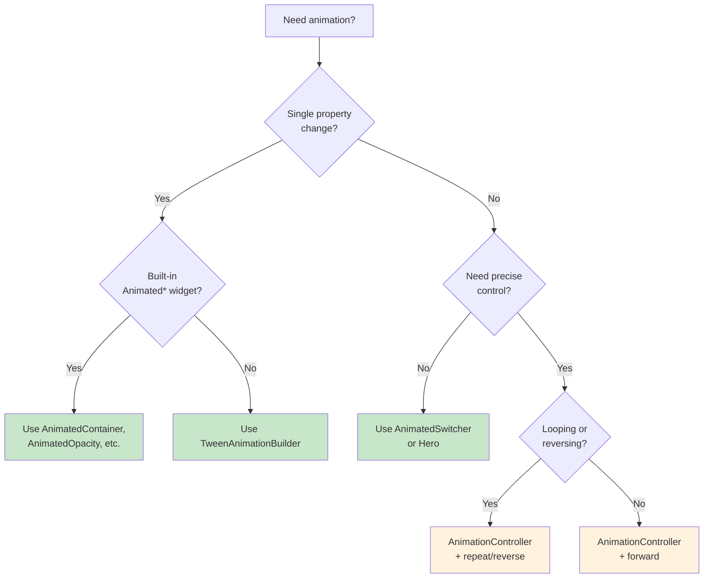

import Tabs from '@theme/Tabs';
import TabItem from '@theme/TabItem';

# Smooth Flying — Part 2

## 6. Staggered List Animation

Transaction lists look much better when items appear one by one instead of all at once. This staggered effect uses a single `AnimationController` with interval-based tweens.

```dart title="lib/widgets/animated_transaction_list.dart"
class AnimatedTransactionList extends StatefulWidget {
  final List<Transaction> transactions;

  const AnimatedTransactionList({super.key, required this.transactions});

  @override
  State<AnimatedTransactionList> createState() =>
      _AnimatedTransactionListState();
}

class _AnimatedTransactionListState extends State<AnimatedTransactionList>
    with SingleTickerProviderStateMixin {
  late final AnimationController _controller;

  @override
  void initState() {
    super.initState();
    _controller = AnimationController(
      vsync: this,
      duration: Duration(
        milliseconds: 150 * widget.transactions.length + 300,
      ),
    )..forward();
  }

  @override
  void dispose() {
    _controller.dispose();
    super.dispose();
  }

  @override
  Widget build(BuildContext context) {
    final count = widget.transactions.length;

    return ListView.builder(
      itemCount: count,
      itemBuilder: (context, index) {
        final start = (index / count) * 0.6;
        final end = start + 0.4;

        final slideAnimation = Tween<Offset>(
          begin: const Offset(0.3, 0),
          end: Offset.zero,
        ).animate(CurvedAnimation(
          parent: _controller,
          curve: Interval(start, end.clamp(0.0, 1.0), curve: Curves.easeOut),
        ));

        final fadeAnimation = Tween<double>(begin: 0, end: 1).animate(
          CurvedAnimation(
            parent: _controller,
            curve: Interval(start, end.clamp(0.0, 1.0), curve: Curves.easeIn),
          ),
        );

        return FadeTransition(
          opacity: fadeAnimation,
          child: SlideTransition(
            position: slideAnimation,
            child: TransactionTile(transaction: widget.transactions[index]),
          ),
        );
      },
    );
  }
}
```

The key insight is `Interval`. Each item gets a slice of the overall animation timeline. Item 0 starts at 0%, item 1 at 10%, item 2 at 20%, and so on — but they overlap, creating a cascade effect.

---

## 7. Page Transitions with GoRouter

GoRouter's default page transition varies by platform (fade on iOS, slide on Android). You can customize it with `CustomTransitionPage`.

```dart title="lib/router.dart"
GoRoute(
  path: '/account/:id',
  pageBuilder: (context, state) {
    final id = state.pathParameters['id']!;
    return CustomTransitionPage(
      key: state.pageKey,
      child: AccountDetailScreen(accountId: id),
      transitionsBuilder: (context, animation, secondaryAnimation, child) {
        return SlideTransition(
          position: Tween<Offset>(
            begin: const Offset(1.0, 0.0),
            end: Offset.zero,
          ).animate(CurvedAnimation(
            parent: animation,
            curve: Curves.fastOutSlowIn,
          )),
          child: child,
        );
      },
      transitionDuration: const Duration(milliseconds: 300),
    );
  },
),
```

For a fade transition (useful for bottom navigation tabs):

```dart
transitionsBuilder: (context, animation, secondaryAnimation, child) {
  return FadeTransition(opacity: animation, child: child);
},
```

:::info[TRY IT YOURSELF]
Combine `SlideTransition` and `FadeTransition` for a slide-and-fade effect:

```dart
transitionsBuilder: (context, animation, secondaryAnimation, child) {
  return FadeTransition(
    opacity: animation,
    child: SlideTransition(
      position: Tween<Offset>(
        begin: const Offset(0, 0.1),
        end: Offset.zero,
      ).animate(animation),
      child: child,
    ),
  );
},
```

This gives a subtle upward slide with a fade — less dramatic than a full horizontal slide.

:::

---

## 8. Respecting Reduced Motion

Some users enable reduced motion in their OS accessibility settings for medical reasons (motion sensitivity, vestibular disorders). A responsible app respects this preference.

```dart title="lib/utils/motion_utils.dart"
bool shouldReduceMotion(BuildContext context) {
  return MediaQuery.of(context).disableAnimations;
}

Duration adaptiveDuration(BuildContext context, Duration normal) {
  return shouldReduceMotion(context) ? Duration.zero : normal;
}
```

Use it throughout your animation code:

```dart
AnimatedContainer(
  duration: adaptiveDuration(context, const Duration(milliseconds: 300)),
  curve: Curves.easeInOut,
  // ...
)
```

For explicit animations, check the flag and skip:

```dart
@override
void initState() {
  super.initState();
  _controller = AnimationController(
    vsync: this,
    duration: const Duration(milliseconds: 800),
  );

  // Start at the end if user prefers reduced motion
  WidgetsBinding.instance.addPostFrameCallback((_) {
    if (shouldReduceMotion(context)) {
      _controller.value = 1.0;
    } else {
      _controller.forward();
    }
  });
}
```

:::tip[WHY THIS MATTERS]
Accessibility is not optional. Ignoring reduced motion preferences can cause physical discomfort for users with vestibular conditions. The code is minimal — a single boolean check — but the impact on affected users is significant.

:::

---

## Choosing the Right Animation Approach

Use this decision tree when deciding how to animate something in FlightBank:



**Green = implicit** (simpler, less code). **Orange = explicit** (more control, more boilerplate). Start implicit. Move to explicit only when you need looping, sequencing, or status listeners.

---

## 9. Before/After: Static Screens vs Animated Screens

<Tabs>
<TabItem value="before" label="Before" default>

```dart title="Static dashboard"
class DashboardScreen extends StatelessWidget {
  @override
  Widget build(BuildContext context) {
    return ListView(
      children: [
        // Card appears instantly
        AccountCard(account: account),
        // List appears all at once
        ...transactions.map((tx) => TransactionTile(transaction: tx)),
      ],
    );
  }
}
```

No motion. Everything pops in simultaneously. Page transitions use the default platform slide. Feels flat and unpolished.

</TabItem>
<TabItem value="after" label="After">

```dart title="Animated dashboard"
class DashboardScreen extends ConsumerStatefulWidget { /* ... */ }

class _DashboardScreenState extends ConsumerState<DashboardScreen>
    with SingleTickerProviderStateMixin {
  late final AnimationController _controller;

  @override
  void initState() {
    super.initState();
    _controller = AnimationController(
      vsync: this,
      duration: const Duration(milliseconds: 1000),
    );

    // Respect reduced motion
    WidgetsBinding.instance.addPostFrameCallback((_) {
      if (shouldReduceMotion(context)) {
        _controller.value = 1.0;
      } else {
        _controller.forward();
      }
    });
  }

  @override
  Widget build(BuildContext context) {
    return ListView(
      children: [
        // Hero-enabled card with animated balance
        Hero(
          tag: 'account-${account.id}',
          child: AccountCard(
            account: account,
            balance: AnimatedBalance(balance: account.balance),
          ),
        ),
        // Staggered transaction list
        AnimatedTransactionList(transactions: transactions),
      ],
    );
  }
}
```

Account cards fly between screens with Hero. Balances count up/down on change. Transactions cascade in with staggered slide + fade. Reduced motion users see the final state immediately.

</TabItem>
</Tabs>

:::tip[CHECKPOINT]
Your FlightBank app should now have:
- Balance cards that animate when expanded or tapped
- A counting balance display that interpolates between values
- Hero transitions linking dashboard cards to detail headers
- A pulsing status dot using explicit AnimationController
- Staggered transaction list items that cascade in
- Custom page transitions in GoRouter
- Reduced motion respected throughout

:::

---

## Summary

You have added motion to FlightBank across every layer:

- **Implicit animations** (`AnimatedContainer`, `AnimatedOpacity`, `AnimatedSwitcher`) for simple state-driven transitions
- **TweenAnimationBuilder** for custom implicit animations like counting balances
- **Hero animations** for spatial continuity between screens
- **AnimationController + Tween** for explicit, looping, or sequenced animations
- **Curved animations** for natural-feeling motion
- **Staggered lists** for cascading item reveals
- **GoRouter page transitions** for custom navigation animation
- **Reduced motion** support for accessibility

---

## Deep Dive

- [Animations tutorial — Flutter docs](https://docs.flutter.dev/ui/animations/tutorial)
- [AnimationController class — Flutter API docs](https://api.flutter.dev/flutter/animation/AnimationController-class.html)
- [Hero class — Flutter API docs](https://api.flutter.dev/flutter/widgets/Hero-class.html)
- [Curves class — Flutter API docs](https://api.flutter.dev/flutter/animation/Curves-class.html)
- [ImplicitlyAnimatedWidget class — Flutter API docs](https://api.flutter.dev/flutter/widgets/ImplicitlyAnimatedWidget-class.html)

---

## What's Next

Next chapter, we cross into native territory with platform channels. You will learn how to bridge Flutter and native code to access device-specific features like biometric authentication, enabling FlightBank to use fingerprint and face recognition for secure logins.
