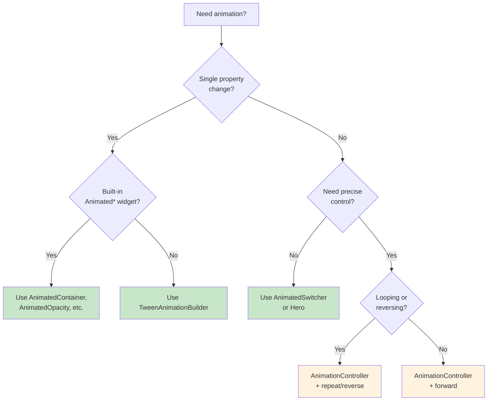

import Tabs from '@theme/Tabs';
import TabItem from '@theme/TabItem';

# Chapter 9: Smooth Flying

> *"The good thing about flying is the flying itself. It is the smoothness that matters — the grace of movement through the air."* — Amelia Earhart

**Estimated time:** ~30 minutes | **Focus:** Animations & Transitions | **Branch:** `chapter-9-smooth`

Static screens feel lifeless. Animations guide the user's eye, communicate state changes, and make an app feel polished and responsive. In a banking app, subtle motion builds trust — a smooth transition says "we are in control." This chapter adds implicit animations, Hero transitions, staggered lists, and page transitions to CoreBank.

---

## 1. Implicit Animations

Implicit animations are the easiest way to add motion. You give a widget a target value and a duration, and Flutter handles the interpolation. No controllers, no tickers — just declare the end state.

### AnimatedContainer

```dart title="lib/widgets/balance_card.dart"
AnimatedContainer(
  duration: const Duration(milliseconds: 300),
  curve: Curves.easeInOut,
  padding: isExpanded
      ? const EdgeInsets.all(24)
      : const EdgeInsets.all(16),
  decoration: BoxDecoration(
    color: isExpanded
        ? Theme.of(context).colorScheme.primaryContainer
        : Theme.of(context).colorScheme.surface,
    borderRadius: BorderRadius.circular(isExpanded ? 20 : 12),
    boxShadow: isExpanded
        ? [BoxShadow(color: Colors.black26, blurRadius: 12, offset: Offset(0, 4))]
        : [],
  ),
  child: Column(
    crossAxisAlignment: CrossAxisAlignment.start,
    children: [
      Text(account.name, style: Theme.of(context).textTheme.titleMedium),
      const SizedBox(height: 8),
      Text('\$${account.balance.toStringAsFixed(2)}',
          style: Theme.of(context).textTheme.headlineMedium),
    ],
  ),
)
```

When `isExpanded` changes, the padding, color, border radius, and shadow all animate smoothly. One `setState` call, zero animation plumbing.

### AnimatedOpacity and AnimatedSwitcher

```dart title="lib/widgets/status_indicator.dart"
// Fade content in and out
AnimatedOpacity(
  opacity: isVisible ? 1.0 : 0.0,
  duration: const Duration(milliseconds: 200),
  child: const Text('Transfer complete'),
)

// Cross-fade between two widgets
AnimatedSwitcher(
  duration: const Duration(milliseconds: 300),
  child: isLoading
      ? const CircularProgressIndicator(key: ValueKey('loading'))
      : const Icon(Icons.check, key: ValueKey('done'), size: 32),
)
```

:::tip[WHY THIS MATTERS]
`AnimatedSwitcher` requires unique keys on its children to detect which widget changed. Without keys, Flutter sees the same widget type and skips the animation entirely. Always add a `ValueKey` when switching between widgets of the same type.

:::

### AnimatedPadding

```dart
AnimatedPadding(
  duration: const Duration(milliseconds: 250),
  padding: EdgeInsets.only(left: isSelected ? 16 : 0),
  child: TransactionTile(transaction: tx),
)
```

Useful for sliding list items to indicate selection or swipe states.

---

## 2. TweenAnimationBuilder for Custom Implicit Animations

When the built-in `Animated*` widgets do not cover your use case, `TweenAnimationBuilder` lets you animate any value implicitly.

```dart title="lib/widgets/animated_balance.dart"
class AnimatedBalance extends StatelessWidget {
  final double balance;

  const AnimatedBalance({super.key, required this.balance});

  @override
  Widget build(BuildContext context) {
    return TweenAnimationBuilder<double>(
      tween: Tween(end: balance),
      duration: const Duration(milliseconds: 600),
      curve: Curves.easeOut,
      builder: (context, value, child) {
        return Text(
          '\$${value.toStringAsFixed(2)}',
          style: Theme.of(context).textTheme.headlineLarge,
        );
      },
    );
  }
}
```

When `balance` changes (say from \$1,200.00 to \$950.00 after a transfer), the text counts down smoothly. The tween automatically adjusts its `begin` to the previous `end` value, so it always animates from the last known state.

---

## 3. Hero Animations

Hero animations create a visual link between two screens. When the user taps an account card on the dashboard and navigates to the account detail screen, the card flies to its new position.

### Step 1: Wrap the source widget

```dart title="lib/screens/dashboard_screen.dart"
Hero(
  tag: 'account-${account.id}',
  child: AccountCard(account: account),
)
```


### Step 2: Wrap the destination widget with the same tag

```dart title="lib/screens/account_detail_screen.dart"
Hero(
  tag: 'account-${account.id}',
  child: AccountDetailHeader(account: account),
)
```


### Step 3: Handle Material conflicts

During the flight, the Hero widget is reparented to an overlay. If your card contains a `Material` widget, you may see visual glitches. Use `flightShuttleBuilder` to control what renders mid-flight:

```dart
Hero(
  tag: 'account-${account.id}',
  flightShuttleBuilder: (flightContext, animation, direction, fromContext, toContext) {
    return Material(
      color: Colors.transparent,
      child: toContext.widget,
    );
  },
  child: AccountCard(account: account),
)
```


The tag must be unique and identical on both screens. Use a pattern like `'account-${id}'` to avoid collisions.

---

## 4. AnimationController and Tween — Explicit Animations

When you need precise control — looping, reversing, listening to status changes — you need an explicit `AnimationController`.

```dart title="lib/widgets/pulse_dot.dart"
class PulseDot extends StatefulWidget {
  const PulseDot({super.key});

  @override
  State<PulseDot> createState() => _PulseDotState();
}

class _PulseDotState extends State<PulseDot>
    with SingleTickerProviderStateMixin {
  late final AnimationController _controller;
  late final Animation<double> _scaleAnimation;

  @override
  void initState() {
    super.initState();
    _controller = AnimationController(
      vsync: this,
      duration: const Duration(milliseconds: 1200),
    )..repeat(reverse: true);

    _scaleAnimation = Tween<double>(begin: 0.8, end: 1.2).animate(
      CurvedAnimation(parent: _controller, curve: Curves.easeInOut),
    );
  }

  @override
  void dispose() {
    _controller.dispose();
    super.dispose();
  }

  @override
  Widget build(BuildContext context) {
    return AnimatedBuilder(
      animation: _scaleAnimation,
      builder: (context, child) {
        return Transform.scale(
          scale: _scaleAnimation.value,
          child: child,
        );
      },
      child: Container(
        width: 12,
        height: 12,
        decoration: BoxDecoration(
          color: Colors.green,
          shape: BoxShape.circle,
        ),
      ),
    );
  }
}
```

:::tip[WHY THIS MATTERS]
The `vsync` parameter ties the animation to the widget's lifecycle via `SingleTickerProviderStateMixin`. This prevents the animation from consuming resources when the widget is off-screen. Always use a `TickerProvider` mixin — never create a `Ticker` manually.

:::

---

## 5. Curved Animations

Curves define the pacing of an animation. A linear animation feels robotic. Curves add personality.

```dart
// Smooth start and end
CurvedAnimation(parent: _controller, curve: Curves.easeInOut)

// Bouncy arrival
CurvedAnimation(parent: _controller, curve: Curves.bounceOut)

// Fast start, slow finish — good for things leaving the screen
CurvedAnimation(parent: _controller, curve: Curves.easeOut)

// Spring-like overshoot
CurvedAnimation(parent: _controller, curve: Curves.elasticOut)
```

| Curve | Use Case |
|---|---|
| `Curves.easeInOut` | General-purpose, most transitions |
| `Curves.easeOut` | Elements entering the screen |
| `Curves.easeIn` | Elements leaving the screen |
| `Curves.bounceOut` | Playful confirmations, success states |
| `Curves.fastOutSlowIn` | Material Design default |

For custom curves, use `Cubic`:

```dart
const myCustomCurve = Cubic(0.68, -0.55, 0.265, 1.55); // Overshoot effect
```

---

## 6. Staggered List Animation

Transaction lists look much better when items appear one by one instead of all at once. This staggered effect uses a single `AnimationController` with interval-based tweens.

```dart title="lib/widgets/animated_transaction_list.dart"
class AnimatedTransactionList extends StatefulWidget {
  final List<Transaction> transactions;

  const AnimatedTransactionList({super.key, required this.transactions});

  @override
  State<AnimatedTransactionList> createState() =>
      _AnimatedTransactionListState();
}

class _AnimatedTransactionListState extends State<AnimatedTransactionList>
    with SingleTickerProviderStateMixin {
  late final AnimationController _controller;

  @override
  void initState() {
    super.initState();
    _controller = AnimationController(
      vsync: this,
      duration: Duration(
        milliseconds: 150 * widget.transactions.length + 300,
      ),
    )..forward();
  }

  @override
  void dispose() {
    _controller.dispose();
    super.dispose();
  }

  @override
  Widget build(BuildContext context) {
    final count = widget.transactions.length;

    return ListView.builder(
      itemCount: count,
      itemBuilder: (context, index) {
        final start = (index / count) * 0.6;
        final end = start + 0.4;

        final slideAnimation = Tween<Offset>(
          begin: const Offset(0.3, 0),
          end: Offset.zero,
        ).animate(CurvedAnimation(
          parent: _controller,
          curve: Interval(start, end.clamp(0.0, 1.0), curve: Curves.easeOut),
        ));

        final fadeAnimation = Tween<double>(begin: 0, end: 1).animate(
          CurvedAnimation(
            parent: _controller,
            curve: Interval(start, end.clamp(0.0, 1.0), curve: Curves.easeIn),
          ),
        );

        return FadeTransition(
          opacity: fadeAnimation,
          child: SlideTransition(
            position: slideAnimation,
            child: TransactionTile(transaction: widget.transactions[index]),
          ),
        );
      },
    );
  }
}
```

The key insight is `Interval`. Each item gets a slice of the overall animation timeline. Item 0 starts at 0%, item 1 at 10%, item 2 at 20%, and so on — but they overlap, creating a cascade effect.

---

## 7. Page Transitions with GoRouter

GoRouter's default page transition varies by platform (fade on iOS, slide on Android). You can customize it with `CustomTransitionPage`.

```dart title="lib/router.dart"
GoRoute(
  path: '/account/:id',
  pageBuilder: (context, state) {
    final id = state.pathParameters['id']!;
    return CustomTransitionPage(
      key: state.pageKey,
      child: AccountDetailScreen(accountId: id),
      transitionsBuilder: (context, animation, secondaryAnimation, child) {
        return SlideTransition(
          position: Tween<Offset>(
            begin: const Offset(1.0, 0.0),
            end: Offset.zero,
          ).animate(CurvedAnimation(
            parent: animation,
            curve: Curves.fastOutSlowIn,
          )),
          child: child,
        );
      },
      transitionDuration: const Duration(milliseconds: 300),
    );
  },
),
```

For a fade transition (useful for bottom navigation tabs):

```dart
transitionsBuilder: (context, animation, secondaryAnimation, child) {
  return FadeTransition(opacity: animation, child: child);
},
```

:::info[TRY IT YOURSELF]
Combine `SlideTransition` and `FadeTransition` for a slide-and-fade effect:

```dart
transitionsBuilder: (context, animation, secondaryAnimation, child) {
  return FadeTransition(
    opacity: animation,
    child: SlideTransition(
      position: Tween<Offset>(
        begin: const Offset(0, 0.1),
        end: Offset.zero,
      ).animate(animation),
      child: child,
    ),
  );
},
```

This gives a subtle upward slide with a fade — less dramatic than a full horizontal slide.

:::

---

## 8. Respecting Reduced Motion

Some users enable reduced motion in their OS accessibility settings for medical reasons (motion sensitivity, vestibular disorders). A responsible app respects this preference.

```dart title="lib/utils/motion_utils.dart"
bool shouldReduceMotion(BuildContext context) {
  return MediaQuery.of(context).disableAnimations;
}

Duration adaptiveDuration(BuildContext context, Duration normal) {
  return shouldReduceMotion(context) ? Duration.zero : normal;
}
```

Use it throughout your animation code:

```dart
AnimatedContainer(
  duration: adaptiveDuration(context, const Duration(milliseconds: 300)),
  curve: Curves.easeInOut,
  // ...
)
```

For explicit animations, check the flag and skip:

```dart
@override
void initState() {
  super.initState();
  _controller = AnimationController(
    vsync: this,
    duration: const Duration(milliseconds: 800),
  );

  // Start at the end if user prefers reduced motion
  WidgetsBinding.instance.addPostFrameCallback((_) {
    if (shouldReduceMotion(context)) {
      _controller.value = 1.0;
    } else {
      _controller.forward();
    }
  });
}
```

:::tip[WHY THIS MATTERS]
Accessibility is not optional. Ignoring reduced motion preferences can cause physical discomfort for users with vestibular conditions. The code is minimal — a single boolean check — but the impact on affected users is significant.

:::

---

## Choosing the Right Animation Approach

Use this decision tree when deciding how to animate something in CoreBank:



**Green = implicit** (simpler, less code). **Orange = explicit** (more control, more boilerplate). Start implicit. Move to explicit only when you need looping, sequencing, or status listeners.

---

## 9. Before/After: Static Screens vs Animated Screens

<Tabs>
<TabItem value="before" label="Before" default>

```dart title="Static dashboard"
class DashboardScreen extends StatelessWidget {
  @override
  Widget build(BuildContext context) {
    return ListView(
      children: [
        // Card appears instantly
        AccountCard(account: account),
        // List appears all at once
        ...transactions.map((tx) => TransactionTile(transaction: tx)),
      ],
    );
  }
}
```

No motion. Everything pops in simultaneously. Page transitions use the default platform slide. Feels flat and unpolished.

</TabItem>
<TabItem value="after" label="After">

```dart title="Animated dashboard"
class DashboardScreen extends ConsumerStatefulWidget { /* ... */ }

class _DashboardScreenState extends ConsumerState<DashboardScreen>
    with SingleTickerProviderStateMixin {
  late final AnimationController _controller;

  @override
  void initState() {
    super.initState();
    _controller = AnimationController(
      vsync: this,
      duration: const Duration(milliseconds: 1000),
    );

    // Respect reduced motion
    WidgetsBinding.instance.addPostFrameCallback((_) {
      if (shouldReduceMotion(context)) {
        _controller.value = 1.0;
      } else {
        _controller.forward();
      }
    });
  }

  @override
  Widget build(BuildContext context) {
    return ListView(
      children: [
        // Hero-enabled card with animated balance
        Hero(
          tag: 'account-${account.id}',
          child: AccountCard(
            account: account,
            balance: AnimatedBalance(balance: account.balance),
          ),
        ),
        // Staggered transaction list
        AnimatedTransactionList(transactions: transactions),
      ],
    );
  }
}
```

Account cards fly between screens with Hero. Balances count up/down on change. Transactions cascade in with staggered slide + fade. Reduced motion users see the final state immediately.

</TabItem>
</Tabs>

:::tip[CHECKPOINT]
Your CoreBank app should now have:
- Balance cards that animate when expanded or tapped
- A counting balance display that interpolates between values
- Hero transitions linking dashboard cards to detail headers
- A pulsing status dot using explicit AnimationController
- Staggered transaction list items that cascade in
- Custom page transitions in GoRouter
- Reduced motion respected throughout

:::

---

## Summary

You have added motion to CoreBank across every layer:

- **Implicit animations** (`AnimatedContainer`, `AnimatedOpacity`, `AnimatedSwitcher`) for simple state-driven transitions
- **TweenAnimationBuilder** for custom implicit animations like counting balances
- **Hero animations** for spatial continuity between screens
- **AnimationController + Tween** for explicit, looping, or sequenced animations
- **Curved animations** for natural-feeling motion
- **Staggered lists** for cascading item reveals
- **GoRouter page transitions** for custom navigation animation
- **Reduced motion** support for accessibility

Next chapter, we cross into native territory with platform channels.
