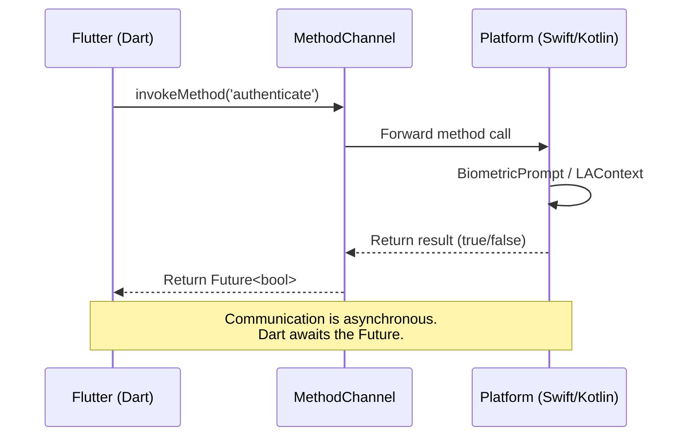

import Tabs from '@theme/Tabs';
import TabItem from '@theme/TabItem';

# Chapter 10: Ground Control

> *"Houston, we've had a problem." — the moment you realise your app needs something only the native platform can provide.* — adapted from Jim Lovell

**Estimated time:** ~30 minutes | **Focus:** Platform Integration | **Branch:** `chapter-10-ground-control`

Flutter handles 95% of what a banking app needs. But biometric authentication, hardware sensors, and certain native UI elements live outside Flutter's reach. This chapter teaches you to cross the boundary — first manually with platform channels, then smartly with existing plugins. You will add biometric login to FlightBank.

---

## 1. When You Need Platform Code

Flutter's rendering engine draws its own pixels on a canvas. It does not wrap native UI components. This means some capabilities require talking directly to the host platform.

Common cases where you need platform code:

| Capability | Why Native? |
|---|---|
| Biometric auth (Face ID, fingerprint) | OS-level security APIs |
| Push notification tokens | Firebase/APNs registration |
| Camera with custom processing | Platform-specific camera pipelines |
| Bluetooth / NFC | Hardware access APIs |
| Platform-specific UI (share sheet, contacts picker) | OS widgets not available in Flutter |
| Secure storage (Keychain / Keystore) | Hardware-backed encryption |

For FlightBank, biometric authentication is the critical case. Users expect to unlock a banking app with their face or fingerprint.

---

## 2. MethodChannel Explained

A `MethodChannel` is a named pipe between Flutter (Dart) and the host platform (Swift/Kotlin). Flutter sends a message with a method name and arguments, the platform processes it, and sends a result back.



Key rules:
- Channel names must be unique across your app. Convention: reverse domain notation (`com.flightbank/biometrics`).
- Arguments and return values must be serializable — primitives, lists, maps. No custom objects.
- Calls are asynchronous. The Dart side gets a `Future`.
- Either side can initiate a call, but typically Flutter calls the platform.

---

## 3. Define the Channel

Start by defining the channel name as a constant shared between your Dart code and the method call handler.

```dart title="lib/services/biometric_channel.dart"
import 'package:flutter/services.dart';

class BiometricChannel {
  static const _channel = MethodChannel('com.flightbank/biometrics');

  /// Check if biometric authentication is available on this device.
  static Future<bool> isAvailable() async {
    try {
      final result = await _channel.invokeMethod<bool>('isAvailable');
      return result ?? false;
    } on PlatformException {
      return false;
    }
  }

  /// Prompt the user for biometric authentication.
  /// Returns true if authentication succeeded.
  static Future<bool> authenticate({
    String reason = 'Authenticate to access FlightBank',
  }) async {
    try {
      final result = await _channel.invokeMethod<bool>(
        'authenticate',
        {'reason': reason},
      );
      return result ?? false;
    } on PlatformException catch (e) {
      throw BiometricException(
        code: e.code,
        message: e.message ?? 'Authentication failed',
      );
    }
  }
}

class BiometricException implements Exception {
  final String code;
  final String message;

  const BiometricException({required this.code, required this.message});

  @override
  String toString() => 'BiometricException($code): $message';
}
```

:::tip[WHY THIS MATTERS]
Always wrap `invokeMethod` in a try/catch for `PlatformException`. If the native side throws an error (device has no biometric hardware, user cancelled, etc.), it arrives as a `PlatformException` on the Dart side. An unhandled exception here crashes your app.

:::

---

## 4. Flutter Side: Calling the Channel

The Dart wrapper above is clean, but you need to integrate it into FlightBank's login flow. Here is how the login screen uses it:

```dart title="lib/screens/login_screen.dart"
class _LoginScreenState extends ConsumerState<LoginScreen> {
  bool _biometricsAvailable = false;

  @override
  void initState() {
    super.initState();
    _checkBiometrics();
  }

  Future<void> _checkBiometrics() async {
    final available = await BiometricChannel.isAvailable();
    if (mounted) {
      setState(() => _biometricsAvailable = available);
    }
  }

  Future<void> _authenticateWithBiometrics() async {
    try {
      final success = await BiometricChannel.authenticate(
        reason: 'Log in to FlightBank',
      );
      if (success && mounted) {
        ref.read(authProvider.notifier).loginWithBiometrics();
        context.go('/dashboard');
      }
    } on BiometricException catch (e) {
      if (!mounted) return;
      ScaffoldMessenger.of(context).showSnackBar(
        SnackBar(content: Text(e.message)),
      );
    }
  }

  @override
  Widget build(BuildContext context) {
    return Scaffold(
      body: Center(
        child: Column(
          mainAxisSize: MainAxisSize.min,
          children: [
            // ... email/password fields ...
            if (_biometricsAvailable) ...[
              const SizedBox(height: 16),
              OutlinedButton.icon(
                onPressed: _authenticateWithBiometrics,
                icon: const Icon(Icons.fingerprint),
                label: const Text('Use Biometrics'),
              ),
            ],
          ],
        ),
      ),
    );
  }
}
```

The biometric button only appears if the device supports it. This graceful degradation is essential — not every device has a fingerprint sensor.

---

## 5. iOS (Swift) Implementation

On the iOS side, you register a `FlutterPlugin` that listens for method calls on the same channel name.

### Step 1: Create the plugin class

```swift title="ios/Runner/BiometricPlugin.swift"
import Flutter
import LocalAuthentication

class BiometricPlugin: NSObject, FlutterPlugin {

    static func register(with registrar: FlutterPluginRegistrar) {
        let channel = FlutterMethodChannel(
            name: "com.flightbank/biometrics",
            binaryMessenger: registrar.messenger()
        )
        let instance = BiometricPlugin()
        registrar.addMethodCallDelegate(instance, channel: channel)
    }

    func handle(_ call: FlutterMethodCall, result: @escaping FlutterResult) {
        switch call.method {
        case "isAvailable":
            handleIsAvailable(result: result)
        case "authenticate":
            let args = call.arguments as? [String: Any]
            let reason = args?["reason"] as? String ?? "Authenticate"
            handleAuthenticate(reason: reason, result: result)
        default:
            result(FlutterMethodNotImplemented)
        }
    }

    private func handleIsAvailable(result: FlutterResult) {
        let context = LAContext()
        var error: NSError?
        let available = context.canEvaluatePolicy(
            .deviceOwnerAuthenticationWithBiometrics,
            error: &error
        )
        result(available)
    }

    private func handleAuthenticate(reason: String, result: @escaping FlutterResult) {
        let context = LAContext()
        context.evaluatePolicy(
            .deviceOwnerAuthenticationWithBiometrics,
            localizedReason: reason
        ) { success, error in
            DispatchQueue.main.async {
                if success {
                    result(true)
                } else if let error = error as? LAError {
                    switch error.code {
                    case .userCancel:
                        result(
                            FlutterError(code: "USER_CANCEL",
                                         message: "User cancelled authentication",
                                         details: nil)
                        )
                    case .biometryNotAvailable:
                        result(
                            FlutterError(code: "NOT_AVAILABLE",
                                         message: "Biometrics not available",
                                         details: nil)
                        )
                    default:
                        result(
                            FlutterError(code: "AUTH_FAILED",
                                         message: error.localizedDescription,
                                         details: nil)
                        )
                    }
                } else {
                    result(false)
                }
            }
        }
    }
}
```

### Step 2: Register in AppDelegate

```swift title="ios/Runner/AppDelegate.swift"
import Flutter
import UIKit

@main
@objc class AppDelegate: FlutterAppDelegate {
    override func application(
        _ application: UIApplication,
        didFinishLaunchingWithOptions launchOptions: [UIApplication.LaunchOptionsKey: Any]?
    ) -> Bool {
        GeneratedPluginRegistrant.register(with: self)

        // Register our custom plugin
        BiometricPlugin.register(with: registrar(forPlugin: "BiometricPlugin")!)

        return super.application(application, didFinishLaunchingWithOptions: launchOptions)
    }
}
```

### Step 3: Add the Info.plist entry

iOS requires a usage description for biometrics:

```xml title="ios/Runner/Info.plist"
<key>NSFaceIDUsageDescription</key>
<string>FlightBank uses Face ID to securely log you in.</string>
```

Without this entry, iOS will terminate your app when you try to use Face ID.

*Continued in [Part 2](/chapters/ground-control/part-2) — Android implementation, conditional platform code, using plugins, and writing your own plugin package.*
