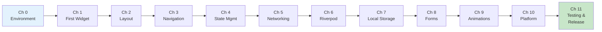

import Tabs from '@theme/Tabs';
import TabItem from '@theme/TabItem';

# Cleared for Landing — Part 2

## 6. Performance Profiling with Flutter DevTools

Flutter DevTools is a browser-based suite for debugging and profiling your app.

```bash
# Launch DevTools
flutter run --profile
# Then open the DevTools URL printed in the console
```

### Timeline View

The timeline shows every frame your app renders. Look for frames that exceed the 16ms budget (for 60fps). Common culprits:

- **Expensive `build` methods** — building too many widgets per frame
- **Synchronous computation in the UI thread** — parsing JSON, complex calculations
- **Unnecessary rebuilds** — missing `const`, overly broad `setState`

### Memory View

The memory tab shows allocation patterns and helps find leaks. Watch for:

- **Steady memory growth** — objects being created but never freed (leaking controllers, streams)
- **Large allocations on navigation** — images or data not being released when screens pop

### Widget Inspector

The inspector shows the live widget tree, constraint propagation, and render object details. Use it to debug layout issues:

- **Overflow errors** — a child is larger than its parent allows
- **Unbounded constraints** — a `ListView` inside a `Column` without `Expanded`

:::info[TRY IT YOURSELF]
Run CoreBank in profile mode (`flutter run --profile`) and navigate through the app. Open DevTools and look at the Timeline tab. Find the slowest frame during a page transition and identify which phase (build, layout, paint) took the most time.

:::

---

## 7. Release Checklist

Before CoreBank hits the app stores, work through this checklist.

### App Icon and Splash Screen

```yaml title="pubspec.yaml"
dependencies:
  flutter_launcher_icons: ^0.13.0
  flutter_native_splash: ^2.4.0

flutter_launcher_icons:
  android: true
  ios: true
  image_path: "assets/icon/app_icon.png"
  adaptive_icon_background: "#1A237E"
  adaptive_icon_foreground: "assets/icon/app_icon_foreground.png"

flutter_native_splash:
  color: "#1A237E"
  image: "assets/splash/logo.png"
  android_12:
    icon_background_color: "#1A237E"
    image: "assets/splash/logo.png"
```

```bash
dart run flutter_launcher_icons
dart run flutter_native_splash:create
```

### Signing

<Tabs>
<TabItem value="android" label="Android" default>

```bash
# Generate a keystore (do this once, store securely)
keytool -genkey -v -keystore ~/corebank-release.jks \
  -keyalg RSA -keysize 2048 -validity 10000 \
  -alias corebank
```

```properties title="android/key.properties"
storePassword=your_store_password
keyPassword=your_key_password
keyAlias=corebank
storeFile=/Users/you/corebank-release.jks
```

```groovy title="android/app/build.gradle"
def keystoreProperties = new Properties()
def keystoreFile = rootProject.file('key.properties')
if (keystoreFile.exists()) {
    keystoreProperties.load(new FileInputStream(keystoreFile))
}

android {
    signingConfigs {
        release {
            keyAlias keystoreProperties['keyAlias']
            keyPassword keystoreProperties['keyPassword']
            storeFile file(keystoreProperties['storeFile'])
            storePassword keystoreProperties['storePassword']
        }
    }
    buildTypes {
        release {
            signingConfig signingConfigs.release
        }
    }
}
```

Never commit `key.properties` or `.jks` files to version control.

</TabItem>
<TabItem value="ios" label="iOS">

iOS signing is managed through Xcode and Apple Developer Portal:

1. Open `ios/Runner.xcworkspace` in Xcode.
2. Select the Runner target, go to **Signing & Capabilities**.
3. Select your team and let Xcode manage provisioning automatically, or configure a manual provisioning profile.
4. For distribution, create an **App Store** provisioning profile in the Apple Developer Portal.

For CI/CD, use tools like [Fastlane](https://fastlane.tools/) with `match` to manage certificates and profiles.

</TabItem>
</Tabs>

### Code Obfuscation and Tree Shaking

```bash
# Release build with obfuscation
flutter build apk \
  --release \
  --obfuscate \
  --split-debug-info=build/debug-info

flutter build ipa \
  --release \
  --obfuscate \
  --split-debug-info=build/debug-info
```

- `--obfuscate` renames classes and methods to meaningless names, protecting your source code
- `--split-debug-info` saves the symbol map separately so you can still decode crash stack traces
- Tree shaking is automatic in release mode — unused code is stripped

Keep the `build/debug-info` directory safe. You need it to symbolicate crash reports from production.

### Build Modes

| Mode | Use Case | Assertions | DevTools | Optimized |
|---|---|---|---|---|
| `debug` | Development | Yes | Yes | No |
| `profile` | Performance testing | No | Yes | Yes |
| `release` | Production | No | No | Yes |

```bash
flutter run                    # debug (default)
flutter run --profile          # profile
flutter build apk --release    # release APK
flutter build appbundle        # release AAB (preferred for Play Store)
flutter build ipa              # release IPA for App Store
```

:::tip[CHECKPOINT]
Before submitting to the stores, verify:
- [ ] All widget tests pass: `flutter test`
- [ ] Integration tests pass on a real device
- [ ] No analyzer warnings: `flutter analyze`
- [ ] App icon renders correctly on both platforms
- [ ] Splash screen displays and transitions smoothly
- [ ] Release build runs without crashes
- [ ] ProGuard / R8 (Android) does not strip needed classes
- [ ] `--obfuscate` build produces readable crash reports with the debug info

:::

---

## 8. What You Have Built

Over 12 chapters (0 through 11), you have built CoreBank — a complete Flutter banking app. Here is the full flight path:



| Chapter | What You Learned |
|---|---|
| 0 — Pre-Flight Check | Flutter SDK, IDE setup, project creation |
| 1 — First Flight | Widgets, StatelessWidget, StatefulWidget, hot reload |
| 2 — Instrument Panel | Row, Column, Expanded, layout constraints, Material Design |
| 3 — Navigation | GoRouter, named routes, path parameters, redirects |
| 4 — Cockpit | setState, lifting state, InheritedWidget patterns |
| 5 — Networking | HTTP requests, JSON serialization, error handling |
| 6 — Autopilot | Riverpod providers, AsyncValue, state architecture |
| 7 — Flight Recorder | SharedPreferences, SQLite, Hive, offline caching |
| 8 — Forms & Checklists | Form validation, input formatting, submit flows |
| 9 — Smooth Flying | Implicit and explicit animations, Hero, page transitions |
| 10 — Ground Control | MethodChannel, platform code, biometrics, plugins |
| 11 — Cleared for Landing | Testing, golden files, profiling, release builds |

---

## 9. Where to Go Next

CoreBank is complete, but your Flutter journey continues. Here are paths forward:

### Deepen Your Knowledge

- **State management deep dive** — explore Bloc, Signals, or vanilla ChangeNotifier to understand trade-offs
- **Custom painting** — `CustomPainter` for charts, graphs, and custom visualizations in the account detail screen
- **Slivers** — `SliverAppBar`, `SliverList`, `SliverGrid` for complex scrolling experiences
- **Isolates** — move heavy computation (CSV export, data processing) off the main thread

### Expand CoreBank

- **Push notifications** — Firebase Cloud Messaging for transaction alerts
- **Deep linking** — handle `corebank://transfer?to=acc-2` URLs
- **Internationalization** — `flutter_localizations` and `.arb` files for multi-language support
- **Theming** — dynamic color with Material You on Android, system accent colors on iOS
- **Accessibility** — semantic labels, screen reader testing, contrast verification

### Production Concerns

- **CI/CD** — GitHub Actions or Codemagic for automated builds and tests
- **Crash reporting** — Firebase Crashlytics or Sentry for production error tracking
- **Analytics** — Firebase Analytics or Amplitude for user behavior insights
- **Feature flags** — LaunchDarkly or Firebase Remote Config for gradual rollouts
- **Code generation** — Freezed for immutable models, json_serializable for JSON, auto_route for type-safe routing

### Community and Resources

- [flutter.dev/docs](https://flutter.dev/docs) — official documentation
- [pub.dev](https://pub.dev) — package repository
- [Flutter YouTube channel](https://www.youtube.com/flutterdev) — Widget of the Week, Decoding Flutter
- [r/FlutterDev](https://reddit.com/r/FlutterDev) — community discussions
- [Flutter Discord](https://discord.gg/flutter) — real-time help

:::tip[CHECKPOINT]
You made it. CoreBank is built, tested, and ready for takeoff. You understand Flutter's widget system, state management with Riverpod, networking, local persistence, forms, animations, platform channels, testing, and release builds. You are not a beginner anymore — you are a Flutter developer. Happy flying.

:::

---

## Summary

This final chapter covered the last mile:

- **Widget tests** with `testWidgets`, `pumpWidget`, `find`, and `expect`
- **Interaction tests** using `tap`, `enterText`, `pump`, and `pumpAndSettle`
- **Riverpod test overrides** for isolated, deterministic widget tests
- **Integration tests** on real devices with `integration_test`
- **Golden tests** for pixel-perfect visual regression detection
- **DevTools profiling** — timeline, memory, and widget inspector
- **Release checklist** — icons, splash, signing, obfuscation, build modes

CoreBank is cleared for landing.

---

## Deep Dive

- [Testing Flutter apps — Flutter docs](https://docs.flutter.dev/testing/overview)
- [integration_test package — Flutter docs](https://docs.flutter.dev/testing/integration-tests)
- [Flutter DevTools — Flutter docs](https://docs.flutter.dev/tools/devtools/overview)
- [Build and release an Android app — Flutter docs](https://docs.flutter.dev/deployment/android)
- [Riverpod testing — Riverpod docs](https://riverpod.dev/docs/essentials/testing)

---

## Where to Go From Here

Congratulations on completing the entire Flight School tutorial. You have gone from zero to a production-ready Flutter banking app. Here is how to keep climbing:

**Join the community.** The [r/FlutterDev](https://reddit.com/r/FlutterDev) subreddit and [Flutter Discord](https://discord.gg/flutter) are active communities where you can ask questions, share your projects, and learn from other developers building real apps.

**Explore advanced topics.** Custom render objects give you pixel-level control over how widgets paint. Isolates let you run expensive computation without janking the UI. Dart FFI opens the door to calling C/C++ libraries directly — useful for cryptography, image processing, or game engines.

**Contribute back.** The Flutter ecosystem thrives on open-source contributions. File issues when you find bugs, submit pull requests to packages you use, write blog posts about what you have learned, or publish your own packages on pub.dev. Every contribution — no matter how small — makes Flutter better for the next developer starting their own flight school.
