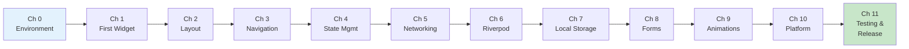

import Tabs from '@theme/Tabs';
import TabItem from '@theme/TabItem';

# Chapter 11: Cleared for Landing

> *"Any landing you can walk away from is a good landing. Any landing you can use the aeroplane again is an outstanding landing."* — attributed to Chuck Yeager

**Estimated time:** ~30 minutes | **Focus:** Testing & Production | **Branch:** `chapter-11-landing`

You have built FlightBank from the ground up — widgets, navigation, state management, networking, local storage, forms, animations, and platform integration. Now you need to prove it works, catch regressions, profile performance, and ship it. This chapter covers testing at every level, performance tooling, and the release checklist that gets FlightBank into the app stores.

---

## 1. Widget Testing Basics

Widget tests render a widget in a test environment, interact with it, and verify expectations. They are faster than integration tests (no device needed) and more meaningful than unit tests (they test real widget trees).

```dart title="test/widgets/account_card_test.dart"
import 'package:flutter/material.dart';
import 'package:flutter_test/flutter_test.dart';
import 'package:flightbank/models/account.dart';
import 'package:flightbank/widgets/account_card.dart';

void main() {
  final testAccount = Account(
    id: 'acc-1',
    name: 'Checking',
    balance: 2450.75,
    type: AccountType.checking,
  );

  testWidgets('AccountCard displays account name and formatted balance',
      (tester) async {
    await tester.pumpWidget(
      MaterialApp(
        home: Scaffold(
          body: AccountCard(account: testAccount),
        ),
      ),
    );

    // Verify the account name is displayed
    expect(find.text('Checking'), findsOneWidget);

    // Verify the balance is formatted correctly
    expect(find.text('\$2,450.75'), findsOneWidget);
  });

  testWidgets('AccountCard shows correct icon for account type',
      (tester) async {
    await tester.pumpWidget(
      MaterialApp(
        home: Scaffold(
          body: AccountCard(account: testAccount),
        ),
      ),
    );

    expect(find.byIcon(Icons.account_balance), findsOneWidget);
  });
}
```

Key functions:
- `tester.pumpWidget()` — renders the widget tree
- `find.text()` / `find.byIcon()` / `find.byType()` — locators
- `expect(finder, findsOneWidget)` — assertion

:::tip[WHY THIS MATTERS]
Always wrap your widget in `MaterialApp` (or `CupertinoApp`) inside `pumpWidget`. Many widgets depend on `Theme`, `MediaQuery`, `Navigator`, or `Directionality` from their ancestor tree. A bare widget without these ancestors will throw.

:::

---

## 2. Testing Interactions

Widgets are interactive. You need to test taps, text entry, scrolling, and the resulting state changes.

```dart title="test/screens/transfer_screen_test.dart"
testWidgets('Transfer form shows validation errors on empty submit',
    (tester) async {
  await tester.pumpWidget(
    MaterialApp(
      home: ProviderScope(
        overrides: [
          accountsProvider.overrideWith((ref) => [
            Account(id: '1', name: 'Checking', balance: 1000, type: AccountType.checking),
            Account(id: '2', name: 'Savings', balance: 5000, type: AccountType.savings),
          ]),
        ],
        child: const TransferScreen(),
      ),
    ),
  );

  // Tap the Transfer button without filling any fields
  await tester.tap(find.text('Transfer'));
  await tester.pumpAndSettle();

  // Verify validation errors appear
  expect(find.text('Select a source account'), findsOneWidget);
  expect(find.text('Amount is required'), findsOneWidget);
});

testWidgets('Transfer form accepts valid input', (tester) async {
  await tester.pumpWidget(/* ... same setup ... */);

  // Select "From" account
  await tester.tap(find.text('From Account').last);
  await tester.pumpAndSettle();
  await tester.tap(find.text('Checking — \$1,000.00').last);
  await tester.pumpAndSettle();

  // Enter amount
  await tester.enterText(
    find.byType(TextFormField).at(0), // Amount field
    '250.00',
  );

  // Tap Transfer
  await tester.tap(find.text('Transfer'));
  await tester.pumpAndSettle();

  // The confirmation dialog should appear
  expect(find.text('Confirm Transfer'), findsOneWidget);
});
```

Important timing methods:
- `tester.pump()` — advances one frame. Use when you know exactly how many frames to advance.
- `tester.pump(Duration(milliseconds: 300))` — advances by a specific duration. Good for testing animations mid-flight.
- `tester.pumpAndSettle()` — keeps pumping frames until no more animations or scheduled frames remain. Use after taps and navigation.

---

## 3. Testing with Riverpod

Riverpod's `ProviderScope` makes dependency injection trivial in tests. Override any provider with test data.

```dart title="test/screens/dashboard_screen_test.dart"
testWidgets('Dashboard shows loading state while fetching accounts',
    (tester) async {
  await tester.pumpWidget(
    ProviderScope(
      overrides: [
        accountsStreamProvider.overrideWith(
          (ref) => const Stream.empty(), // Never completes — stays loading
        ),
      ],
      child: const MaterialApp(home: DashboardScreen()),
    ),
  );

  expect(find.byType(CircularProgressIndicator), findsOneWidget);
});

testWidgets('Dashboard displays account cards when data loads',
    (tester) async {
  final testAccounts = [
    Account(id: '1', name: 'Checking', balance: 1000, type: AccountType.checking),
    Account(id: '2', name: 'Savings', balance: 5000, type: AccountType.savings),
  ];

  await tester.pumpWidget(
    ProviderScope(
      overrides: [
        accountsStreamProvider.overrideWith(
          (ref) => Stream.value(testAccounts),
        ),
      ],
      child: const MaterialApp(home: DashboardScreen()),
    ),
  );

  await tester.pumpAndSettle();

  expect(find.text('Checking'), findsOneWidget);
  expect(find.text('Savings'), findsOneWidget);
  expect(find.text('\$1,000.00'), findsOneWidget);
  expect(find.text('\$5,000.00'), findsOneWidget);
});

testWidgets('Dashboard shows error state on stream failure',
    (tester) async {
  await tester.pumpWidget(
    ProviderScope(
      overrides: [
        accountsStreamProvider.overrideWith(
          (ref) => Stream.error(Exception('Network failure')),
        ),
      ],
      child: const MaterialApp(home: DashboardScreen()),
    ),
  );

  await tester.pumpAndSettle();

  expect(find.text('Something went wrong'), findsOneWidget);
  expect(find.text('Retry'), findsOneWidget);
});
```

:::info[TRY IT YOURSELF]
Write a test that verifies the "Retry" button on the error state actually re-triggers the data fetch. Override the provider with a stream that fails once, then succeeds on retry. Use `tester.tap(find.text('Retry'))` and verify the loading indicator reappears.

:::

---

## 4. Integration Testing

Integration tests run on a real device or emulator, testing the full app stack including navigation, networking (or mocked backends), and platform features.

```yaml title="pubspec.yaml"
dev_dependencies:
  integration_test:
    sdk: flutter
  flutter_test:
    sdk: flutter
```

```dart title="integration_test/login_flow_test.dart"
import 'package:flutter_test/flutter_test.dart';
import 'package:integration_test/integration_test.dart';
import 'package:flightbank/main.dart' as app;

void main() {
  IntegrationTestWidgetsFlutterBinding.ensureInitialized();

  testWidgets('Full login and dashboard flow', (tester) async {
    app.main();
    await tester.pumpAndSettle();

    // Should start on login screen
    expect(find.text('Log In'), findsOneWidget);

    // Enter credentials
    await tester.enterText(
      find.byKey(const Key('email-field')),
      'test@flightbank.com',
    );
    await tester.enterText(
      find.byKey(const Key('password-field')),
      'testpassword123',
    );

    // Tap login
    await tester.tap(find.text('Log In'));
    await tester.pumpAndSettle(const Duration(seconds: 5));

    // Should navigate to dashboard
    expect(find.text('Checking'), findsOneWidget);
    expect(find.text('Savings'), findsOneWidget);

    // Tap on an account card
    await tester.tap(find.text('Checking'));
    await tester.pumpAndSettle();

    // Should navigate to account detail
    expect(find.text('Recent Transactions'), findsOneWidget);
  });
}
```

Run integration tests with:

```bash
flutter test integration_test/login_flow_test.dart
```

For more sophisticated integration testing, consider [Patrol](https://patrol.leancode.co/) — it adds native interaction capabilities (dismissing system dialogs, handling permissions) that the standard `integration_test` package cannot do.

---

## 5. Golden Tests

Golden tests capture a screenshot of a widget and compare it against a stored reference image. Any pixel difference fails the test — catching visual regressions automatically.

```dart title="test/golden/account_card_golden_test.dart"
import 'package:flutter/material.dart';
import 'package:flutter_test/flutter_test.dart';
import 'package:flightbank/widgets/account_card.dart';
import 'package:flightbank/models/account.dart';

void main() {
  testWidgets('AccountCard matches golden file', (tester) async {
    await tester.pumpWidget(
      MaterialApp(
        theme: ThemeData(useMaterial3: true),
        home: Scaffold(
          body: Center(
            child: SizedBox(
              width: 350,
              child: AccountCard(
                account: Account(
                  id: '1',
                  name: 'Checking',
                  balance: 2450.75,
                  type: AccountType.checking,
                ),
              ),
            ),
          ),
        ),
      ),
    );

    await expectLater(
      find.byType(AccountCard),
      matchesGoldenFile('goldens/account_card.png'),
    );
  });
}
```

Generate the initial golden files:

```bash
flutter test --update-goldens test/golden/
```

On subsequent runs, the test compares the current rendering against the stored image. If your theme changes or a widget layout shifts, the test fails with a diff image showing exactly what changed.

:::tip[WHY THIS MATTERS]
Golden tests are platform-dependent — font rendering differs between macOS, Linux, and Windows. Run golden generation and comparison on the same platform (typically CI on Linux). Some teams use packages like `alchemist` to improve golden test reliability across environments.

:::

---

## 6. Performance Profiling with Flutter DevTools

Flutter DevTools is a browser-based suite for debugging and profiling your app.

```bash
# Launch DevTools
flutter run --profile
# Then open the DevTools URL printed in the console
```

### Timeline View

The timeline shows every frame your app renders. Look for frames that exceed the 16ms budget (for 60fps). Common culprits:

- **Expensive `build` methods** — building too many widgets per frame
- **Synchronous computation in the UI thread** — parsing JSON, complex calculations
- **Unnecessary rebuilds** — missing `const`, overly broad `setState`

### Memory View

The memory tab shows allocation patterns and helps find leaks. Watch for:

- **Steady memory growth** — objects being created but never freed (leaking controllers, streams)
- **Large allocations on navigation** — images or data not being released when screens pop

### Widget Inspector

The inspector shows the live widget tree, constraint propagation, and render object details. Use it to debug layout issues:

- **Overflow errors** — a child is larger than its parent allows
- **Unbounded constraints** — a `ListView` inside a `Column` without `Expanded`

:::info[TRY IT YOURSELF]
Run FlightBank in profile mode (`flutter run --profile`) and navigate through the app. Open DevTools and look at the Timeline tab. Find the slowest frame during a page transition and identify which phase (build, layout, paint) took the most time.

:::

---

## 7. Release Checklist

Before FlightBank hits the app stores, work through this checklist.

### App Icon and Splash Screen

```yaml title="pubspec.yaml"
dependencies:
  flutter_launcher_icons: ^0.13.0
  flutter_native_splash: ^2.4.0

flutter_launcher_icons:
  android: true
  ios: true
  image_path: "assets/icon/app_icon.png"
  adaptive_icon_background: "#1A237E"
  adaptive_icon_foreground: "assets/icon/app_icon_foreground.png"

flutter_native_splash:
  color: "#1A237E"
  image: "assets/splash/logo.png"
  android_12:
    icon_background_color: "#1A237E"
    image: "assets/splash/logo.png"
```

```bash
dart run flutter_launcher_icons
dart run flutter_native_splash:create
```

### Signing

<Tabs>
<TabItem value="android" label="Android" default>

```bash
# Generate a keystore (do this once, store securely)
keytool -genkey -v -keystore ~/flightbank-release.jks \
  -keyalg RSA -keysize 2048 -validity 10000 \
  -alias flightbank
```

```properties title="android/key.properties"
storePassword=your_store_password
keyPassword=your_key_password
keyAlias=flightbank
storeFile=/Users/you/flightbank-release.jks
```

```groovy title="android/app/build.gradle"
def keystoreProperties = new Properties()
def keystoreFile = rootProject.file('key.properties')
if (keystoreFile.exists()) {
    keystoreProperties.load(new FileInputStream(keystoreFile))
}

android {
    signingConfigs {
        release {
            keyAlias keystoreProperties['keyAlias']
            keyPassword keystoreProperties['keyPassword']
            storeFile file(keystoreProperties['storeFile'])
            storePassword keystoreProperties['storePassword']
        }
    }
    buildTypes {
        release {
            signingConfig signingConfigs.release
        }
    }
}
```

Never commit `key.properties` or `.jks` files to version control.

</TabItem>
<TabItem value="ios" label="iOS">

iOS signing is managed through Xcode and Apple Developer Portal:

1. Open `ios/Runner.xcworkspace` in Xcode.
2. Select the Runner target, go to **Signing & Capabilities**.
3. Select your team and let Xcode manage provisioning automatically, or configure a manual provisioning profile.
4. For distribution, create an **App Store** provisioning profile in the Apple Developer Portal.

For CI/CD, use tools like [Fastlane](https://fastlane.tools/) with `match` to manage certificates and profiles.

</TabItem>
</Tabs>

### Code Obfuscation and Tree Shaking

```bash
# Release build with obfuscation
flutter build apk \
  --release \
  --obfuscate \
  --split-debug-info=build/debug-info

flutter build ipa \
  --release \
  --obfuscate \
  --split-debug-info=build/debug-info
```

- `--obfuscate` renames classes and methods to meaningless names, protecting your source code
- `--split-debug-info` saves the symbol map separately so you can still decode crash stack traces
- Tree shaking is automatic in release mode — unused code is stripped

Keep the `build/debug-info` directory safe. You need it to symbolicate crash reports from production.

### Build Modes

| Mode | Use Case | Assertions | DevTools | Optimized |
|---|---|---|---|---|
| `debug` | Development | Yes | Yes | No |
| `profile` | Performance testing | No | Yes | Yes |
| `release` | Production | No | No | Yes |

```bash
flutter run                    # debug (default)
flutter run --profile          # profile
flutter build apk --release    # release APK
flutter build appbundle        # release AAB (preferred for Play Store)
flutter build ipa              # release IPA for App Store
```

:::tip[CHECKPOINT]
Before submitting to the stores, verify:
- [ ] All widget tests pass: `flutter test`
- [ ] Integration tests pass on a real device
- [ ] No analyzer warnings: `flutter analyze`
- [ ] App icon renders correctly on both platforms
- [ ] Splash screen displays and transitions smoothly
- [ ] Release build runs without crashes
- [ ] ProGuard / R8 (Android) does not strip needed classes
- [ ] `--obfuscate` build produces readable crash reports with the debug info

:::

---

## 8. What You Have Built

Over 12 chapters (0 through 11), you have built FlightBank — a complete Flutter banking app. Here is the full flight path:



| Chapter | What You Learned |
|---|---|
| 0 — Pre-Flight Check | Flutter SDK, IDE setup, project creation |
| 1 — First Flight | Widgets, StatelessWidget, StatefulWidget, hot reload |
| 2 — Instrument Panel | Row, Column, Expanded, layout constraints, Material Design |
| 3 — Navigation | GoRouter, named routes, path parameters, redirects |
| 4 — Cockpit | setState, lifting state, InheritedWidget patterns |
| 5 — Networking | HTTP requests, JSON serialization, error handling |
| 6 — Autopilot | Riverpod providers, AsyncValue, state architecture |
| 7 — Flight Recorder | SharedPreferences, SQLite, Hive, offline caching |
| 8 — Forms & Checklists | Form validation, input formatting, submit flows |
| 9 — Smooth Flying | Implicit and explicit animations, Hero, page transitions |
| 10 — Ground Control | MethodChannel, platform code, biometrics, plugins |
| 11 — Cleared for Landing | Testing, golden files, profiling, release builds |

---

## 9. Where to Go Next

FlightBank is complete, but your Flutter journey continues. Here are paths forward:

### Deepen Your Knowledge

- **State management deep dive** — explore Bloc, Signals, or vanilla ChangeNotifier to understand trade-offs
- **Custom painting** — `CustomPainter` for charts, graphs, and custom visualizations in the account detail screen
- **Slivers** — `SliverAppBar`, `SliverList`, `SliverGrid` for complex scrolling experiences
- **Isolates** — move heavy computation (CSV export, data processing) off the main thread

### Expand FlightBank

- **Push notifications** — Firebase Cloud Messaging for transaction alerts
- **Deep linking** — handle `flightbank://transfer?to=acc-2` URLs
- **Internationalization** — `flutter_localizations` and `.arb` files for multi-language support
- **Theming** — dynamic color with Material You on Android, system accent colors on iOS
- **Accessibility** — semantic labels, screen reader testing, contrast verification

### Production Concerns

- **CI/CD** — GitHub Actions or Codemagic for automated builds and tests
- **Crash reporting** — Firebase Crashlytics or Sentry for production error tracking
- **Analytics** — Firebase Analytics or Amplitude for user behavior insights
- **Feature flags** — LaunchDarkly or Firebase Remote Config for gradual rollouts
- **Code generation** — Freezed for immutable models, json_serializable for JSON, auto_route for type-safe routing

### Community and Resources

- [flutter.dev/docs](https://flutter.dev/docs) — official documentation
- [pub.dev](https://pub.dev) — package repository
- [Flutter YouTube channel](https://www.youtube.com/flutterdev) — Widget of the Week, Decoding Flutter
- [r/FlutterDev](https://reddit.com/r/FlutterDev) — community discussions
- [Flutter Discord](https://discord.gg/flutter) — real-time help

:::tip[CHECKPOINT]
You made it. FlightBank is built, tested, and ready for takeoff. You understand Flutter's widget system, state management with Riverpod, networking, local persistence, forms, animations, platform channels, testing, and release builds. You are not a beginner anymore — you are a Flutter developer. Happy flying.

:::

---

## Summary

This final chapter covered the last mile:

- **Widget tests** with `testWidgets`, `pumpWidget`, `find`, and `expect`
- **Interaction tests** using `tap`, `enterText`, `pump`, and `pumpAndSettle`
- **Riverpod test overrides** for isolated, deterministic widget tests
- **Integration tests** on real devices with `integration_test`
- **Golden tests** for pixel-perfect visual regression detection
- **DevTools profiling** — timeline, memory, and widget inspector
- **Release checklist** — icons, splash, signing, obfuscation, build modes

FlightBank is cleared for landing.
